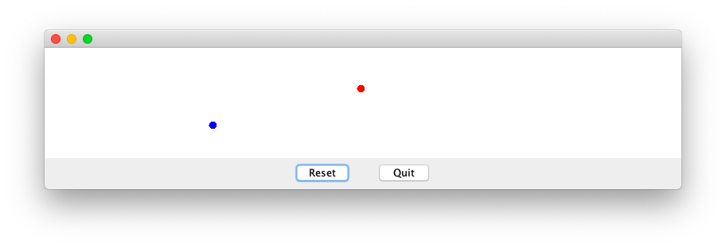
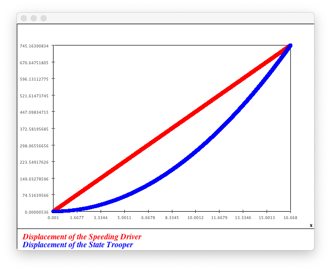
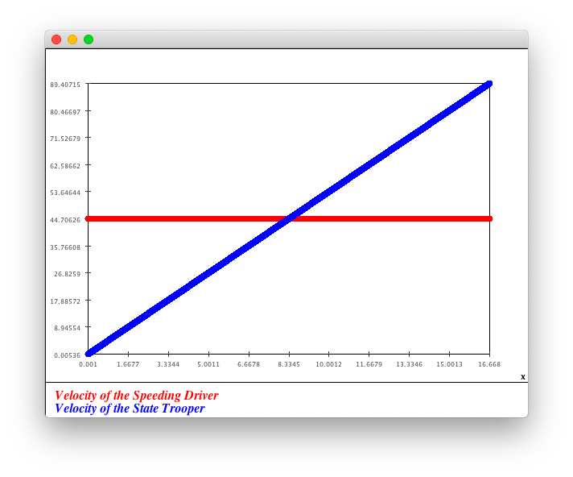
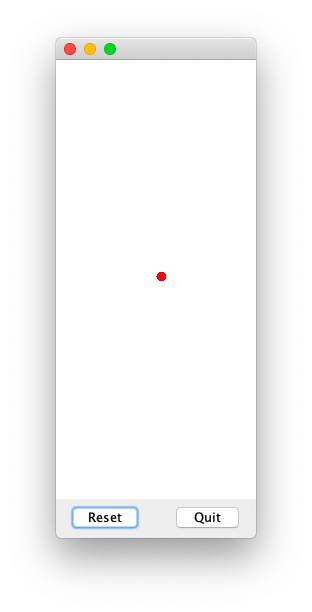
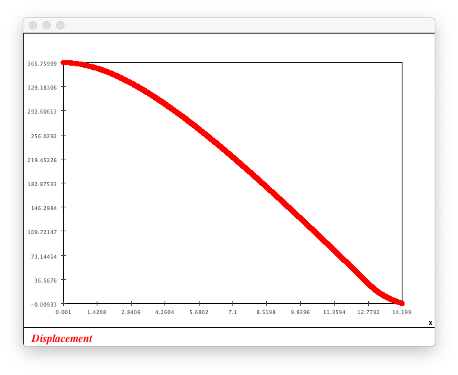
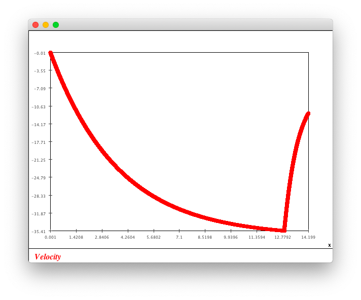
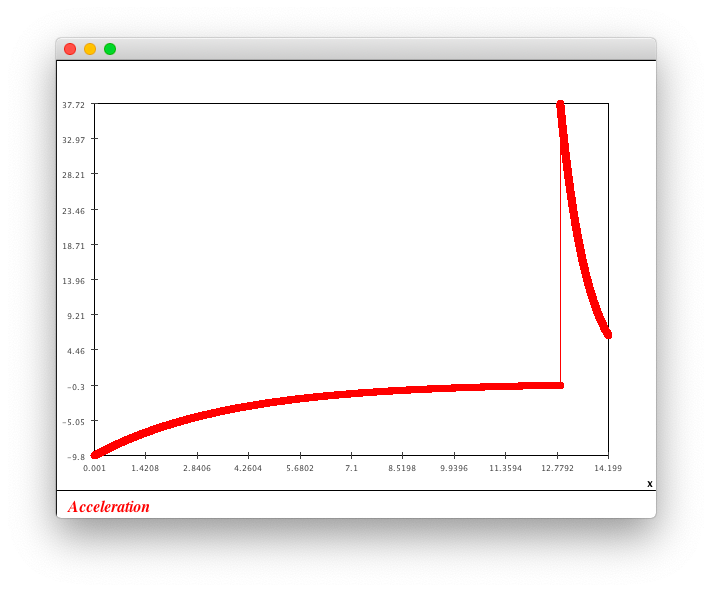
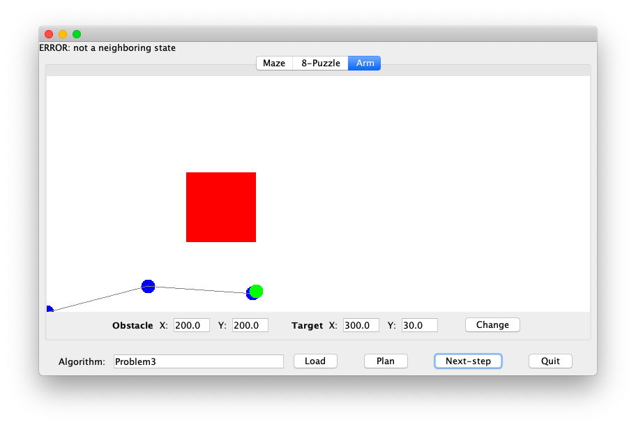

# Assignment 03

### Problem 1

Convert all things to international system of units (SI) at first:

- 100 $mile/hour$ = 44.704 $m/s$

- 12 $mile/hour/s$ = 5.364 $m/s^{2}​$

Write codes in file `Problem1.java`.

Result:

- Use international system of units, 1px on screem represents 1 $m​$.
- Red things represents the speeding driver.
- Blue things represents the state trooper.







Conclusion:

- The displacement when trooper catches the driver is about 745.163 $m$ (0.463 $mile$).
- The velocity of the trooper at this time is about 89.407 $m/s$ (200.001 $mile/hour$), which is twice as the velocity of the driver.

### Problem 2

Convert all things to international system of units (SI) at first:

- 1200 $feet$ = 365.760 $m$
- 40 $inch/sec$ = 12.192 $m/s$

Write codes in file `Problem2.java`.

After running several time, choose `T = 12.875` to fit the constraint.

Result:

- Use international system of units, 1px on screem represents 1 $m$.
- Set positive direction as UP.









```
Finally:
a = 6.381776797156977 m/s^2
v = -12.05157410782056 m/s
d = -0.009327123869047016 m
```

It shows that the chute should be opened no later than 12.875 $s$.

### Problem 3

See file `Problem3.java`.

Result:


```
Starting plan generation ...
< Pre-plan start. >
# pre-plan 1: [140.0, 30.0]
After 100: |F|=24  |V|=100
After 200: |F|=31  |V|=200
After 300: |F|=40  |V|=300
After 400: |F|=48  |V|=400
After 500: |F|=55  |V|=500
After 600: |F|=59  |V|=600
After 700: |F|=57  |V|=700
After 800: |F|=55  |V|=800
After 900: |F|=54  |V|=900
After 1000: |F|=36  |V|=1000
After 1100: |F|=30  |V|=1100
After 1200: |F|=100  |V|=1200
Cost: Solution of length=88 found with cost=435.0 after 1201 moves
# pre-plan 2: [180.0, 30.0]
After 100: |F|=24  |V|=100
After 200: |F|=38  |V|=200
After 300: |F|=45  |V|=300
After 400: |F|=53  |V|=400
After 500: |F|=60  |V|=500
After 600: |F|=60  |V|=600
After 700: |F|=57  |V|=700
After 800: |F|=57  |V|=800
After 900: |F|=45  |V|=900
After 1000: |F|=35  |V|=1000
After 1100: |F|=98  |V|=1100
Cost: Solution of length=88 found with cost=435.0 after 1124 moves
# pre-plan 3: [220.0, 30.0]
After 100: |F|=28  |V|=100
After 200: |F|=39  |V|=200
After 300: |F|=51  |V|=300
After 400: |F|=60  |V|=400
After 500: |F|=60  |V|=500
After 600: |F|=59  |V|=600
After 700: |F|=57  |V|=700
After 800: |F|=59  |V|=800
After 900: |F|=41  |V|=900
After 1000: |F|=36  |V|=1000
After 1100: |F|=105  |V|=1100
Cost: Solution of length=88 found with cost=435.0 after 1121 moves
# pre-plan 4: [260.0, 30.0]
After 100: |F|=32  |V|=100
After 200: |F|=45  |V|=200
After 300: |F|=60  |V|=300
After 400: |F|=61  |V|=400
After 500: |F|=60  |V|=500
After 600: |F|=59  |V|=600
After 700: |F|=60  |V|=700
After 800: |F|=46  |V|=800
After 900: |F|=42  |V|=900
After 1000: |F|=36  |V|=1000
After 1100: |F|=104  |V|=1100
Cost: Solution of length=88 found with cost=435.0 after 1167 moves
# pre-plan 5: [300.0, 30.0]
After 100: |F|=34  |V|=100
After 200: |F|=49  |V|=200
After 300: |F|=61  |V|=300
After 400: |F|=61  |V|=400
After 500: |F|=61  |V|=500
After 600: |F|=61  |V|=600
After 700: |F|=61  |V|=700
After 800: |F|=47  |V|=800
After 900: |F|=42  |V|=900
After 1000: |F|=37  |V|=1000
After 1100: |F|=102  |V|=1100
After 1200: |F|=91  |V|=1200
Cost: Solution of length=94 found with cost=465.0 after 1249 moves
< Pre-plan complete. >
< Plan start. >
Use pre-plan 4.
Cost: Solution of length=89 found with cost=440.0 after 1 moves
Cost: Solution of length=177 found with cost=440.0
< Plan complete. >
```



```
Starting plan generation ...
< Plan start. >
Use pre-plan 5.
Cost: Solution of length=94 found with cost=465.0 after 0 moves
Cost: Solution of length=188 found with cost=465.0
< Plan complete. >
```

It seems that pre-A* will cost less time when "close enough".

The solution provided by pre-A* does not guarantee to be optimal.