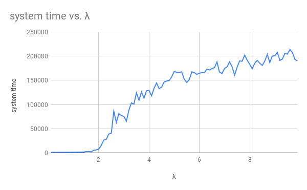
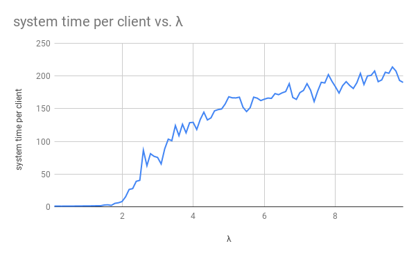
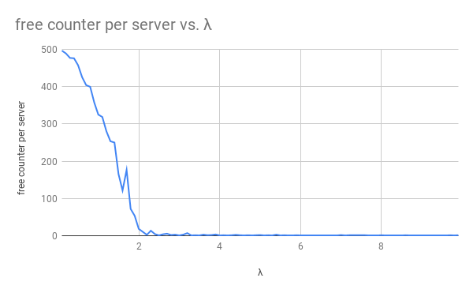
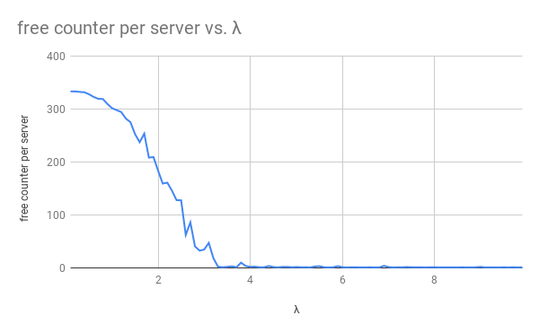

# Assignment 04

### Simulation

Since there are some bugs when directly modifing `Queue.java`, I use a different method to simulate (asynchronously). See code and annotation in file `ThreeServerQueue.java`.

### Inspection

#### 1

File `ThreeServerQueue.java`:

``` java
public class ThreeServerQueue {

    public static void main(String[] args) {
        ThreeServerQueue queue = new ThreeServerQueue(1, 0.75, 1);
        if (queue.simulate(1000)) {
            System.out.println(queue.toString());
        }
    }
    
    ...

}
```

Result:

```
Parameter:
  server number (K): 1
  arrival rate  (λ): 0.75
  service rate  (μ): 1.0
  max client number: 1000000
Results:
  total time:     1333151.2262177207
  arrival time:   1332122.138188411
    - per client: 1.332122138188411  #1
    - rate        0.7506819167196839
  wait time:      2999997.1044096174
    - per client: 2.9999971044096174 #2
  service time:   999175.7426322775
    - per client: 0.9991757426322776 #3
    - rate:       1.0008249373283933
  system time:    3999172.8470418686
    - per client: 3.999172847041869  #4
  free time:      333975.4835854431
    - per server: 333975.4835854431
  free counter:   249753.0
    - per server: 249753.0
```

#### 2

File `Queue.java`:

```java
public class Queue {

    ...

    public static void main(String[] argv) {
        Queue queue = new Queue();
        queue.simulate(1000000);
        System.out.println(queue);
        queue.M.display();
        queue.D.display();
    }

}
```

Result:

```
Simulation results:
  numArrivals:           1000000
  numDepartures:         999999
  avg Wait:              2.9521488083301035 #2
  avg System Time (d)    3.9509479782228114 #4
  avg Interarrival Time: 1.333542668225313  #1
  interarrival Rate (λ): 0.7498822676073846
  avg Service Time:      0.9987995459747511 #3
  service Rate (μ):      1.001201896847157
  Custom number:         3957824.0
  avg Custom Number (m): 3.957824
  probability of Free:   0.25118
```

#### 3

Compare pairs of values which end with `#1`, `#2`, `#3`, `#4` - they are almost equal.

File `ThreeServerQueue.java` is OK.

### Question

#### 1

> For the case $K=2$, plot the system time vs. increasing arrival rate $\lambda$.

File `ThreeServerQueue.java`:

``` java
public class ThreeServerQueue {

    public static void main(String[] args) {
        for (double i = 0.1; i < 10; i += 0.1) {
            ThreeServerQueue queue = new ThreeServerQueue(2, i, 1);
            if (queue.simulate(1000)) {
                System.out.println(String.format("%.1f", i)
                        + "\t" + queue.systemTime
                        + "\t" + queue.systemTimePerClient);
            }
        }
    }

    ...

}
```

Result:

```
Parameter:
  server number (K): 2
  service rate  (μ): 1.0
  max client number: 1000
```

(Get full data from *table 1* below.)





#### 2

> What is the value of the system time when $\lambda=1.5$?

*Table 1* shows that: the system time is 2665.77 when $\lambda=1.5$.

#### 3

> What value of $\lambda$ would cause the queue to become unstable?
>
> What value of λ would cause the queue to become unstable when $K=3$?
>
> What did you do to assess the accuracy of your estimates?

Define and calculate 4 variables:

- **free time** - the total idle time of all servers.
- **free time per server** - "free time" averaged by each server.
- **free counter** - the counter of the event "a server is idle but the queue is empty".
- **free counter per server** - "free counter" averaged by each server.

When "free counter per server" approaches to its minimum value, the queue become **"stable"**. In other words, event "a server is idle but the queue is empty" rarely happens.

The following results show that:

- $\lambda<2.2$ cause the queue to become unstable when $K=2$.
- $\lambda<3.4$ cause the queue to become unstable when $K=3$.

##### K=2

File `ThreeServerQueue.java`:

``` java
public class ThreeServerQueue {

    public static void main(String[] args) {
        for (double i = 0.1; i < 10; i += 0.1) {
            ThreeServerQueue queue = new ThreeServerQueue(2, i, 1);
            if (queue.simulate(1000)) {
                System.out.println(String.format("%.1f", i)
                        + "\t" + queue.freeTime
                        + "\t" + queue.freeTimePerServer
                        + "\t" + queue.freeCounter
                        + "\t" + queue.freeCounterPerServer);
            }
        }
    }
    
    ...

}
```

Result:

```
Parameter:
  server number (K): 2
  service rate  (μ): 1.0
  max client number: 1000
```

(Get full data from *table 2* below.)



##### K=3

File `ThreeServerQueue.java`:

```java
public class ThreeServerQueue {

    public static void main(String[] args) {
        for (double i = 0.1; i < 10; i += 0.1) {
            ThreeServerQueue queue = new ThreeServerQueue(3, i, 1);
            if (queue.simulate(1000)) {
                System.out.println(String.format("%.1f", i)
                        + "\t" + queue.freeTime
                        + "\t" + queue.freeTimePerServer
                        + "\t" + queue.freeCounter
                        + "\t" + queue.freeCounterPerServer);
            }
        }
    }
    
    ...

}
```

Result:

```
Parameter:
  server number (K): 3
  service rate  (μ): 1.0
  max client number: 1000
```

(Get full data from *table 3* below.)



#### 4

> Write down two applications of the above queueing model?

1. cashier of Whole Foods Market (foggy bottom) - $K$ might be 6 to 16
2. restroom of District House - $K$ might be 2 to 3

### Table

#### 1

| λ    | system time | system time per client |
| ---- | ----------- | ---------------------- |
| 0.1  | 1010.214058 | 1.010214058            |
| 0.2  | 1040.67641  | 1.04067641             |
| 0.3  | 996.765757  | 0.996765757            |
| 0.4  | 1048.284635 | 1.048284635            |
| 0.5  | 1046.407754 | 1.046407754            |
| 0.6  | 1131.969027 | 1.131969027            |
| 0.7  | 1141.598139 | 1.141598139            |
| 0.8  | 1194.696502 | 1.194696502            |
| 0.9  | 1275.277795 | 1.275277795            |
| 1    | 1300.587145 | 1.300587145            |
| 1.1  | 1375.855366 | 1.375855366            |
| 1.2  | 1473.452182 | 1.473452182            |
| 1.3  | 1607.334601 | 1.607334601            |
| 1.4  | 1573.059522 | 1.573059522            |
| 1.5  | 2665.769401 | 2.665769401            |
| 1.6  | 2986.743366 | 2.986743366            |
| 1.7  | 2132.933078 | 2.132933078            |
| 1.8  | 5273.632764 | 5.273632764            |
| 1.9  | 6128.766925 | 6.128766925            |
| 2    | 7975.912645 | 7.975912645            |
| 2.1  | 15225.67974 | 15.22567974            |
| 2.2  | 26486.41416 | 26.48641416            |
| 2.3  | 27817.23325 | 27.81723325            |
| 2.4  | 38934.44848 | 38.93444848            |
| 2.5  | 40454.15037 | 40.45415037            |
| 2.6  | 86486.16474 | 86.48616474            |
| 2.7  | 62818.11874 | 62.81811874            |
| 2.8  | 81188.92835 | 81.18892835            |
| 2.9  | 77162.12188 | 77.16212188            |
| 3    | 75438.29299 | 75.43829299            |
| 3.1  | 65526.1295  | 65.5261295             |
| 3.2  | 88634.22068 | 88.63422068            |
| 3.3  | 103385.4423 | 103.3854423            |
| 3.4  | 101078.9407 | 101.0789407            |
| 3.5  | 124152.9791 | 124.1529791            |
| 3.6  | 108714.7678 | 108.7147678            |
| 3.7  | 126156.4628 | 126.1564628            |
| 3.8  | 113086.461  | 113.086461             |
| 3.9  | 128550.6285 | 128.5506285            |
| 4    | 129143.9677 | 129.1439677            |
| 4.1  | 118165.653  | 118.165653             |
| 4.2  | 133617.0554 | 133.6170554            |
| 4.3  | 144631.0342 | 144.6310342            |
| 4.4  | 132754.3855 | 132.7543855            |
| 4.5  | 135957.971  | 135.957971             |
| 4.6  | 146686.8374 | 146.6868374            |
| 4.7  | 148572.4057 | 148.5724057            |
| 4.8  | 149553.9359 | 149.5539359            |
| 4.9  | 157210.8069 | 157.2108069            |
| 5    | 168211.3138 | 168.2113138            |
| 5.1  | 166604.411  | 166.604411             |
| 5.2  | 166468.5638 | 166.4685638            |
| 5.3  | 167594.6878 | 167.5946878            |
| 5.4  | 152201.3481 | 152.2013481            |
| 5.5  | 145603.9787 | 145.6039787            |
| 5.6  | 151438.8591 | 151.4388591            |
| 5.7  | 167623.1253 | 167.6231253            |
| 5.8  | 166077.2642 | 166.0772642            |
| 5.9  | 162422.8189 | 162.4228189            |
| 6    | 164505.6949 | 164.5056949            |
| 6.1  | 166236.2224 | 166.2362224            |
| 6.2  | 165780.9314 | 165.7809314            |
| 6.3  | 173064.108  | 173.064108             |
| 6.4  | 171407.8667 | 171.4078667            |
| 6.5  | 174184.5412 | 174.1845412            |
| 6.6  | 176183.9038 | 176.1839038            |
| 6.7  | 188190.8182 | 188.1908182            |
| 6.8  | 167162.178  | 167.162178             |
| 6.9  | 164209.5582 | 164.2095582            |
| 7    | 174556.3878 | 174.5563878            |
| 7.1  | 177887.9127 | 177.8879127            |
| 7.2  | 188227.7842 | 188.2277842            |
| 7.3  | 178202.4481 | 178.2024481            |
| 7.4  | 160929.6512 | 160.9296512            |
| 7.5  | 176886.8842 | 176.8868842            |
| 7.6  | 190316.8968 | 190.3168968            |
| 7.7  | 189377.4588 | 189.3774588            |
| 7.8  | 202104.4694 | 202.1044694            |
| 7.9  | 191932.7595 | 191.9327595            |
| 8    | 183319.4721 | 183.3194721            |
| 8.1  | 173906.3111 | 173.9063111            |
| 8.2  | 185198.5291 | 185.1985291            |
| 8.3  | 191338.938  | 191.338938             |
| 8.4  | 185456.1434 | 185.4561434            |
| 8.5  | 180885.7025 | 180.8857025            |
| 8.6  | 189621.7756 | 189.6217756            |
| 8.7  | 203930.516  | 203.930516             |
| 8.8  | 186990.2784 | 186.9902784            |
| 8.9  | 200107.0657 | 200.1070657            |
| 9    | 200856.3754 | 200.8563754            |
| 9.1  | 207580.8354 | 207.5808354            |
| 9.2  | 191280.927  | 191.280927             |
| 9.3  | 194036.3119 | 194.0363119            |
| 9.4  | 205700.5513 | 205.7005513            |
| 9.5  | 204164.5564 | 204.1645564            |
| 9.6  | 213773.6947 | 213.7736947            |
| 9.7  | 207452.0222 | 207.4520222            |
| 9.8  | 193177.3409 | 193.1773409            |
| 9.9  | 190181.357  | 190.181357             |

#### 2

| λ    | free time     | free time per server | free counter | free counter per server |
| ---- | ------------- | -------------------- | ------------ | ----------------------- |
| 0.1  | 17670.31931   | 8835.159656          | 993          | 496.5                   |
| 0.2  | 8843.824447   | 4421.912224          | 978          | 489                     |
| 0.3  | 5436.808503   | 2718.404251          | 954          | 477                     |
| 0.4  | 4344.180834   | 2172.090417          | 952          | 476                     |
| 0.5  | 2800.282254   | 1400.141127          | 915          | 457.5                   |
| 0.6  | 2437.007667   | 1218.503834          | 851          | 425.5                   |
| 0.7  | 1800.246525   | 900.1232626          | 808          | 404                     |
| 0.8  | 1463.81014    | 731.9050698          | 799          | 399.5                   |
| 0.9  | 1164.598442   | 582.299221           | 715          | 357.5                   |
| 1    | 954.6829458   | 477.3414729          | 650          | 325                     |
| 1.1  | 897.6450842   | 448.8225421          | 637          | 318.5                   |
| 1.2  | 695.3697989   | 347.6848994          | 561          | 280.5                   |
| 1.3  | 600.0913879   | 300.045694           | 507          | 253.5                   |
| 1.4  | 540.6654189   | 270.3327094          | 500          | 250                     |
| 1.5  | 325.6117131   | 162.8058565          | 331          | 165.5                   |
| 1.6  | 222.3736204   | 111.1868102          | 243          | 121.5                   |
| 1.7  | 285.0415879   | 142.5207939          | 353          | 176.5                   |
| 1.8  | 91.70207213   | 45.85103607          | 144          | 72                      |
| 1.9  | 70.85244483   | 35.42622241          | 107          | 53.5                    |
| 2    | 25.16875089   | 12.58437545          | 37           | 18.5                    |
| 2.1  | 15.47965302   | 7.73982651           | 21           | 10.5                    |
| 2.2  | 1.910070821   | 0.9550354106         | 5            | 2.5                     |
| 2.3  | 10.27416352   | 5.137081761          | 27           | 13.5                    |
| 2.4  | 3.337928115   | 1.668964058          | 9            | 4.5                     |
| 2.5  | 0.8378142441  | 0.418907122          | 2            | 1                       |
| 2.6  | 5.209892598   | 2.604946299          | 8            | 4                       |
| 2.7  | 5.474094657   | 2.737047328          | 11           | 5.5                     |
| 2.8  | 2.073283358   | 1.036641679          | 4            | 2                       |
| 2.9  | 2.756913163   | 1.378456581          | 6            | 3                       |
| 3    | 0.822324221   | 0.4111621105         | 2            | 1                       |
| 3.1  | 5.816356614   | 2.908178307          | 6            | 3                       |
| 3.2  | 8.509635045   | 4.254817523          | 14           | 7                       |
| 3.3  | 0.6305799423  | 0.3152899711         | 2            | 1                       |
| 3.4  | 2.07966125    | 1.039830625          | 3            | 1.5                     |
| 3.5  | 0.2307336692  | 0.1153668346         | 2            | 1                       |
| 3.6  | 2.004342905   | 1.002171452          | 6            | 3                       |
| 3.7  | 0.7233894484  | 0.3616947242         | 3            | 1.5                     |
| 3.8  | 0.9416313944  | 0.4708156972         | 4            | 2                       |
| 3.9  | 3.117528466   | 1.558764233          | 7            | 3.5                     |
| 4    | 0.5101150453  | 0.2550575227         | 2            | 1                       |
| 4.1  | 0.6726101143  | 0.3363050572         | 3            | 1.5                     |
| 4.2  | 0.3252478121  | 0.1626239061         | 2            | 1                       |
| 4.3  | 0.514165439   | 0.2570827195         | 3            | 1.5                     |
| 4.4  | 1.245198856   | 0.6225994281         | 5            | 2.5                     |
| 4.5  | 0.816859605   | 0.4084298025         | 3            | 1.5                     |
| 4.6  | 0.4640447226  | 0.2320223613         | 2            | 1                       |
| 4.7  | 0.5148497817  | 0.2574248908         | 3            | 1.5                     |
| 4.8  | 0.4523561836  | 0.2261780918         | 2            | 1                       |
| 4.9  | 1.024884421   | 0.5124422105         | 3            | 1.5                     |
| 5    | 0.856575986   | 0.428287993          | 4            | 2                       |
| 5.1  | 0.5230869122  | 0.2615434561         | 2            | 1                       |
| 5.2  | 0.3347443003  | 0.1673721501         | 3            | 1.5                     |
| 5.3  | 0.7806726124  | 0.3903363062         | 2            | 1                       |
| 5.4  | 1.797377792   | 0.8986888959         | 6            | 3                       |
| 5.5  | 1.437743748   | 0.7188718741         | 2            | 1                       |
| 5.6  | 0.4719312399  | 0.23596562           | 3            | 1.5                     |
| 5.7  | 1.188579937   | 0.5942899686         | 2            | 1                       |
| 5.8  | 1.298008251   | 0.6490041254         | 2            | 1                       |
| 5.9  | 1.26588128    | 0.63294064           | 3            | 1.5                     |
| 6    | 0.8295474722  | 0.4147737361         | 2            | 1                       |
| 6.1  | 0.3786521621  | 0.1893260811         | 2            | 1                       |
| 6.2  | 0.1971613466  | 0.09858067332        | 2            | 1                       |
| 6.3  | 0.2765663701  | 0.1382831851         | 2            | 1                       |
| 6.4  | 0.5054060003  | 0.2527030002         | 2            | 1                       |
| 6.5  | 0.5426509767  | 0.2713254884         | 2            | 1                       |
| 6.6  | 0.3765596615  | 0.1882798307         | 2            | 1                       |
| 6.7  | 0.2630756091  | 0.1315378046         | 2            | 1                       |
| 6.8  | 0.364101484   | 0.182050742          | 2            | 1                       |
| 6.9  | 0.1506630642  | 0.07533153208        | 2            | 1                       |
| 7    | 1.245291725   | 0.6226458625         | 4            | 2                       |
| 7.1  | 0.2725029209  | 0.1362514605         | 2            | 1                       |
| 7.2  | 0.7627242273  | 0.3813621136         | 3            | 1.5                     |
| 7.3  | 0.3077152542  | 0.1538576271         | 3            | 1.5                     |
| 7.4  | 0.453521672   | 0.226760836          | 3            | 1.5                     |
| 7.5  | 0.6229602317  | 0.3114801158         | 3            | 1.5                     |
| 7.6  | 0.2490231732  | 0.1245115866         | 3            | 1.5                     |
| 7.7  | 0.2154954514  | 0.1077477257         | 2            | 1                       |
| 7.8  | 0.2382549428  | 0.1191274714         | 2            | 1                       |
| 7.9  | 0.1556470091  | 0.07782350457        | 2            | 1                       |
| 8    | 0.4813357394  | 0.2406678697         | 3            | 1.5                     |
| 8.1  | 0.8341818876  | 0.4170909438         | 2            | 1                       |
| 8.2  | 0.2007625646  | 0.1003812823         | 2            | 1                       |
| 8.3  | 0.6172179144  | 0.3086089572         | 2            | 1                       |
| 8.4  | 0.1925873884  | 0.09629369418        | 2            | 1                       |
| 8.5  | 0.596923849   | 0.2984619245         | 2            | 1                       |
| 8.6  | 0.7952882805  | 0.3976441402         | 3            | 1.5                     |
| 8.7  | 0.7069173388  | 0.3534586694         | 2            | 1                       |
| 8.8  | 0.1646923661  | 0.08234618304        | 2            | 1                       |
| 8.9  | 0.5349981916  | 0.2674990958         | 2            | 1                       |
| 9    | 0.2642837578  | 0.1321418789         | 2            | 1                       |
| 9.1  | 0.3550504014  | 0.1775252007         | 2            | 1                       |
| 9.2  | 0.1229946254  | 0.06149731269        | 2            | 1                       |
| 9.3  | 0.04144409998 | 0.02072204999        | 2            | 1                       |
| 9.4  | 0.01541217526 | 0.007706087629       | 2            | 1                       |
| 9.5  | 0.2747564556  | 0.1373782278         | 2            | 1                       |
| 9.6  | 0.6668590206  | 0.3334295103         | 2            | 1                       |
| 9.7  | 0.4565450459  | 0.2282725229         | 3            | 1.5                     |
| 9.8  | 0.2227082586  | 0.1113541293         | 2            | 1                       |
| 9.9  | 0.2728998223  | 0.1364499112         | 3            | 1.5                     |

#### 3

| λ    | free time     | free time per server | free counter | free counter per server |
| ---- | ------------- | -------------------- | ------------ | ----------------------- |
| 0.1  | 26978.33779   | 8992.779263          | 1000         | 333.3333333             |
| 0.2  | 13769.71498   | 4589.904992          | 1000         | 333.3333333             |
| 0.3  | 8638.400289   | 2879.466763          | 997          | 332.3333333             |
| 0.4  | 7020.947013   | 2340.315671          | 995          | 331.6666667             |
| 0.5  | 4694.092377   | 1564.697459          | 984          | 328                     |
| 0.6  | 4161.720923   | 1387.240308          | 969          | 323                     |
| 0.7  | 3204.865498   | 1068.288499          | 958          | 319.3333333             |
| 0.8  | 2703.502689   | 901.167563           | 957          | 319                     |
| 0.9  | 2245.712236   | 748.5707454          | 929          | 309.6666667             |
| 1    | 1903.24289    | 634.4142968          | 905          | 301.6666667             |
| 1.1  | 1852.643078   | 617.5476925          | 894          | 298                     |
| 1.2  | 1531.906601   | 510.6355338          | 883          | 294.3333333             |
| 1.3  | 1389.775952   | 463.2586506          | 846          | 282                     |
| 1.4  | 1291.304807   | 430.4349358          | 826          | 275.3333333             |
| 1.5  | 975.3321134   | 325.1107045          | 758          | 252.6666667             |
| 1.6  | 822.9246793   | 274.3082264          | 712          | 237.3333333             |
| 1.7  | 898.2759868   | 299.4253289          | 761          | 253.6666667             |
| 1.8  | 620.0452161   | 206.6817387          | 625          | 208.3333333             |
| 1.9  | 597.3470175   | 199.1156725          | 628          | 209.3333333             |
| 2    | 493.4075165   | 164.4691722          | 551          | 183.6666667             |
| 2.1  | 431.491456    | 143.8304853          | 478          | 159.3333333             |
| 2.2  | 378.5000213   | 126.1666738          | 483          | 161                     |
| 2.3  | 293.2184561   | 97.73948535          | 438          | 146                     |
| 2.4  | 282.2439685   | 94.08132284          | 384          | 128                     |
| 2.5  | 259.5105232   | 86.50350774          | 383          | 127.6666667             |
| 2.6  | 136.8462431   | 45.61541438          | 187          | 62.33333333             |
| 2.7  | 132.140127    | 44.046709            | 258          | 86                      |
| 2.8  | 67.24642309   | 22.41547436          | 122          | 40.66666667             |
| 2.9  | 66.29733594   | 22.09911198          | 98           | 32.66666667             |
| 3    | 63.5315203    | 21.17717343          | 104          | 34.66666667             |
| 3.1  | 86.76894612   | 28.92298204          | 142          | 47.33333333             |
| 3.2  | 34.23286393   | 11.41095464          | 55           | 18.33333333             |
| 3.3  | 2.746869711   | 0.9156232369         | 7            | 2.333333333             |
| 3.4  | 3.551176867   | 1.183725622          | 4            | 1.333333333             |
| 3.5  | 0.7246583608  | 0.2415527869         | 6            | 2                       |
| 3.6  | 4.771031417   | 1.590343806          | 9            | 3                       |
| 3.7  | 1.315082282   | 0.4383607607         | 4            | 1.333333333             |
| 3.8  | 12.63510102   | 4.211700341          | 30           | 10                      |
| 3.9  | 7.458916164   | 2.486305388          | 11           | 3.666666667             |
| 4    | 1.992971951   | 0.6643239837         | 6            | 2                       |
| 4.1  | 2.026267838   | 0.6754226128         | 7            | 2.333333333             |
| 4.2  | 0.9474993265  | 0.3158331088         | 4            | 1.333333333             |
| 4.3  | 1.241743872   | 0.4139146238         | 4            | 1.333333333             |
| 4.4  | 3.475826785   | 1.158608928          | 11           | 3.666666667             |
| 4.5  | 2.317991954   | 0.7726639846         | 5            | 1.666666667             |
| 4.6  | 0.7710838173  | 0.2570279391         | 3            | 1                       |
| 4.7  | 1.034785174   | 0.3449283913         | 6            | 2                       |
| 4.8  | 1.60417449    | 0.5347248299         | 6            | 2                       |
| 4.9  | 1.681188574   | 0.5603961912         | 4            | 1.333333333             |
| 5    | 1.606684018   | 0.5355613393         | 5            | 1.666666667             |
| 5.1  | 1.184850018   | 0.3949500059         | 4            | 1.333333333             |
| 5.2  | 1.136429086   | 0.3788096952         | 4            | 1.333333333             |
| 5.3  | 1.353056219   | 0.4510187398         | 3            | 1                       |
| 5.4  | 3.697708134   | 1.232569378          | 8            | 2.666666667             |
| 5.5  | 3.217929606   | 1.072643202          | 10           | 3.333333333             |
| 5.6  | 1.43473079    | 0.4782435966         | 4            | 1.333333333             |
| 5.7  | 2.000986318   | 0.6669954392         | 3            | 1                       |
| 5.8  | 2.18968337    | 0.7298944567         | 4            | 1.333333333             |
| 5.9  | 3.040884999   | 1.013628333          | 10           | 3.333333333             |
| 6    | 1.425422126   | 0.4751407087         | 4            | 1.333333333             |
| 6.1  | 0.6811195234  | 0.2270398411         | 3            | 1                       |
| 6.2  | 0.4691933252  | 0.1563977751         | 4            | 1.333333333             |
| 6.3  | 0.5481217645  | 0.1827072548         | 4            | 1.333333333             |
| 6.4  | 0.80948004    | 0.26982668           | 3            | 1                       |
| 6.5  | 1.271044306   | 0.4236814353         | 3            | 1                       |
| 6.6  | 1.368714412   | 0.4562381373         | 4            | 1.333333333             |
| 6.7  | 0.5750927519  | 0.191697584          | 3            | 1                       |
| 6.8  | 0.591945587   | 0.1973151957         | 3            | 1                       |
| 6.9  | 2.223765697   | 0.7412552322         | 12           | 4                       |
| 7    | 2.398200314   | 0.7994001046         | 5            | 1.666666667             |
| 7.1  | 0.6047323935  | 0.2015774645         | 3            | 1                       |
| 7.2  | 1.361678011   | 0.4538926703         | 4            | 1.333333333             |
| 7.3  | 0.7224523807  | 0.2408174602         | 4            | 1.333333333             |
| 7.4  | 1.294870659   | 0.431623553          | 5            | 1.666666667             |
| 7.5  | 1.123047109   | 0.3743490364         | 4            | 1.333333333             |
| 7.6  | 0.676293005   | 0.2254310017         | 4            | 1.333333333             |
| 7.7  | 0.5124948073  | 0.1708316024         | 4            | 1.333333333             |
| 7.8  | 0.4081434781  | 0.136047826          | 3            | 1                       |
| 7.9  | 0.6850353944  | 0.2283451315         | 4            | 1.333333333             |
| 8    | 0.9481288321  | 0.316042944          | 4            | 1.333333333             |
| 8.1  | 1.438563796   | 0.4795212653         | 3            | 1                       |
| 8.2  | 0.3621185673  | 0.1207061891         | 3            | 1                       |
| 8.3  | 1.241361177   | 0.413787059          | 3            | 1                       |
| 8.4  | 0.3255725525  | 0.1085241842         | 3            | 1                       |
| 8.5  | 1.029680405   | 0.3432268018         | 3            | 1                       |
| 8.6  | 1.359141398   | 0.4530471326         | 4            | 1.333333333             |
| 8.7  | 1.204961301   | 0.4016537672         | 3            | 1                       |
| 8.8  | 0.3215539609  | 0.1071846536         | 3            | 1                       |
| 8.9  | 1.148211997   | 0.3827373324         | 4            | 1.333333333             |
| 9    | 1.04183539    | 0.3472784632         | 6            | 2                       |
| 9.1  | 0.7239007351  | 0.241300245          | 3            | 1                       |
| 9.2  | 0.2092157604  | 0.06973858679        | 3            | 1                       |
| 9.3  | 0.337550502   | 0.112516834          | 3            | 1                       |
| 9.4  | 0.06896764607 | 0.02298921536        | 3            | 1                       |
| 9.5  | 0.5198979413  | 0.1732993138         | 4            | 1.333333333             |
| 9.6  | 1.293968569   | 0.4313228565         | 3            | 1                       |
| 9.7  | 1.142816755   | 0.3809389182         | 4            | 1.333333333             |
| 9.8  | 0.4518060807  | 0.1506020269         | 3            | 1                       |
| 9.9  | 0.5846564142  | 0.1948854714         | 4            | 1.333333333             |