# Module 01

### 01

> Are integers also real numbers? What are rational numbers and how are they different from integers or reals?

Integers are also real number.

Rational numbers can be expressed by division of two integers. They can also be expressed by finate or repeating fraction.

Rational numbers are also real numbers. Numbers which are real numbers but not rational numbers called irrational numbers (like $\pi$ and $\sqrt{2}$).

### 02

> What about rationals? Is there a rational number between every two rationals?

Rational numbers can be expressed by the division of two integers.

$m,n,p,q$ are integers.

Let $a=\frac{m}{n}$ and $b=\frac{p}{q}$. It is clear that $a,b$ are rational numbers.

Let $c=\frac{a+b}{2}$ which means $a\le c\le b$.
$$
\begin{align*}
c&=\frac{a+b}{2}=\frac{\frac{m}{n}+\frac{p}{q}}{2}=\frac{mp+nq}{2nq}\\
\end{align*}
$$
Both numerator and denominator are integers, so $c$ is a rational number.

As a result, a rational number always exists between every two rational numbers.

### 03

> How do the sizes of the naturals compare with the integers? What about the size of the rationals compared to integers?

The sizes of the naturals is much smaller than the integers. The sizes of the rationals is much larger than the integers.

### 04

> In the above example, we knew that $f(a)<0$ . Re-write the pseudocode to make it more general: replace the test $f(m)<0$ with a test to see if they are of the same sign. Modify the code in [Bisection.java](https://www2.seas.gwu.edu/~simhaweb/contalg/modules/module1/examples/Bisection.java) accordingly.

See function `bisection` in file `Bisection.java`

### 05

> Examine the code in [Bisection.java](https://www2.seas.gwu.edu/~simhaweb/contalg/modules/module1/examples/Bisection.java):
>
> - Use a calculator to compute $\sqrt{3}$ and compare with the output of the program. How would you increase the accuracy of the program?
> - Can you make the code a little more efficient?
> - Can the `bisection()` method be written recursively? What would that do to efficiency?

More precious: see function `bisectionPrecious` in file `Bisection.java`.

Recursive: see function `bisectionRecursive` in file `Bisection.java`.

### 06

> Add code to [Zeno.java](https://www2.seas.gwu.edu/~simhaweb/contalg/modules/module1/examples/Zeno.java) to compute $S_{n}$ for any value of n. Try $n=5,10,100$. What do you observe?

See function `sum` in file `Bisection.java`

Running result:

```
sum(5)   = 0.96875
sum(10)  = 0.9990234375
sum(100) = 1.0
```

The larger the parameter `n` is, the closer the return value approachs to 1.

### 07

> Modify the above to compute $S_{n}$ and compare. Plot $S_{n}$ vs. $n$.

It has been given that:
$$
\begin{align*}
S'_{n}(x)&=1+x+x^{2}+x^{3}+...+x^{n}\\
S'_{n-1}(x)&=\frac{x^{n}-1}{x-1}\\
\end{align*}
$$
So:
$$
\begin{align*}
S'_{n}(x)&=\frac{x^{n+1}-1}{x-1}
\end{align*}
$$
Based on the definition of Zeno:
$$
\begin{align*}
S_{n}&=\frac{1}{2}+\frac{1}{4}+\frac{1}{8}+...+\frac{1}{2^{n}}\\
&=(1+\frac{1}{2}+\frac{1}{4}+\frac{1}{8}+...+\frac{1}{2^{n}})-1\\
&=S'_{n}(\frac{1}{2})-1\\
&=\frac{(\frac{1}{2})^{n+1}-1}{\frac{1}{2}-1}-1\\
&=1-(\frac{1}{2})^{n}\\
\end{align*}
$$
See function `sumFormula` in file `Bisection.java`

Running result:

```
sumFormula(5)   = 0.96875
sumFormula(10)  = 0.9990234375
sumFormula(100) = 1.0
```

Plot $S_{n}$ vs. $n$

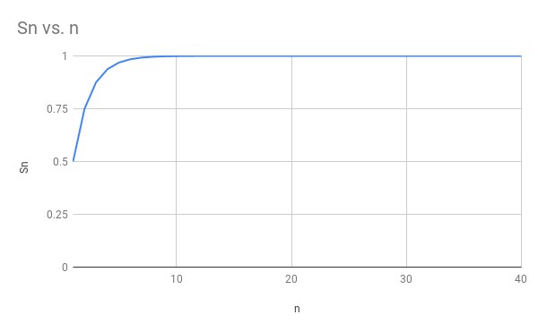

### 08

> Add code to [Harmonic.java](https://www2.seas.gwu.edu/~simhaweb/contalg/modules/module1/examples/Harmonic.java) and compare the output from two computations: using `double` vs. using `float`. Try different value of $n$. What do you think the sum is converging to? Plot $H_{n}$ vs. $n$.

See file `Harmonic.java`

Running result:

```
sumDouble(100): 5.187377517639621
sumFloat(100): 5.187378
```

Plot $H_{n}$ vs. $n$

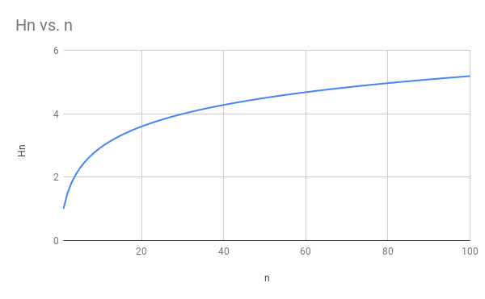

It seems that $H_{n}$ does not converge to any number.

### 09

> Write code to compute $A_{n}=(1+\frac{1}{n})^{n}$ for various values of $n$. Write your code in the `computeA()` of [SequenceExample.java](https://www2.seas.gwu.edu/~simhaweb/contalg/modules/module1/examples/SequenceExample.java). Plot $A_{n}$ vs. $n$.

See function `computeA` in file `SequenceExample.java`

Running result:

```
An, n=10: 2.5937424601000023
An, n=10000: 2.7181459268249255
```

Plot $A_{n}$ vs. $n$.

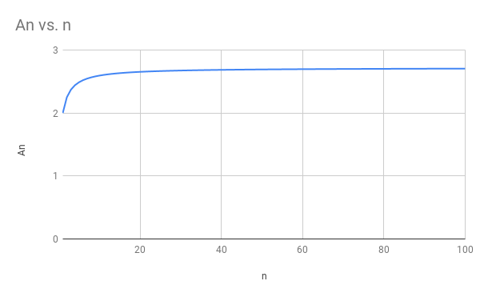

### 10

> Write code to print the first few terms of the sequence $C_{n}=\frac{\sin(n)}{n}$. How is this sequence different from the ones we've seen so far?

See function `computeC` in file `SequenceExample.java`

Running result:

```
Cn, n=10: -0.05440211108893698
Cn, n=100: -0.005063656411097588
```

Plot $A_{n}$ vs. $n$.


The sequence $C_{n}$ converges to 0 from 2 sides, which is different from sequences mentions below.

### 11

> Write code in [RandomSequence2.java](https://www2.seas.gwu.edu/~simhaweb/contalg/modules/module1/examples/RandomSequence2.java) to print the first 10 terms of the sequence $V_{n}$ defined above. You will also need [RandTool.java](https://www2.seas.gwu.edu/~simhaweb/contalg/useful/RandTool.java).
>
> - Does the sequence $U_{n}$ have a limit?
> - Does the sequence $V_{n}$ have a limit?
>
> How are these sequences different from the ones we've seen before? After writing your code to compute $V_{n}$ above, examine the code in [RandomSequence3.java](https://www2.seas.gwu.edu/~simhaweb/contalg/modules/module1/examples/RandomSequence3.java). What is the difference in the two approaches?

See function `computeV` in file `RandomSequence2.java`.

- Sequence $U_{n}$ does not have a limit.

- Sequence $V_{n}$ may have a limit of 0.5 (it is clear when setting $n$ as 100).

These sequences use random numbers, which is different from ones we have seen before.

The difference between `RandomSequence2.java` and `RandomSequence3.java` is that:

- `RandomSequence2.java` calculates each $V_{n}$ independently.
- `RandomSequence3.java` uses previous sum of random to calculate each $V_{n}$ (dependently).

### 12

> First, examine the code in [RandomSequence4.java](https://www2.seas.gwu.edu/~simhaweb/contalg/modules/module1/examples/RandomSequence4.java) and verify that it prints out possible random values, or samples, of $U_{5}$. Modify the code to print values of $U_{493}$. Next, download [Histogram.java](https://www2.seas.gwu.edu/~simhaweb/contalg/modules/module1/examples/Histogram.java) and print a histogram for $U_{5}$ with different numbers of samples: 10, 100 and 10000. What do you notice? Is it intuitive? How do the histograms for $U_{5}$ differ from the equivalent histograms for $U_{493}$?

See file `RandomSequence4.java` and file `Histogram.java`.

Samples tend to distribute averagely when the number of samples becomes larger.

There is very little difference between histograms for $U_{5}$ and $U_{493}$.

### 13

> Modify [Histogram.java](https://www2.seas.gwu.edu/~simhaweb/contalg/modules/module1/examples/Histogram.java) and to compute and print a histogram for $V_{n}$ with different numbers of samples: 10, 100 and 10000.
>
> - How does the histogram for $V_{5}$ differ from the histogram for $V_{493}$.
> - Print the histogram for $V_{10000}$ and explain the result.

See file `Histogram.java`.

Histogram of $V_{5}$ (10000 samples)

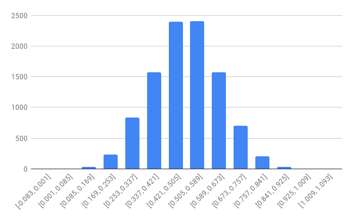

Histogram of $V_{495}$ (10000 samples)

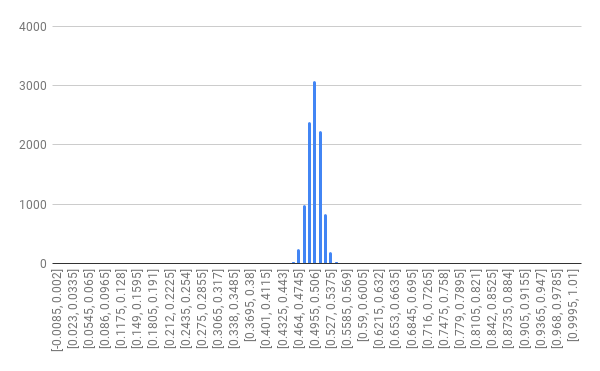

Histogram of $V_{10000}$ (10000 samples)

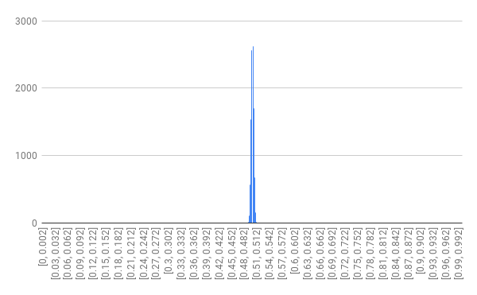

Comparing with $V_{5}$, $V_{495}$ has more samples which are close to 0.5.

### 14

> 1. First, let's get a feel for this by printing out example values: add code in [RandomSequence5.java](https://www2.seas.gwu.edu/~simhaweb/contalg/modules/module1/examples/RandomSequence5.java). Does this appear to converge to a number for large values of $n$?
> 2. Next, let's examine the histograms for various values of n. Modify [Histogram.java](https://www2.seas.gwu.edu/~simhaweb/contalg/modules/module1/examples/Histogram.java) and to compute and print a histogram for $W_{n}$ with different numbers of samples: 10, 100 and 10000.
>    - How does the histogram for $W_{5}$ differ from the histogram for $W_{493}$ ?
>    - Print and then plot the histogram for $W_{10000}$.
> 3. We'll now change the type of random generation. In [Histogram2.java](https://www2.seas.gwu.edu/~simhaweb/contalg/modules/module1/examples/Histogram2.java), create a means of generating $U'_{n}$ , a random variable that's different from $U_{n}$.
>    - Then define $V'_{n}=\frac{1}{n}(U'_{1}+...+U'_{n})$.
>    - Then, run your program to estimate what $V_{n}$ is converging to. Let's call this number $\mu$.
>    - Now define $W'_{n}=\sqrt{n}(V'_{n}-\mu)$.
>    - Plot the histograms for $W'_{5}$ and $W'_{493}$.

**(1)**

See file `RandomSequence5.java`.

Yes, it converges to a number for large values of $n$.

**(2)**

See file `Histogram.java`.

Histogram of $W_{5}$ (10000 samples)

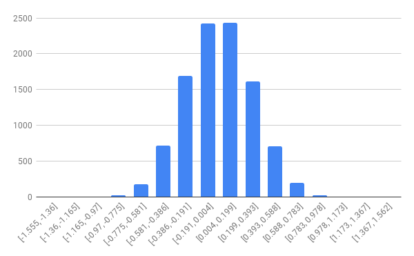

Histogram of $W_{495}$ (10000 samples)

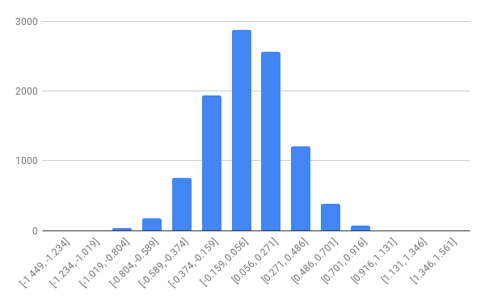

Histogram of $W_{10000}$ (10000 samples)

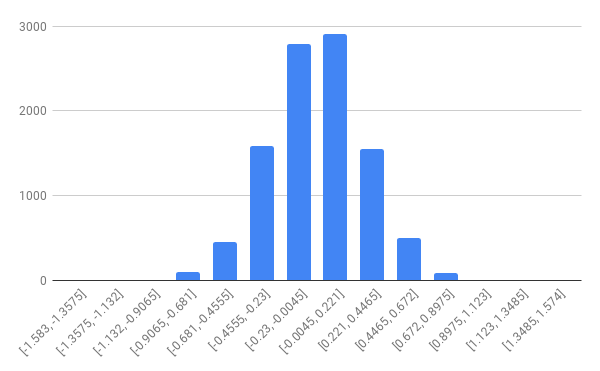

There is little difference between histograms for $W_{5}$, $W_{493}$ and $W_{10000}$.

**(2)**

See file `Histogram2.java`.

$U'_{n}$ is defined as a random in $[0, 10]$.

$\mu$ is set as 5, which means $W'_{n}=\sqrt{n}(V'_{n}-5)$.

Histogram of $W'_{5}$ (10000 samples)

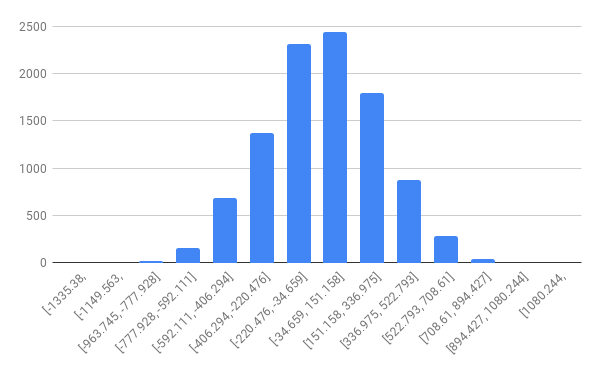

Histogram of $W'_{493}$ (10000 samples)

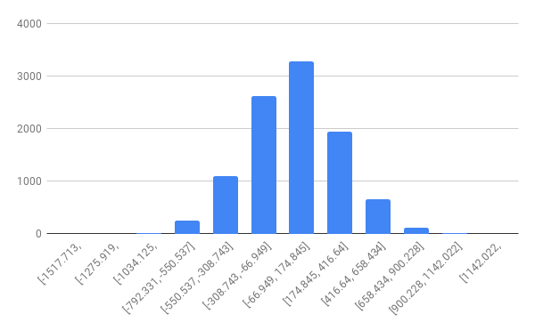

### 15

> What types of "odd" cases do we have to worry about in real life? Can you think of a function such that the number 2 is a "bad" input value (i.e., shouldn't be allowed)?

For example, $f(x)=\frac{1}{x-2}$.

### 16

> Get out a piece of paper and draw (by hand) the function $f(x) = 3x^{2}+5$. What are the domain and range of this function? How much of the domain and range did you sketch out?

$f(x) = 3x^{2}+5$

domain: $(-\infty,+\infty)$

range: $[5,+\infty)$

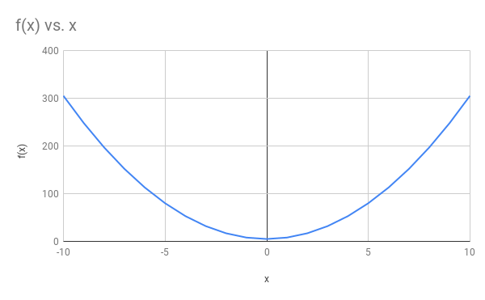

### 17

> Download, compile and execute the above program. Change the last line to make the output friendlier.

Source Code:

``` java
import java.util.*;

public class FunctionExample1 {

    public static void main(String[] argv) {
        // This is what reads from the keyboard:
        Scanner scanner = new Scanner(System.in);

        // Put out a prompt:
        System.out.print("Enter x: ");

        // Read in a "double" (real) value:
        double x = scanner.nextDouble();

        // Compute function:
        double f = 3 * x * x + 5;

        // Print result (output):
        System.out.println("f(x) = " + f);
    }

}
```

### 18

> Modify the above program to compute the function $f(x)=\frac{1}{(x-2)}$. Use the program to generate some values and draw a graph of the function. What happens when you enter $x=2$?
>

See file `FunctionExample1`.

Running result:

```
Enter x: 0
f(x) = -0.5
Enter x: 1
f(x) = -1.0
Enter x: 2
f(x) = Infinity
Enter x: 3
f(x) = 1.0
Enter x: 4
f(x) = 0.5
```

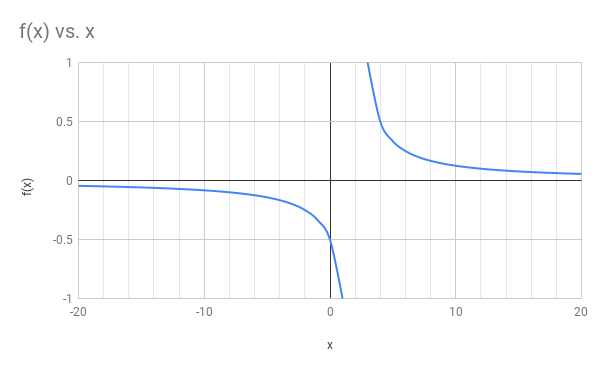

### 19

> Modify the above program to print out function values for x in the range [−10, −1].

See file `FunctionExample2`.

Running result:

```
x   f(x)
---------
-10.0  305.0
-9.0  248.0
-8.0  197.0
-7.0  152.0
-6.0  113.0
-5.0  80.0
-4.0  53.0
-3.0  32.0
-2.0  17.0
-1.0  8.0
```

### 20

> Modify the above program to show the shape of the function $f(x)=\frac{1}{(x-2)}$ in range [0, 5]. You will need to download [Function.java](https://www2.seas.gwu.edu/~simhaweb/contalg/useful/Function.java) and [SimplePlotPanel.java](https://www2.seas.gwu.edu/~simhaweb/contalg/useful/SimplePlotPanel.java).

See file `FunctionExample3.java`.

Running result:

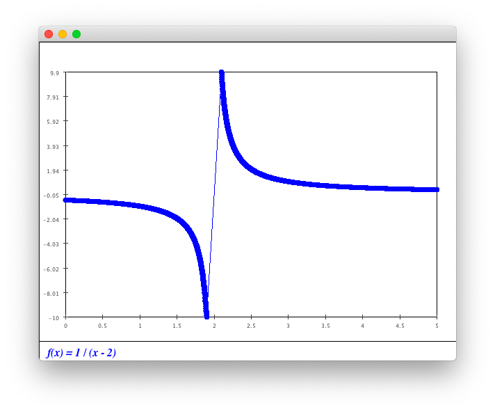

### 21

> For each of the functions below, generate 100 values in the range [0, 10] and feed them into a `Function` object. Then, display the result.
>
> - $f(x)=3x+5$
> - $f(x)=x^{2}−2$
> - $f(x)=\frac{5}{x^{2}}$
> - $f(x)=e^{-2x}$
>
> Use `Function.show(F,G,...)` to plot multiple `Function`'s together.

See file `FunctionExample4.java`.

Running result:

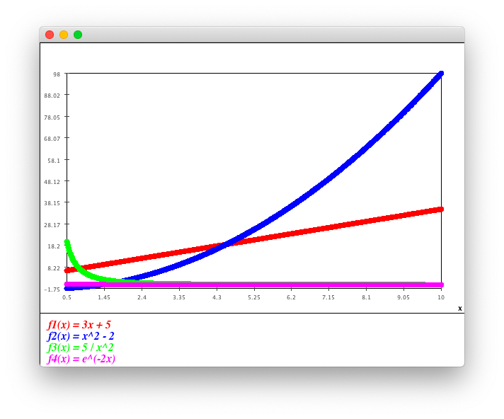

### 22

> Modify the above code to draw $f(x)=3x+5$ and $g(x)=3x+10$ in the range [0, 10]. Use only 50 points.

See `FunctionComparison.java`.

Running result:

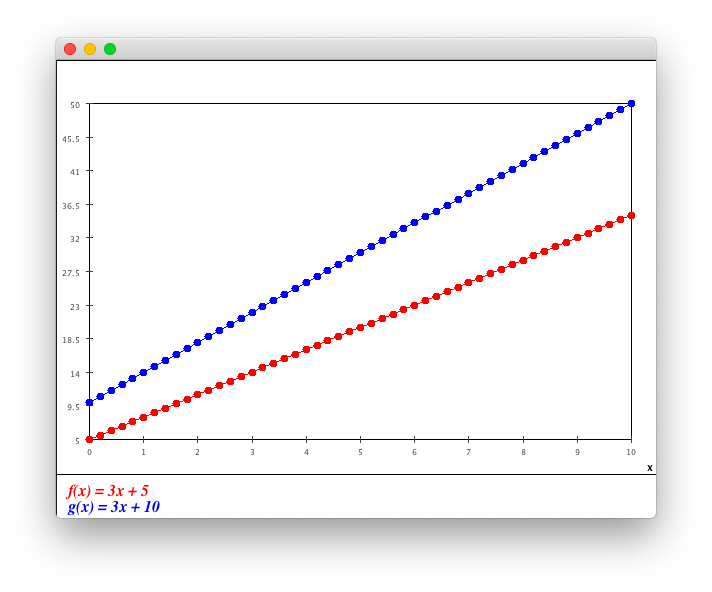

### 23

> Did it matter whether we used $g−f$ or $f−g$ above? What is the distance between the functions $f(x)=3x+5$ and $h(x)=20$ ? What happens when you use $f−h$ vs. $h−f$ ?

Values of $g−f$ and $f−g$ are opposite.

Values of $f−h$ and $h−f$ are opposite.

### 24

> Coding exercise: modify the above example so that the loop has only one line of code (and is therefore more compact).

Source code:

``` java
public class FunctionComparison2 {

    public static void main(String[] argv) {
        // Initialize sum.
        double distance = 0;

        // Generate 50 values in the range [0,10]
        for (double x = 0; x <= 10; x += 0.2) {
            distance = distance + ((3 * x + 10) - (3 * x + 5));
        }

        System.out.println("Distance: " + distance);
    }

}
```

### 25

> Modify the example to use 100 points instead of 50. What do you notice? What does this tell you about the method we're using to compute distance?

See `FunctionComparison2.java`.

The "distance" of using 100 points is 2 times as which using 50 points.

It seems that the method is not appropriate to calculate distance.

### 26

> Modify the above example as follows:
>
> - First, use 100 points instead of 50. Then use 1000 points. What do you observe?
> - Next, change the range from [0, 10] to [0, 5]. What is the distance between $f$ and $g$ using this range?
> - Repeat the above for $f$ and $h(x)=20$. Does the distance measure for functions make sense?

Origin:

See file `FunctionComparison3.java`.

```
Distance f to g: 5.1
```

First:

``` java
public class FunctionComparison3 {

    public static void main(String[] argv) {
        // Initialize sum.
        double sum = 0;

        // Generate 100 values in the range [0,10]
        for (double x = 0; x <= 10; x += 0.1) {
            double f = 3 * x + 5;
            double g = 3 * x + 10;
            sum += Math.abs(f - g);
        }

        // Compute the average distance:
        double distance = sum / 100;

        System.out.println("Distance f to g: " + distance);
    }

}
```

```
Distance f to g: 5.05
```

``` java
public class FunctionComparison3 {

    public static void main(String[] argv) {
        // Initialize sum.
        double sum = 0;

        // Generate 1000 values in the range [0,10]
        for (double x = 0; x <= 10; x += 0.01) {
            double f = 3 * x + 5;
            double g = 3 * x + 10;
            sum += Math.abs(f - g);
        }

        // Compute the average distance:
        double distance = sum / 1000;

        System.out.println("Distance f to g: " + distance);
    }

}
```

```
Distance f to g: 5.005
```

Next,

``` java
public class FunctionComparison3 {

    public static void main(String[] argv) {
        // Initialize sum.
        double sum = 0;

        // Generate 50 values in the range [0,5]
        for (double x = 0; x <= 10; x += 0.1) {
            double f = 3 * x + 5;
            double g = 3 * x + 10;
            sum += Math.abs(f - g);
        }

        // Compute the average distance:
        double distance = sum / 50;

        System.out.println("Distance f to g: " + distance);
    }

}
```

```
Distance f to g: 10.1
```

It is 2 times as which of using range [0,5].

It seems that the method does not make sence.

### 27

> Now modify the above example to use [0, 5] as the range:
>
> - What is the distance between $f$ and $g$ using this range?
> - Next, use 100 points instead of 50. Then use 1000 points. Is our modified measure severely affected by the number of points?

See file `FunctionComparison4.java`.

```
Distance f to g: 51.0
```

Next,

``` java
public class FunctionComparison4 {

    public static void main(String[] argv) {
        // Initialize sum.
        double sum = 0;

        // Generate 100 values in the range [0,10]
        for (double x = 0; x <= 10; x += 0.1) {
            double f = 3 * x + 5;
            double g = 3 * x + 10;
            sum += Math.abs(f - g);
        }

        // Compute the average distance, multiplied by length of interval:
        double distance = (10 - 0) * sum / 100;

        System.out.println("Distance f to g: " + distance);
    }

}

```

```
Distance f to g: 50.5
```

``` java
public class FunctionComparison4 {

    public static void main(String[] argv) {
        // Initialize sum.
        double sum = 0;

        // Generate 1000 values in the range [0,10]
        for (double x = 0; x <= 10; x += 0.01) {
            double f = 3 * x + 5;
            double g = 3 * x + 10;
            sum += Math.abs(f - g);
        }

        // Compute the average distance, multiplied by length of interval:
        double distance = (10 - 0) * sum / 1000;

        System.out.println("Distance f to g: " + distance);
    }

}
```

```
Distance f to g: 50.05
```

Our modified measure does not severely affect the result by the number of points.

### 28

> Why does this produce exactly the same result?

It produce exactly the same result since interval is included to counteract the influence of using more points.

(By the way, I fix a bug, see `FunctionComparison5.java`)

###29

> Coding exercise: Change the second line to
>
> `double interval = (10 - 0) / 50;`
>
> Then compile and execute - what do you observe? Explain.

The result will be 0, since `interval` is 0.

When dividing two integers, Java uses **integer division** and discard fractional part.

### 30

> Consider the function $h(x)=20$ in the range [0, 10]. Draw this on paper - you should have a rectangle of width 10 and height 20. Next, use 4 equally-spaced x-values and hand-execute the above program with $h(x)$ instead of $f(x)$. Can you relate the calculations to the area of the rectangle?
>

The area surround by $y=h(x),y=0,x=0,x=10$ is 200.

The result of calculation is also 200.

They are equivalent.

### 31

> Now consider the function $f(x)=3x+5$ in the range [0, 10]. Draw this on paper and repeat the above steps (using 4 intervals) to compute the distance to the x-axis. How does this relate to the area? What happens when we use more intervals (e.g., 50 intervals)? Try 50 intervals, then try 1000 intervals. Can you calculate the area exactly by hand?

The area surrounded by $y=f(x),y=0,x=0,x=10$ is 200.

Results of calculation are:

- 4 divisions: 250
- 50 divisions: 204
- 1000 divisions: 200.2

The larger the number of divisions is, the closer the result to 200.

### 32

> Draw the two functions $f(x)=3x+5$ and $g(x)=20$ on paper. What is the relationship between our distance measure and area?

The result tend to be closer to the actual area when the number of divisions becomes larger.

### 33

> Why is this true?

It is clear that they are similar triangles.

### 34

> Modify the above program to print out $sin(\frac{4\pi}{3})$ and answer the following:
>
> - Why is the result negative? What does it have to do with actual angles and our earlier definition of the sin function?
> - Convert the angle from radians to degrees (perhaps by modifying the program). Draw the result on paper. See if this helps answering the above question.
> - Modify the code to print out $sin(2\pi+\frac{4\pi}{3})$. Can you explain the result?

See file `SinCos.java`.

The result of $sin(\frac{4\pi}{3})$ is nagitive since $x$ is negative and $r$ is positive.

The result of $sin(\frac{4\pi}{3})$ is equal to which of $sin(2\pi+\frac{4\pi}{3})$ nagitive since these hypotenuse ($r$) both point to the same direction ($2\pi$ rad = 360 deg).

### 35

> Explain why both functions are periodic (that is, the structure repeats). What is the period (the size of the interval after it repeats)?

Both functions are periodic since hypotenuse ($r$) rotates around the origin once and once.

The period is $2\pi$ rad (360 deg).

### 36

> Use the above approach to find the minimum value of cos(x) for x in the range [0, 2π]. What could we do to make the result more accurate?

See file `CosMaximum.java`.

Running result:

```
Max value 1.0 occurred at x=0.0
```

Let the step of loop become smaller to make the result more accurate.

### 37

> What good are such "rules"? Why are they useful? Why not just use the data directly?

We can use such "rules" to calculate any data rather than list them all.

### 38

> Can you guess the function that produced this data:
>
> | x    | f(x)  |
> | ---- | ----- |
> | 1.0  | 5.86  |
> | 2.0  | 9.00  |
> | 3.0  | 12.14 |
> | 4.0  | 15.28 |
> | 5.0  | 18.43 |
> | 6.0  | 21.57 |

At first, plot them.

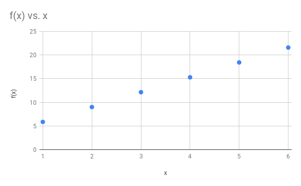

It seeme that $f(x)=kx+b$.

Subtitute $(1.0,5.86)$ and $(6.0,21.57)$.
$$
\begin{align*}
5.86&=1.0k+b\\
21.57&=6.0k+b\\
\end{align*}
$$
Solve it.
$$
\begin{align*}
k=3.142\\
b=2.718\\
\end{align*}
$$


The result is $f(x)=3.142x+2.718$.

### 39

> Identify the linear function in the previous exercise.

(See exercise 38.)

### 40

> Draw the graph for this data:
>
> | d      | v        |
> | ------ | -------- |
> | 8.33   | 1666.67  |
> | 22.22  | 3666.67  |
> | 23.61  | 4833.33  |
> | 30.55  | 5000     |
> | 36.81  | 5166.67  |
> | 47.22  | 8000     |
> | 69.44  | 11333.33 |
> | 105.56 | 19666.67 |

Source Code:

``` java
public class DataAnalysis {

    public static void main(String[] argv) {
        // Make a Function object.
        Function F = new Function("mystery");

        // Put the data in.
        F.add(8.33, 1666.67);
        F.add(22.22, 3666.67);
        F.add(23.61, 4833.33);
        F.add(30.55, 5000);
        F.add(36.81, 5166.67);
        F.add(47.22, 8000);
        F.add(69.44, 11333.33);
        F.add(105.56, 19666.67);
        // Display it.
        F.show();
    }

}
```

Running result:

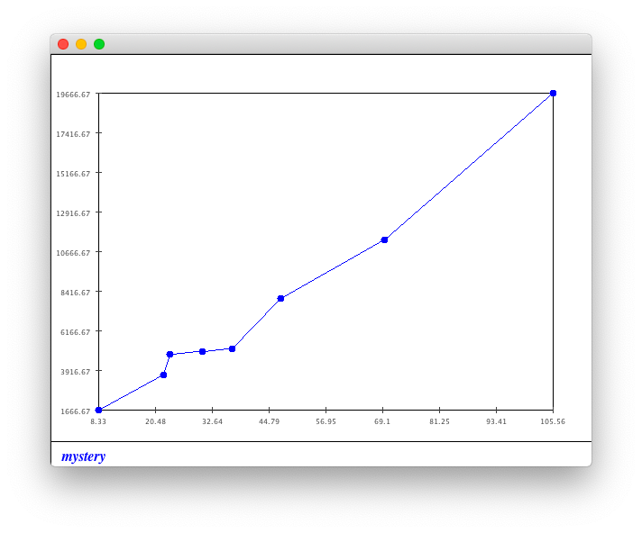

The curve is non-linear.

### 41

> Draw the graph for this data:
>
> | x    | f(x) |
> | ---- | ---- |
> | 1.0  | 1    |
> | 2.0  | 13   |
> | 3.0  | 33   |
> | 4.0  | 61   |
> | 5.0  | 97   |

See file `DataAnalysis.java`.

Running result:

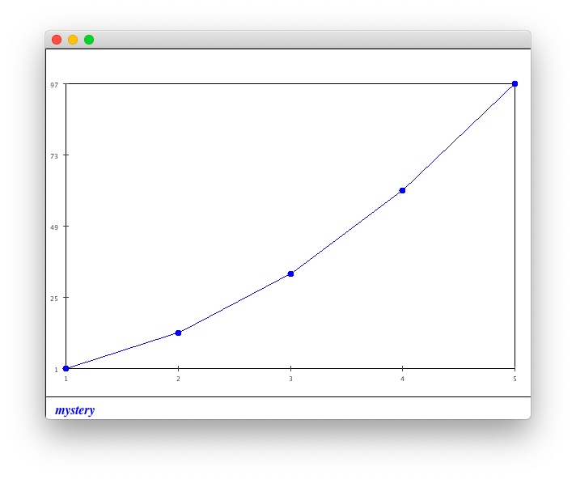

The curve is non-linear.

### 42

> Write a small program to compute $x^{2}+(f(x))^{2}$.
>

See `Exercise42.java`.

Running result:

```
x = 0.5, f(x) = 4.97, x^2 + (f(x))^2 = 0.2524.700899999999997
x = 1.5, f(x) = 4.77, x^2 + (f(x))^2 = 2.2522.752899999999997
x = 2.5, f(x) = 4.33, x^2 + (f(x))^2 = 6.2518.7489
x = 3.5, f(x) = 3.57, x^2 + (f(x))^2 = 12.2512.7449
x = 4.5, f(x) = 2.18, x^2 + (f(x))^2 = 20.254.752400000000001
```

### 43

> Execute the above program. Does the function $g(x)$ look familiar? Modify the above code to fill in the $f$ and $g$ values into Function objects and display them.

See `Diff.java`.

Running result:

```
x=0.0  g(x)=0.029999999999999995
x=1.0  g(x)=6.030000000000024
x=2.0  g(x)=12.029999999999674
x=3.0  g(x)=18.029999999999546
x=4.0  g(x)=24.029999999999774
x=5.0  g(x)=30.02999999999929
x=6.0  g(x)=36.03000000000094
x=7.0  g(x)=42.029999999999745
x=8.0  g(x)=48.02999999999997
x=9.0  g(x)=54.0300000000002
x=10.0  g(x)=60.03000000000043
```

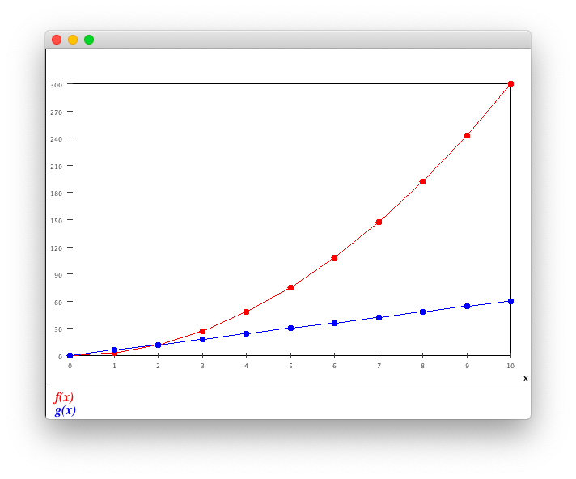

### 44

> - Use d = 0.01 and plot the derivative function $g(x)$ along with $f(x)$ when $f(x) = 3x^{2}+5$. Compare this derivative function with that of $f(x)=3x^{2}$ . Explain what you observe.
> - Use two points on the derivative function and write down the function as a formula.
> - Explore what happens with different $d$ values, for example try $d=1$, $d=0.1$, $d=0.0001$, $d=0.00001$.

By change file `Diff.java` and observe running result. I find that:

- By calculating, $g(x)=6x+0.03$, which is same for $f(x)=3x^{2}$ and $f(x)=3x^{2}+5$.
- $g(x)$ tends to be close to $g(x)=6x$ when $d$ becomes smaller.

### 45

> Suppose the derivative of $f(x)$ is $g(x)=−sin(x)$ and that we know $f(0)=1$. Modify the above code to compute $f(x)$ in the interval $[0,2\pi]$ and display the result.

See file `Integration2.java`.

Running result:

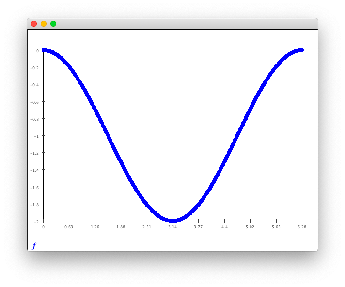

It seems that $f(x)=\cos(x)$.

### 46

> Download [Simulator.class](https://www2.seas.gwu.edu/~simhaweb/contalg/modules/module1/examples/Simulator.class) and [UnknownFunctionDerivative.java](https://www2.seas.gwu.edu/~simhaweb/contalg/modules/module1/examples/UnknownFunctionDerivative.java), and execute. What is the relationship between $x$ and $f(x)$?

It seems that $f(x)=\frac{1}{3}x^{3}+b$ which $b$ is an arbitrary constant.

### 47

> How can you simplify and speed up the code above? What does the Java library use to compute sin(x)? Compare the accuracy of the above function with Java's sin function.

See `Exercise47.java`.

Running result:

```
x = 0.0, Math.sin(x) = 0.0000000, sin(x) = 0.0000000, sinQuick(x) = 0.0000000
x = 0.1, Math.sin(x) = 0.0998334, sin(x) = 0.0998334, sinQuick(x) = 0.0998334
x = 0.2, Math.sin(x) = 0.1986693, sin(x) = 0.1986693, sinQuick(x) = 0.1986693
x = 0.3, Math.sin(x) = 0.2955202, sin(x) = 0.2955202, sinQuick(x) = 0.2955202
x = 0.4, Math.sin(x) = 0.3894183, sin(x) = 0.3894183, sinQuick(x) = 0.3894183
x = 0.5, Math.sin(x) = 0.4794255, sin(x) = 0.4794255, sinQuick(x) = 0.4794255
x = 0.6, Math.sin(x) = 0.5646425, sin(x) = 0.5646424, sinQuick(x) = 0.5646424
x = 0.7, Math.sin(x) = 0.6442177, sin(x) = 0.6442176, sinQuick(x) = 0.6442176
x = 0.8, Math.sin(x) = 0.7173561, sin(x) = 0.7173557, sinQuick(x) = 0.7173557
x = 0.9, Math.sin(x) = 0.7833269, sin(x) = 0.7833258, sinQuick(x) = 0.7833258
x = 1.0, Math.sin(x) = 0.8414710, sin(x) = 0.8414683, sinQuick(x) = 0.8414683
x = 1.1, Math.sin(x) = 0.8912074, sin(x) = 0.8912009, sinQuick(x) = 0.8912009
x = 1.2, Math.sin(x) = 0.9320391, sin(x) = 0.9320251, sinQuick(x) = 0.9320251
x = 1.3, Math.sin(x) = 0.9635582, sin(x) = 0.9635294, sinQuick(x) = 0.9635294
x = 1.4, Math.sin(x) = 0.9854497, sin(x) = 0.9853938, sinQuick(x) = 0.9853938
x = 1.5, Math.sin(x) = 0.9974950, sin(x) = 0.9973912, sinQuick(x) = 0.9973912
x = 1.6, Math.sin(x) = 0.9995736, sin(x) = 0.9993886, sinQuick(x) = 0.9993886
x = 1.7, Math.sin(x) = 0.9916648, sin(x) = 0.9913464, sinQuick(x) = 0.9913464
x = 1.8, Math.sin(x) = 0.9738476, sin(x) = 0.9733168, sinQuick(x) = 0.9733168
x = 1.9, Math.sin(x) = 0.9463001, sin(x) = 0.9454394, sinQuick(x) = 0.9454394
x = 2.0, Math.sin(x) = 0.9092974, sin(x) = 0.9079365, sinQuick(x) = 0.9079365
x = 2.1, Math.sin(x) = 0.8632094, sin(x) = 0.8611059, sinQuick(x) = 0.8611059
x = 2.2, Math.sin(x) = 0.8084964, sin(x) = 0.8053114, sinQuick(x) = 0.8053114
x = 2.3, Math.sin(x) = 0.7457052, sin(x) = 0.7409725, sinQuick(x) = 0.7409725
x = 2.4, Math.sin(x) = 0.6754632, sin(x) = 0.6685506, sinQuick(x) = 0.6685506
x = 2.5, Math.sin(x) = 0.5984721, sin(x) = 0.5885339, sinQuick(x) = 0.5885339
x = 2.6, Math.sin(x) = 0.5155014, sin(x) = 0.5014200, sinQuick(x) = 0.5014200
x = 2.7, Math.sin(x) = 0.4273799, sin(x) = 0.4076956, sinQuick(x) = 0.4076956
x = 2.8, Math.sin(x) = 0.3349882, sin(x) = 0.3078138, sinQuick(x) = 0.3078138
x = 2.9, Math.sin(x) = 0.2392493, sin(x) = 0.2021696, sinQuick(x) = 0.2021696
x = 3.0, Math.sin(x) = 0.1411200, sin(x) = 0.0910714, sinQuick(x) = 0.0910714
x = 3.1, Math.sin(x) = 0.0415807, sin(x) = -0.0252893, sinQuick(x) = -0.0252893
```

### 48

> Download [AccelCar.java](https://www2.seas.gwu.edu/~simhaweb/contalg/modules/module1/examples/AccelCar.java), [Function.java](https://www2.seas.gwu.edu/~simhaweb/contalg/useful/Function.java) and [SimplePlotPanel.java](https://www2.seas.gwu.edu/~simhaweb/contalg/useful/SimplePlotPanel.java). This is a simple model of an accelerating vehicle - the goal is to start at the left and reach the right in the least time possible but also such that the velocity at the end is as close to zero as possible.
>
> - Compile and execute `AccelCar`. Then try to determine a good acceleration "function" by hand.
> - Download [MyController.java](https://www2.seas.gwu.edu/~simhaweb/contalg/modules/module1/examples/MyController.java), compile and execute. Examine the code - you should see a sample acceleration function.
> - Implement a better acceleration function in `MyController`.
> - How would you systematically search for the optimal acceleration function?'

See `MyController.java`.

Running result:

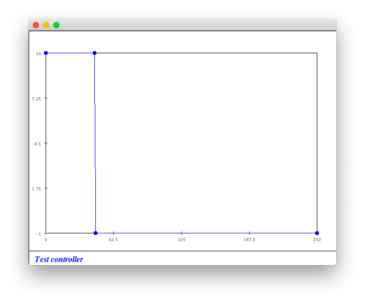

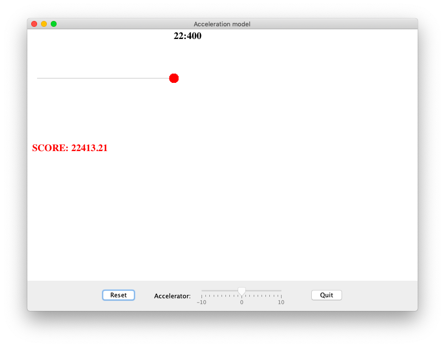

There are 4 functions included by this problem:

- acceleration vs. displacement: $a(s)$ - accepted by `MyController.java`
- acceleration vs. time: $a(t)$
- velocity vs. time: $v(t)$
- distance vs. time: $s(t)$

Based on physical laws:
$$
\begin{align*}
v(t)&=\int_{0}^{t}a(t)\mathrm{d}t\\
s(t)&=\int_{0}^{t}v(t)\mathrm{d}t\\
\end{align*}
$$
Here are restriction:

- The destination is $S=250$.
- There must be a time $T$ to satisfy $s(T)=S$.
- $v(T)=0$.
- $-10 < a(t) <10$

The problem is converted to:

- Find a function $a(t)$ which satisfies all restrictions above. At the same time, $a(t)$ should lead to the smallest $T$.
- Convert $a(t)$ to $a(s)$ based on physical laws.

 Based on the discription below, we may find an optimal solution.

### 49

> Construct a sequence of distinct functions so that the limit is $f(x)=x$.

Here are some examples of such functions:

$F(x)=\frac{1}{2}x^{2}$

$F(x)=\frac{1}{2}x^{2}+1$

$F(x)=\frac{1}{2}x^{2}-1$

