# Module 02

### 01

> Download and execute [Arm.java](https://www2.seas.gwu.edu/~simhaweb/contalg/modules/module2/examples/Arm.java).
>
> - How would you describe the initial "configuration"?
> - Find a configuration that meets the goal (where the arm tip is on the goal). How would you technically describe this particular final configuration?
> - See if you can describe a few intermediate configurations. Then, work with the person next to you: communicate the intermediate positions so that s/he follows the same sequence of actions to reach the goal.

Define each arm (from low to high) as $a_{1}, a_{2}, a_{3}, a_{4}, a_{5}$. Each arm has an angle $r​$ between itself and horizontal line. By using this, we can describe all configurations.

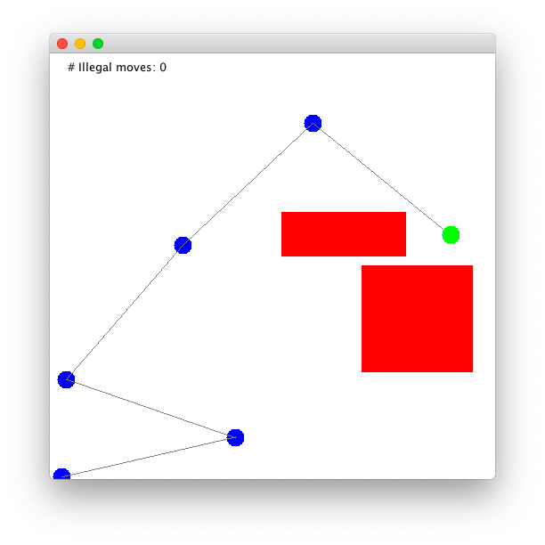

### 02

> Download and unpack [planning.jar](https://www2.seas.gwu.edu/~simhaweb/contalg/modules/module2/examples/planning.jar), then execute `PlanningGUI`. Familiarize yourself with the three planning problems, and experiment with different goal configurations: generate "easy" and "hard" configurations to reach from the initial configuration. How can you tell what's easy or hard?

For maze problem, the degree of difficulty could be the number of obstacles.

For 8-puzzle problem, the degree of difficulty is same.

For arm problem, the degree of difficulty the number of arms and obstacles.

### 03

> Find a goal state for the arm problem. How does one specify a complete description of this state?
>

For example, $(250,30)$ is a goal state for the arm problem, which defines the location  of the destination.

### 04

> How many possible states are there for each of the three problems?

For maze problem, the number of states is the number of available grids.

For 8-puzzle problem, the number of states is $9!​$.

For arm problem, there are infinite states since coordinates are real numbers.

### 05

> What is the size of the neighborhood for each of the three problems?

For maze problem, the size of the neighborhood could be $1,2,3,4$.

For 8-puzzle problem, the size of the neighborhood could be $2,3,4$.

For arm problem, the size of the neighborhood is infinite since coordinates are real numbers.

### 06

> Consider the starting state in the 8-puzzle demo. Draw this state on paper, draw all its neighbors and all neighbors of its neighbors.

```
starting state
1 2 3
4 7 6
5 8

neighbor 1
1 2 3
4 7 6
5   8

neighbor 2
1 2 3
4 7
5 8 6
```

### 07

> Compile and load `MazeHandPlanner` into `PlanningGUI` for the maze problem.
>
> - Click on "Plan" and then click on "Next" repeatedly to see what this algorithm produced.
> - Examine the code in MazeHandPlanner. Create a different maze to solve, and hand-code the solution in `MazeHandPlanner`.
> - Examine the code in `PuzzleHandPlanner`. Observe how states are generated and entered into the plan.

Create a different maze to solve.

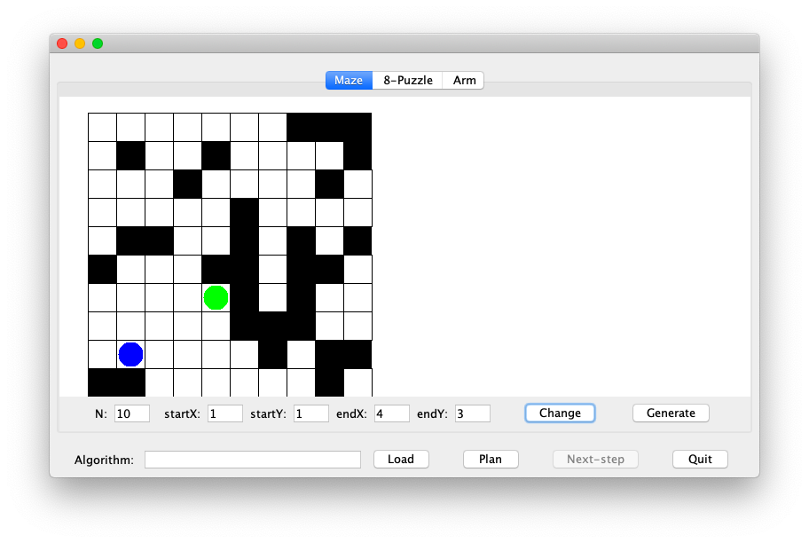

One of the solution is written in file `MazeHandPlanner.java`.

By observing file `PuzzleHandPlanner`, states of 8-puzzle problem are defined as a two-dimensional array (0 is used to indicate the empty grid).

### 08

> Compile and load `BFSPlanner` into `PlanningGUI` for the maze problem. Verify that it finds the solution by clicking on the "next" button once the plan has been generated. Likewise, apply BFS to an instance of the puzzle problem and verify the correctness of the plan generated.

All plans generated by `BFSPlanner` are correct.

### 09

> Implement DFS by modifying the BFS code.
>
> - Compare BFS and DFS using a variety of puzzle-problem instances.
> - Identify both the number of moves (time taken) and the number of steps in the path.
> - Write recursive pseudocode for DFS. Is there an advantage (or disadvantage) to using recursion?

Pseudocode of DFS:

``` pseudocode
Algorithm: DFS (start, goal)
	Initialize frontier and visited
	frontier.add (start)
	currentState = start
	if currentState = goalState
		path = makeSolution ()
		return path
	endif
	while frontier not empty
		next = one neighbor s of currentState
			which is not in frontier and visited
		if next = null
			currentState = frontier.removeLast ()
		else
			currentState.add(next)
			if currentState = goalState
				path = makeSolution ()
				return path
			endif
		endif
	endwhile
	return null // No solution
```

DFS is not a good strategy for solving puzzle-problem. It may take more time (generate more "useless" nodes) and miss the optimal solution (find a longer path).

Comparing with non-recursive algorithm, recursive algorithm may be easier to understand. However, recursive algorithm may use more space in memory (call stack).

### 10

> Compare the memory requirements of BFS and DFS. In general, which one will require more memory? Can you analyze (on paper) the memory requirements for each?

Comparing with BFS, DFS requires more memory since it may generate more "useless" nodes.

### 11

> Examine the use of the two data structures in BFS and DFS. Identify the operations performed on each of these. How much time is taken for each operation performed on these data structures? Are there data stuctures which take less time?

BFS / DFS

Operation:

- list `frontier`: append item to the end, remove item from the head (DFS) OR the tail (BFS), traverse all items, find out whether an item is existence
- list `visitedStates`: find out whether an item is existence

Data structure which take less time:

- list `frontier`: variable-length array, especially, queue of BFS and stack for DFS
- list `visitedStates`: variable-length array

### 12

> Implement the CBP by adding code to the method `removeBest()` in `CBPlanner.java` that is included in `planning.jar`. Most of the code has been written: you only need to extract the best node from the frontier using the `costFromStart` value in each state (which has already been computed for you).

See file `CBPlanner.java`.

### 13

> Compare BFS with Cost-Based for the puzzle problem.

By executing BFS and Cost-Based for maze problem (define `cost` as the sum of index deference between origin and current loaction), it seems that BFS and Cost-Based are same. State at the tail of list `frontier` (BFS) can always be one with the minimum cost (Cost-Based).

### 14

> Examine the operations on data structures in CBP. Estimate the time needed for these operations. Suggest alternative data structures.

CBP

Operation:

- list `frontier`: append item to the end, remove item in the middle, traverse all items, find out whether an item is existence
- list `visitedStates`: find out whether an item is existence

Alternative data structure:

- list `frontier`: linked list
- list `visitedStates`: variable-length array

### 15

> What is a reasonable estimate of the cost-to-goal for the maze and puzzle problems? That is, from given a state and the goal, what is an estimate of how many moves it would take to get from the state to the goal? Show by example how the estimate can fail in each case.

Defince "distance" as the sum of index (x and y) deference between two grids.

For maze problem, a reasonable estimate of the cost-to-goal is the "distance" between current loaction and destination.

For puzzle problem, a reasonable estimate of the cost-to-goal is the sum of all numbers' "distance" - between where they are and where they should be.

It seems that aforementioned estimates will not fail.

### 16

> In a new file called `CBPlannerAStar.java`, copy over your code from `CBPlanner` and implement the A\* algorithm. Again, you do not need to perform the estimation. Simply use the `estimatedCostToGoal` value in each state (which has already been computed for you).

See file `CBPlannerAStar.java`.

### 17

> Compare the time-taken (number of moves) and the quality of solution produced by each of A* and CBP for the maze and puzzle problems. Generate at least 5 instances of each problem and write down both measures (number of moves, quality) for each algorithm.

Example maze-1:

```
# CBPlanner
Cost: Solution of length=21 found with cost=20.0 after 65 moves

# CBPlannerAStar
Cost: Solution of length=21 found with cost=20.0 after 45 moves
```

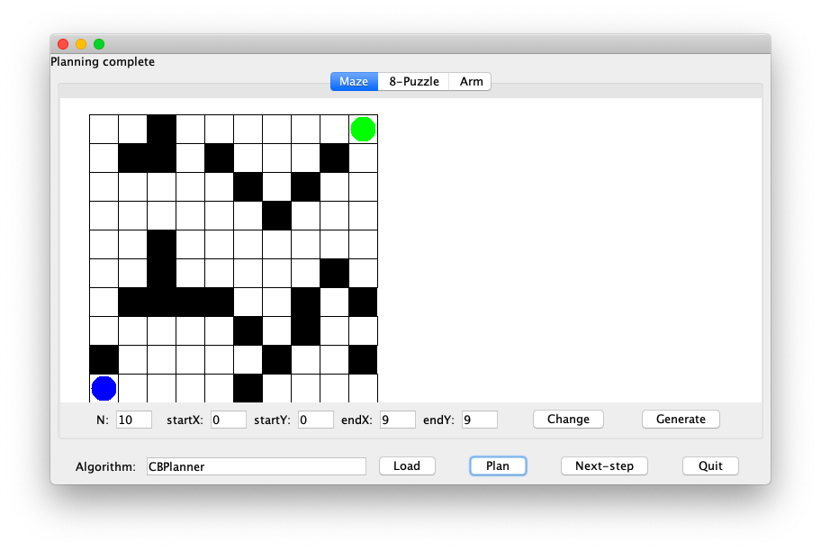

Example maze-2:

```
# CBPlanner
Cost: Solution of length=16 found with cost=15.0 after 35 moves

# CBPlannerAStar
Cost: Solution of length=9 found with cost=8.0 after 15 moves
```

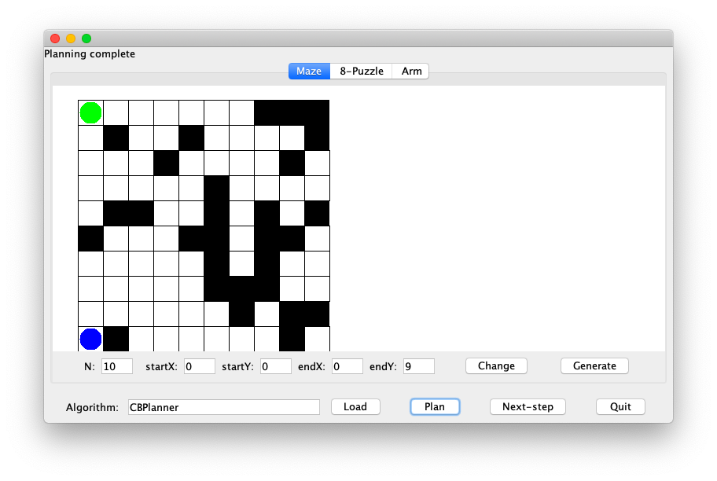

Example maze-3:

```
# CBPlanner
Cost: Solution of length=12 found with cost=11.0 after 25 moves

# CBPlannerAStar
Cost: Solution of length=12 found with cost=11.0 after 12 moves
```

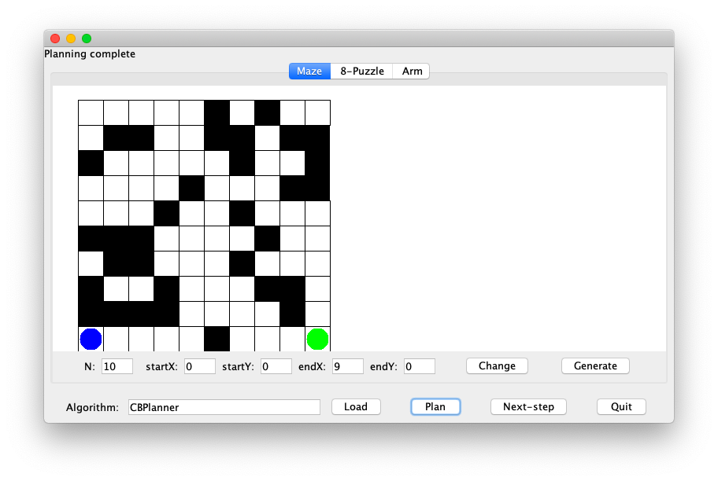

Example maze-4:

```
# CBPlanner
Cost: Solution of length=11 found with cost=10.0 after 40 moves

# CBPlannerAStar
Cost: Solution of length=11 found with cost=10.0 after 22 moves
```

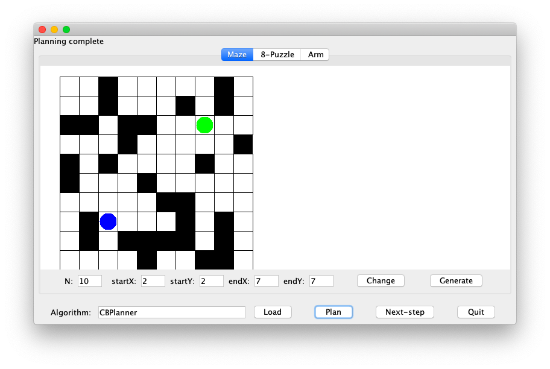

Example maze-5:

```
# CBPlanner
Cost: Solution of length=9 found with cost=8.0 after 59 moves

# CBPlannerAStar
Cost: Solution of length=9 found with cost=8.0 after 23 moves
```

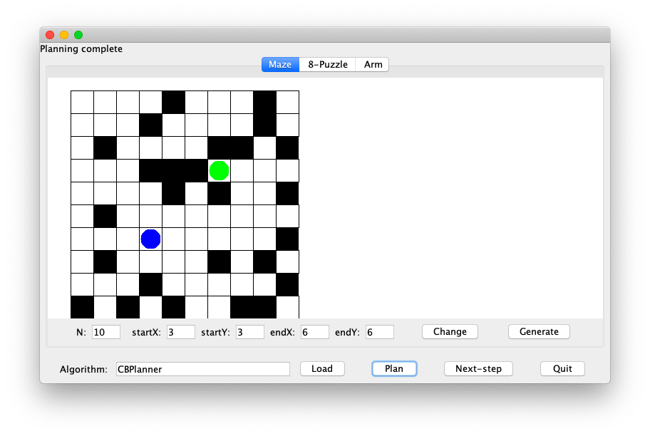

Example puzzle-1:

```
# CBPlanner
Cost: Solution of length=4 found with cost=3.0 after 8 moves

# CBPlannerAStar
Cost: Solution of length=4 found with cost=3.0 after 4 moves
```

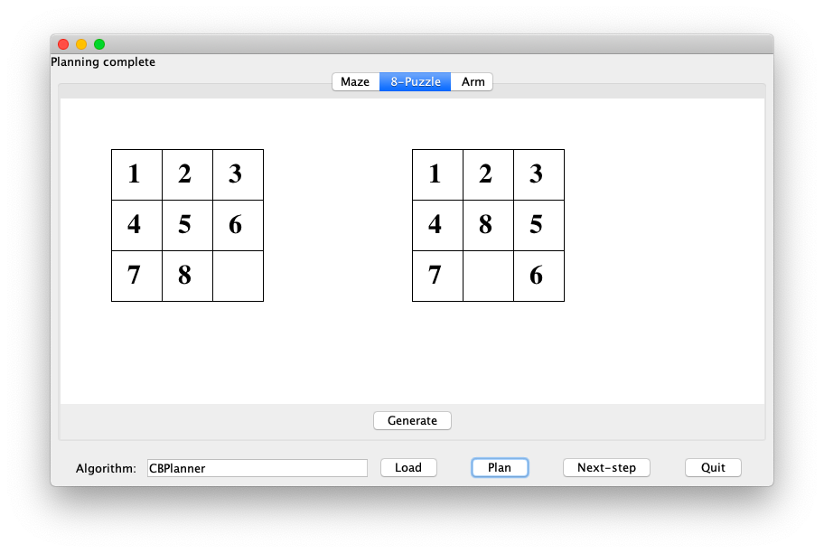

Example puzzle-2:

```
# CBPlanner
Cost: Solution of length=6 found with cost=5.0 after 32 moves

# CBPlannerAStar
Cost: Solution of length=6 found with cost=5.0 after 6 moves
```

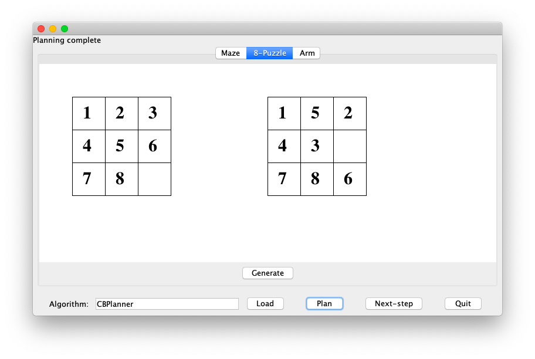

Example puzzle-3:

```
# CBPlanner
Cost: Solution of length=14 found with cost=13.0 after 2742 moves

# CBPlannerAStar
Cost: Solution of length=14 found with cost=13.0 after 177 moves
```


Example puzzle-4:

```
# CBPlanner
Cost: Solution of length=4 found with cost=3.0 after 11 moves

# CBPlannerAStar
Cost: Solution of length=4 found with cost=3.0 after 3 moves
```

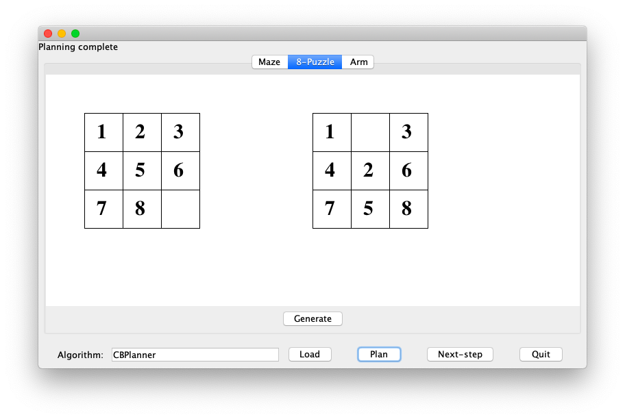

Example puzzle-5:

```
# CBPlanner
Cost: Solution of length=10 found with cost=9.0 after 390 moves

# CBPlannerAStar
Cost: Solution of length=10 found with cost=9.0 after 24 moves
```

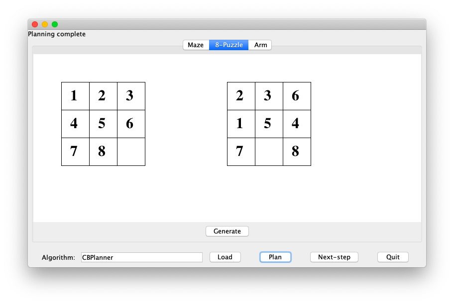

### 18

> Examine the code that produces the `estimatedCostToGoal` for the maze and puzzle problems. Can you suggest an alternative for the puzzle problem?

In puzzle problem, variable `estimatedCostToGoal` of a state is calculated by function `goalCost` which calls function `distance`.

Here is an alternative of function `distance`.

``` java
double distance(int[][] grid1, int[][] grid2) {
    int sum = 0;
    for (int i = 0; i < size; i++) {
        for (int j = 0; j < size; j++) {
            for (int k = 0; k < size; k++) {
                for (int l = 0; l < size; l++) {
                    if (grid1[i][j] == grid2[k][l]) {
                        sum += Math.abs(i - k);
                        sum += Math.abs(j - l);
                    }
                }
            }
        }
    }
    return sum;
}
```

### 19

> Create an example of the maze problem and show that DFS can be arbitrarily worse than optimal. What "arbitrarily worse" means: for any number x, you can find a maze problem example where DFS performs x% worse than than optimal.

For example:

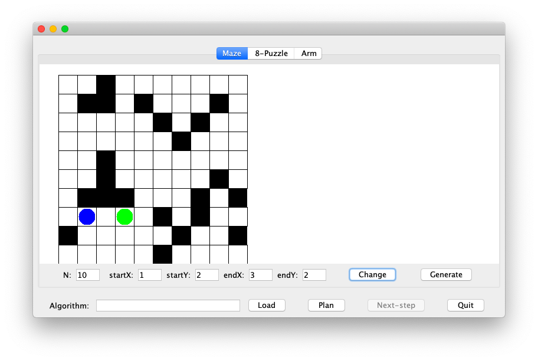

The optimal solution is: $(1,2)\rightarrow (2,2)\rightarrow (3,2)​$, 2 steps.

One of the solution made by DFS might be: $(1,2)\rightarrow (1,1)\rightarrow (2,1)\rightarrow (3,1)\rightarrow (3,2)$, 4 steps.

It is clear that DFS can be arbitrarily worse than optimal.

### 20

> Compare BFS, CBP and A* on the arm problem. Initially, use a simple target (a short distance up the y-axis). Gradually make the target harder.

After several experiments from simple to hard, it seems that A* uses less planning time than BFS and CBP. Also, by comparing planning results, A* gets the best one.

### 21

> Identify the part of the code that computes the neighbors of a state in `ArmProblem.java`. Change the 8-neighborhood to a 4-neighborhood (N,S,E,W) and compare. In the CBP code, you can uncomment the "draw" line to see what the screen looks like when the algorithm is in action.

8-neighborhood

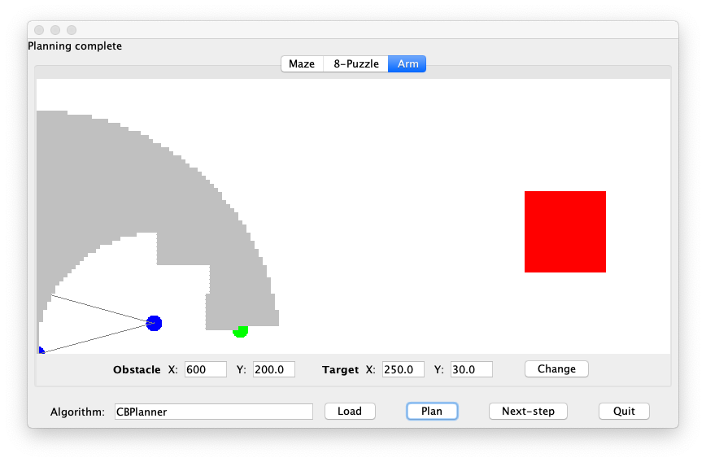

4-neighborhood

Change function `getNeighbors` in file `ArmProblem.java` as:

``` java
public ArrayList<State> getNeighbors(State state) {
    ArmState a = (ArmState) state;
    ArrayList<State> neighbors = new ArrayList<State>();

    // Look at the 4 neighboring points (N, S, E, W) at distance (+- delta, +-delta).
    for (int i = numNodes - 1; i > 1; i--) {
        for (double delX = -delta; delX <= delta; delX += delta) {
            for (double delY = -delta; delY <= delta; delY += delta) {
                if (delX != 0 && delY != 0) {
                    continue;
                }
                ArmState b = makeState(a, i, delX, delY);
                if (isValid(b)) {
                    b.costFromStart = a.costFromStart + delta;
                    b.estimatedCostToGoal = b.tipDistance(targetX, targetY);
                    neighbors.add(b);
                }
            }
        }
    }

    return neighbors;
}

```

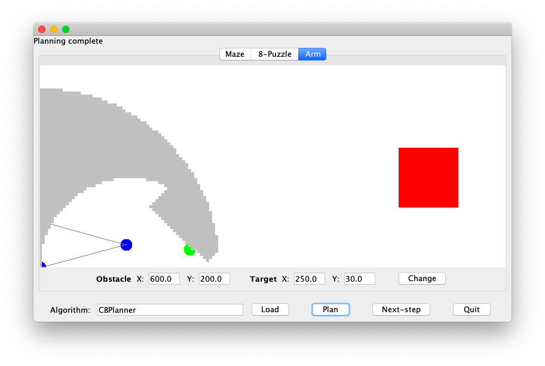

### 22

> How do we know we have visited a state before? How and where is equality-testing performed in the code? What makes this equality-test different from the test used in the maze and puzzle problems?

Comparing with the maze and puzzle problems, the equality-testing is "distance small enough" rather than "exactly equal". The reason is that the space of the arm problem is continuous, and coordinates are real numbers. In computer, real numbers are stored as float/double (IEEE 754) and loss of precision always exists. As a result, "exactly equal" is not appropriate in this problem.

### 23

> Why is this true?

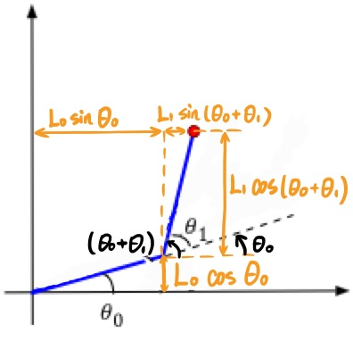

### 24

> Within each of the above phases, identify the signs (positive or negative) of $\Delta \theta​$. For example, when straightening, what are the signs of each likely to be?

(Define anticlockwise as positive for $\Delta \theta​$.)

In phase 1, $\Delta \theta _{0}​$ is positive, $\Delta \theta _{1}​$ is negative.

In phase 2, $\Delta \theta _{0}​$ is 0 or negative (only if $L_{0}>L_{1}​$ and $y<L_{0}-L_{1}​$), $\Delta \theta _{1}​$ is negative.

In phase 3, $\Delta \theta _{0}$ is negative, $\Delta \theta _{1}$ is positive.

### 25

> Download and unpack [twolinkexample.zip](https://www2.seas.gwu.edu/~simhaweb/contalg/modules/module2/examples/twolinkexample.zip).
>
> - Examine the code in `TwoLinkController.java` to confirm that the above controls are implemented.
> - Add code for the last part, to compute $\Delta \theta _{1}'$, or `newTheta1` in the code so that the end effector reaches (30, 10).
> - To execute, run `ArmSimulator`, type in the controller name `TwoLinkController`, set the number of links (to 2), then click on "tracing", then "reset", then "go".

See function `getDeltaAngles` in file `TwoLinkController.java`.

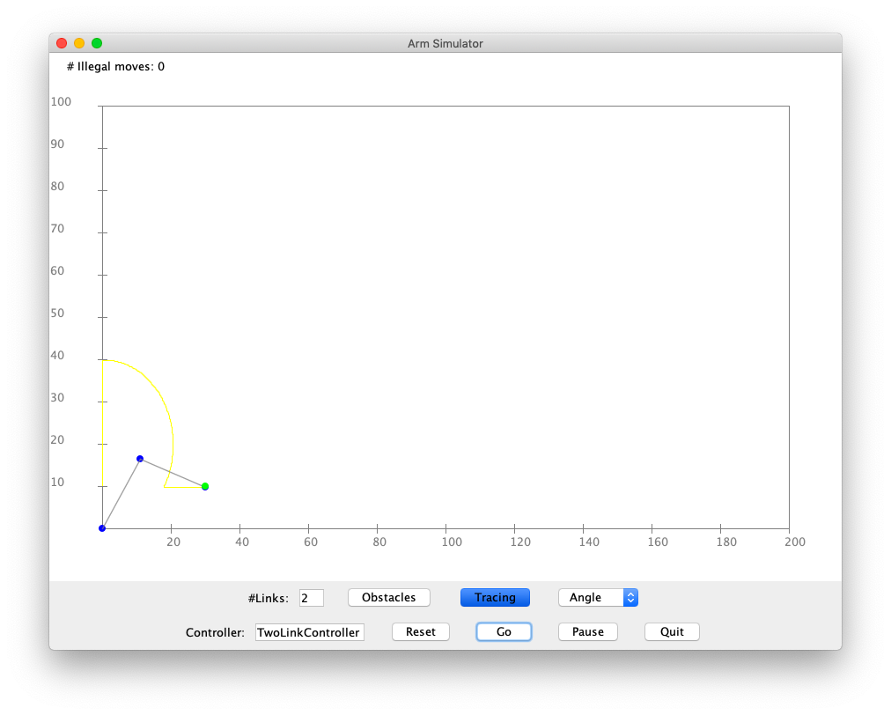

### 26

> Create an example of the maze problem in which Greedy performs badly.

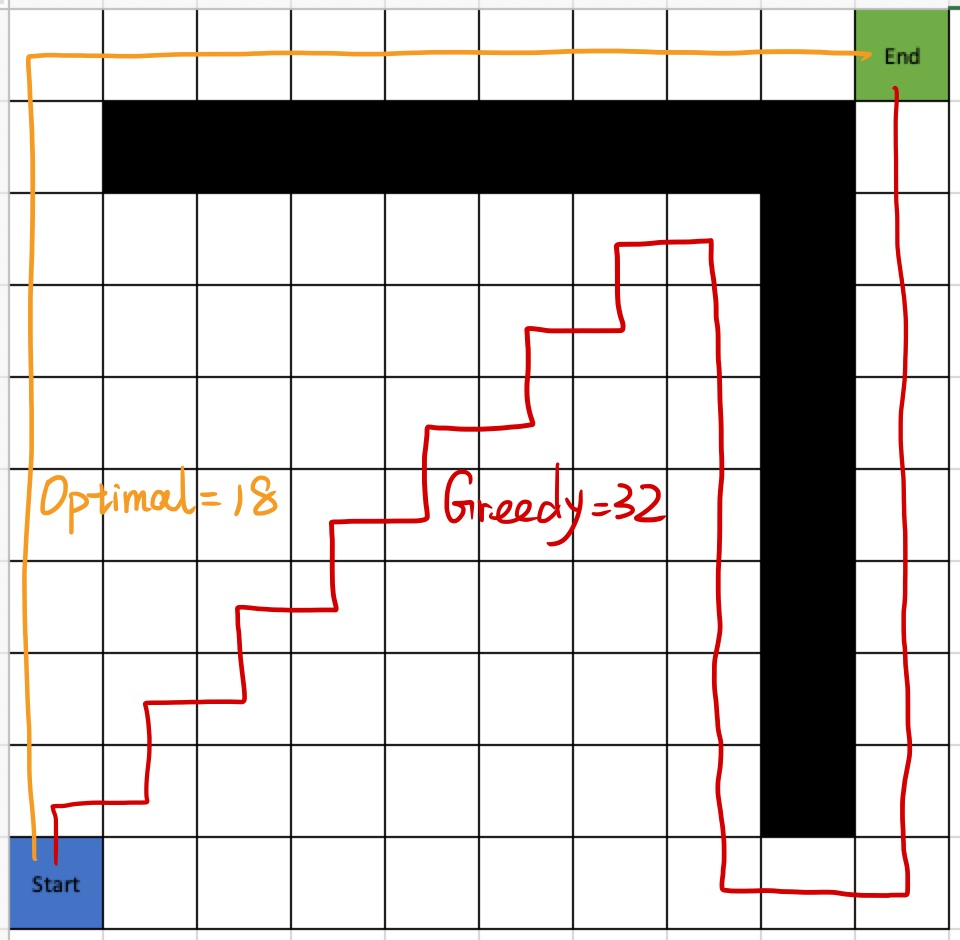

