# Module 03

### 01

> Download and execute [Incline.java](https://www2.seas.gwu.edu/~simhaweb/contalg/modules/module3/examples/Incline.java). This is a simulation of a bead falling along an inclined wire with no friction. You can set the incline angle and also the mass of the bead. Use your own watch/timer and your own observations with pen-and-paper of the executing simulation (that is, don't write code) to answer these questions:
>
> - Estimate the distance traveled in 1 second, in 2 seconds, 3 seconds ... etc. That is, sketch out a graph with time on the x-axis and distance (along incline) along the y-axis.
> - Estimate the velocity between successive tick marks along the incline. That is, what is the velocity between the first two tick marks, between the second two, ... etc.
> - How do these graphs change if you double the mass?
> - How do these graphs change if you double the angle?
>
> From these observations (only) what can you conclude about the relationship between:
>
> - Distance traveled and time?
> - Velocity and time?
> - Mass and distance traveled?
> - Angle and distance traveled?

Observation:

- Angle=30, Mass=1

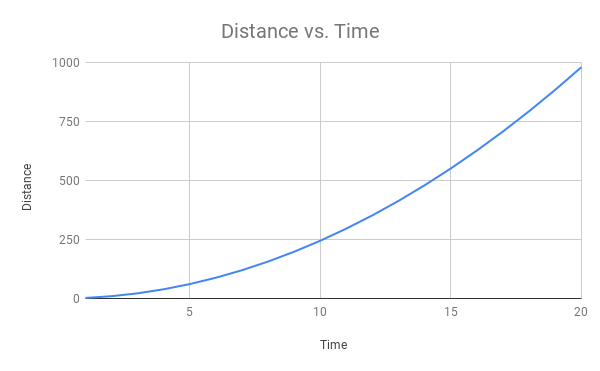

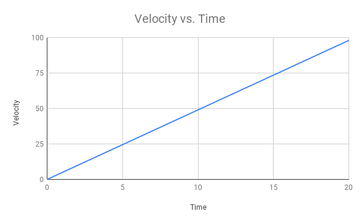

- Angle=30, Mass=2


- Angle=60, Mass=1

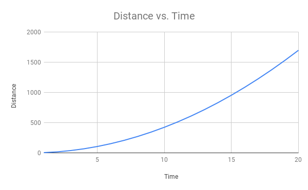


Conclusion:

- $distance \propto time^{2}​$
- $velocity \propto time$
- Mass is not related to distance.
- Angle is related to distance.

### 02

> Download [InclineSimulatorExample.java](https://www2.seas.gwu.edu/~simhaweb/contalg/modules/module3/examples/InclineSimulatorExample.java), [InclineSimulator.java](https://www2.seas.gwu.edu/~simhaweb/contalg/modules/module3/examples/InclineSimulator.java), [Function.java](https://www2.seas.gwu.edu/~simhaweb/contalg/useful/Function.java), and [SimplePlotPanel.java](https://www2.seas.gwu.edu/~simhaweb/contalg/useful/SimplePlotPanel.java). Then, compile and execute `InclineSimulatorExample`. What do you observe is the relationship between distance and time?

$distance \propto time^{2}​$

### 03

> Modify the code in [InclineSimulatorExample.java](https://www2.seas.gwu.edu/~simhaweb/contalg/modules/module3/examples/InclineSimulatorExample.java) to compute the derivative at $t=1,2...$ etc. For example, to estimate the derivative at $t=2$, you would
>
> - Obtain $d$, the distance traveled in 2 seconds.
> - Obtain $d′$, the distance traveled in 2.01 seconds.
> - Estimate the derivative at $t=2$ as $(d′−d)/0.01$.
>
> What do you conclude from estimating the derivative? Repeat the derivative estimation using $0.0001$ instead of $0.01$. Can you explain what you observe?

The derivative is closer and closer to $4.9$, which is $\frac{g}{2}$.

### 04

> Consider the function $f(x)=3x+5$. Use 0.1 and compute the instantaneous rate-of-change at $x=1$ , at $x=2$ , and $x=3$. Then use 0.01 and compute the same. What do you conclude? What can you conclude about the instaneous rate-of-change of any linear function $f(x)=ax+b$?

The instaneous rate-of-changes at $x=1$ , $x=2$ , and $x=3$ of $f(x)=3x+5$ are $3$.

The instaneous rate-of-change of any linear function $f(x)=ax+b$ is $a$.

### 05

> Execute the above code and estimate the slope (by hand, looking at the graph). Then modify the code to estimate the derivative of the velocity function at $t=1$, $t=2$, ..., $t=10$.

The derivatives of the velocity function at $t=1$, $t=2$, ..., $t=10$ are $4.9$.

### 06

> At this point we might try formulating a general "law" about motion:
>
> - How would you state the law?
> - How is the acceleration (velocity-derivative or instantaneous rate-of-change of velocity) affected by the mass of the bead? Try different mass values (1, 2, 3, etc).
> - How is acceleration affected by the angle? Try angles of 10, 20, ..., 80. (You might have to re-size the window).
> - What can we say about a universal law at this time?

$$
\begin{align*}
a=g\sin(\alpha)
\end{align*}
$$

Velocity is the derivative of distance. Acceleration is the derivative of velocity.

### 07

> Execute the above code. You will also need [BallDropSimulator.java](https://www2.seas.gwu.edu/~simhaweb/contalg/modules/module3/examples/BallDropSimulator.java).
>
> - Modify the the code in `main` to estimate the velocity curve.
> - Write code to estimate the slope of the velocity curve.
> - Thought exercise: picture yourself in the times of Newton (mid 1600's). How would you perform an experiment to measure $d(t)$ for a falling object? What was the clock technology like at that time?

See file `BallDropSimulatorExample.java`.

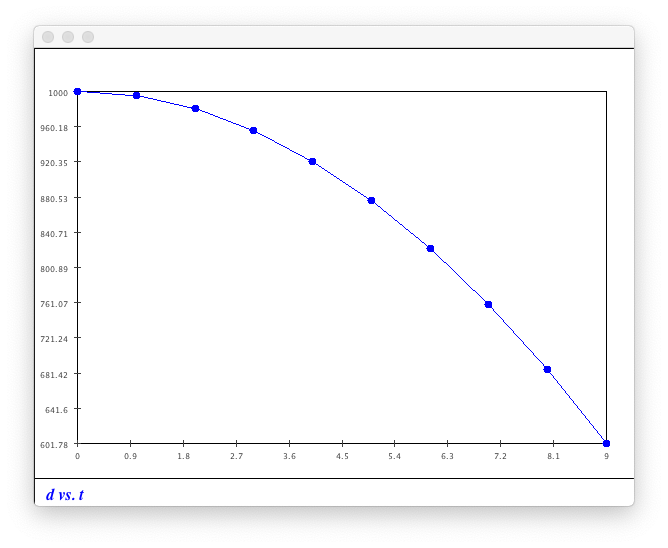

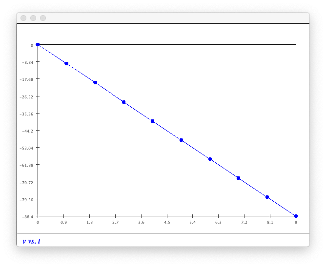

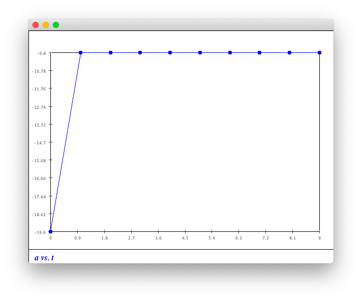

### 08

> Execute the above code. You will also need [BallTossSimulator.java](https://www2.seas.gwu.edu/~simhaweb/contalg/modules/module3/examples/BallTossSimulator.java). Then, modify the the code in main to estimate the velocity curve. What can you conclude about your universal law thus far?

See file `BallTossSimulatorExample.java`.

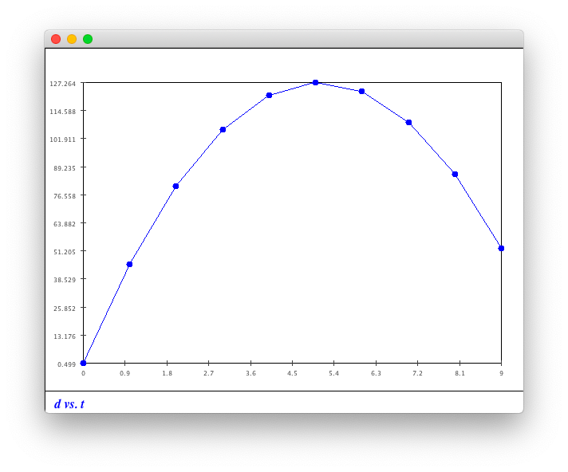

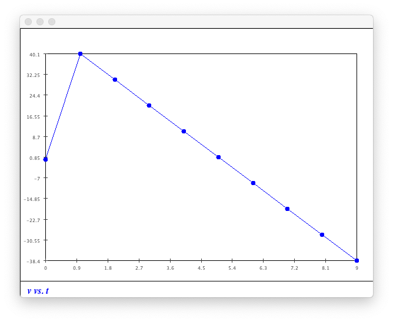

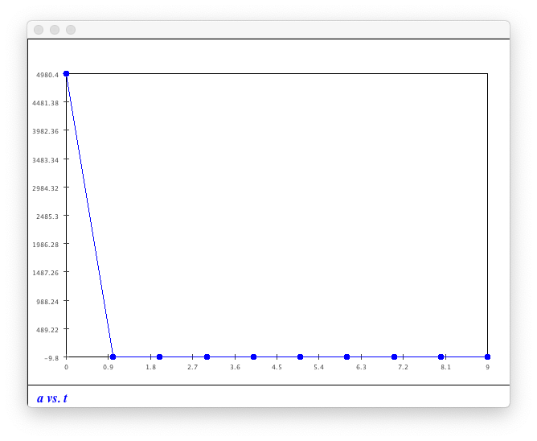

Velocity is the derivative of distance. Acceleration is the derivative of velocity.

### 09

> Download [ProjectileSimulator.java](https://www2.seas.gwu.edu/~simhaweb/contalg/modules/module3/examples/ProjectileSimulator.java) and then modify [ProjectileSimulatorExample.java](https://www2.seas.gwu.edu/~simhaweb/contalg/modules/module3/examples/ProjectileSimulatorExample.java) to compute the distance and velocity functions, $d(t)$ and $v(t)$ . Use $s=0.0$ and, for the derivative of velocity, use $v(t)=\frac{v(t+0.1)−v(t)}{0.1}$. Try this once with $angle=37$ and once with $angle=70$. What do you conclude from observing $d(t)$? What can you conclude about the rate of change of velocity?
>

See file `ProjectileSimulatorExample.java`.

- Angle=37

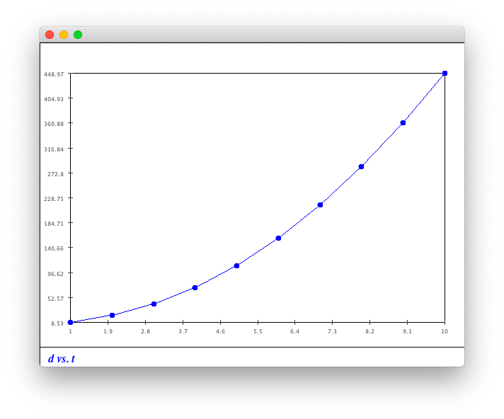


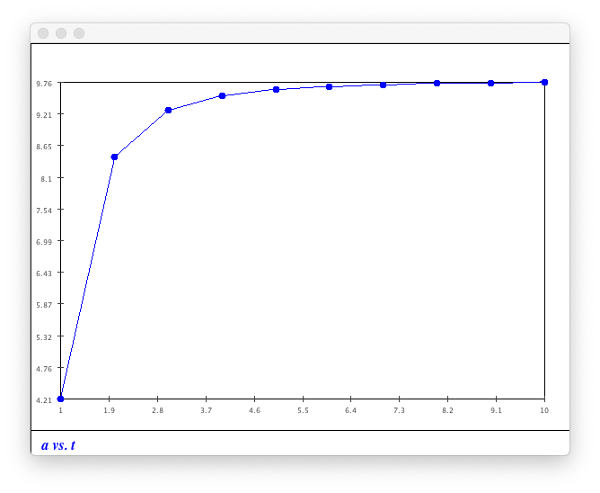

- Angle=70

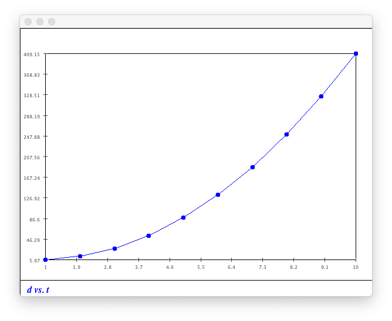

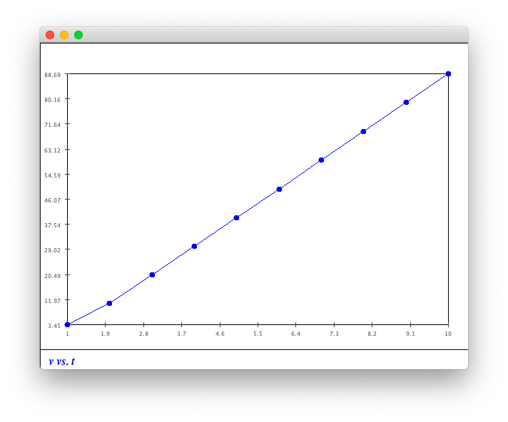

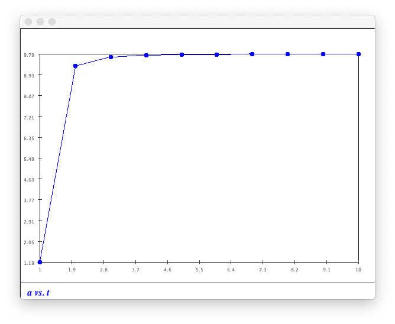

Velocity is the derivative of distance. Acceleration is the derivative of velocity.

### 10

> Suppose $a(t)=4.9$ (acceleration is a constant value of 4.9), and that initial velocity is zero.
>
> - Draw a graph of $a(t)$ in the range $[0, 10]$.
> - Use $s = 0.1$ and compute by hand $v(0.1)$, $v(0.2)$, $v(0.3)$, $v(0.4)$, $v(0.5)$. Show your calculations.
> - Explain why the value for $v(0.5)​$ makes sense.
> - What is the connection between the calculations you did and the terms "line" and "slope"? What is the *equation* of the line in question?

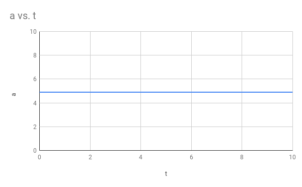

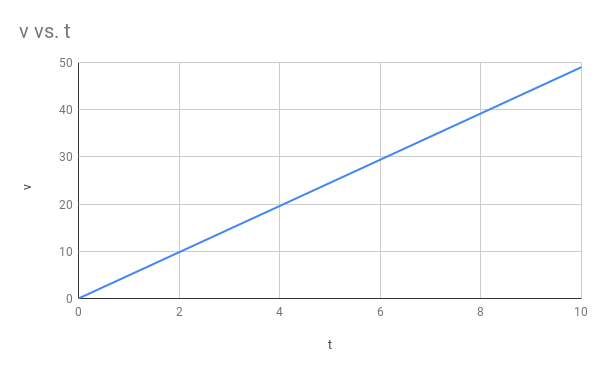

| $t$  | $a(t)$ | $v(t)$ |
| ---- | ------ | ------ |
| 0    | 0      | 0      |
| 0.1  | 0.49   | 0.049  |
| 0.2  | 0.98   | 0.147  |
| 0.3  | 1.47   | 0.294  |
| 0.4  | 1.96   | 0.49   |
| 0.5  | 2.45   | 0.735  |
| 0.6  | 2.94   | 1.029  |
| 0.7  | 3.43   | 1.372  |
| 0.8  | 3.92   | 1.764  |
| 0.9  | 4.41   | 2.205  |
| 1    | 4.9    | 2.695  |

Since $v(0.5)$ is calculated by $v(0.4)$, which is calculated by $v(0.3),v(0.2)$… with $a$, its value makes sense.

The slope of $v(t)$ is $a(t)=4.9$, and $v(t)=4.9t​$.

### 11

> Execute the [above code](https://www2.seas.gwu.edu/~simhaweb/contalg/modules/module3/examples/IntegrateVelocity.java) and compare the results (distance, velocity functions) to the [InclineSimulatorExample.java](https://www2.seas.gwu.edu/~simhaweb/contalg/modules/module3/examples/InclineSimulatorExample.java) example from earlier. Then, explore the following issues:
>
> - There is something wasteful about the way we are creating $d(t)$. Can you see what it is? Can the code be modified to make it more efficient?
> - What is the effect of changing the interval size? Try interval sizes of 0.1 and 1.0.

Change file `IntegrateVelocity.java` to make it more efficient.

The result of executing `InclineSimulatorExample`:

```
t=0.0  d=4.9E-6  v=0.0
t=1.0  d=2.4524500000000105  v=4.904900000000101
t=2.0  d=9.81470490000007  v=9.809799999999314
t=3.0  d=22.072054899999547  v=14.709799999998552
t=4.0  d=39.22940489999825  v=19.60979999999779
t=5.0  d=61.26224999999621  v=24.50489999999661
t=6.0  d=88.21469999999343  v=29.404900000002954
t=7.0  d=120.06714999998984  v=34.30489999999509
t=8.0  d=156.81959999998537  v=39.20489999998722
t=9.0  d=198.47204999998024  v=44.104900000007774
```

The result of executing `IntegrateVelocity`:

```
t=5  d=61.372499999999526
t=9  d=198.67049999999745
```

Change interval sizes to 0.1:

```
t=5  d=62.474999999999994
t=9  d=200.65499999999986
```

Change interval sizes to 1.0:

```
t=5  d=48.99999999999998
t=9  d=176.39999999999998
```

It seems that: larger interval size will cause larger error (comparing with the actual value).

Also, larger $t​$ will cause also cause larger error.

### 12

> What could you do experimentally to determine which of Euler or Euler-Cromer is better?

The result of executing `IntegrateVelocity2` (Euler­-Cromer Algorithm).

```
t=5  d=61.61798999999981
t=9  d=199.11198999999883
```

The result of executing `IntegrateVelocity3` (Euler Algorithm).

```
t=5  d=61.37249999999981
t=9  d=198.67049999999884
```

Euler­-Cromer Algorithm is much better since the result is closer to the actual value.

### 13

> Examine `InclineSimulator` above and answer these questions:
>
> - Is this the Euler or Euler-Cromer Algorithm at work?
> - Is the acceleration changing with time?

Both Euler or Euler-Cromer Algorithm are at work.

See \#11, larger $t$ will cause larger error.

### 14

> Execute [Incline.java](https://www2.seas.gwu.edu/~simhaweb/contalg/modules/module3/examples/Incline.java) and observe the shadow objects moving. Are you able to say anything about whether the shadow objects satisfy our "universal law"?

Yes, the shadow objects also satisfy our "universal law".

### 15

> Download and execute the [above code](https://www2.seas.gwu.edu/~simhaweb/contalg/modules/module3/examples/InclineSimulatorExample2.java). Then modify to compute the velocity of the x-axis shadow. What do you observe?

See file `InclineSimulatorExample2.java`.

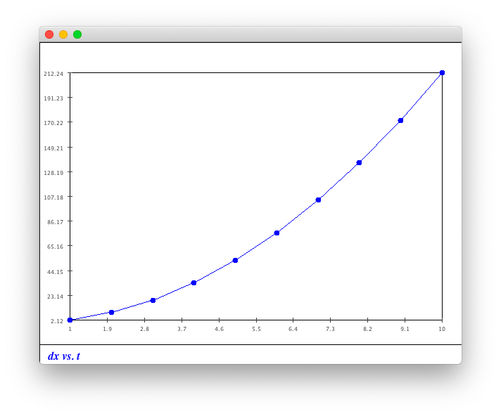

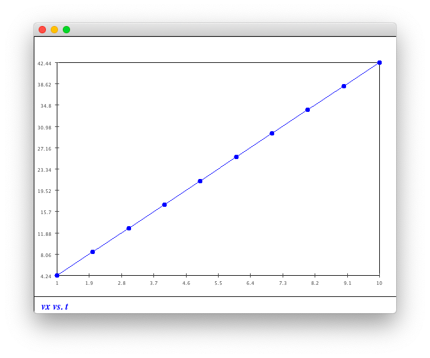

The shape of "dx vs. t" is similiar to "x vs. t".

The shape of "vx vs. t" is similiar to "v vs. t".

### 16

> Execute the above program. What do you notice about the distance function for the x-axis shadow? Can you explain? Modify the above code to estimate and plot velocity. What do you observe?

See file `ProjectileSimulatorExample2.java`.

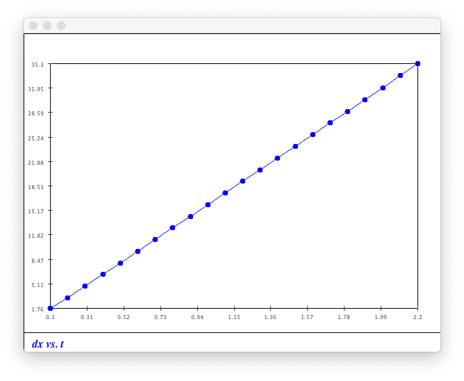

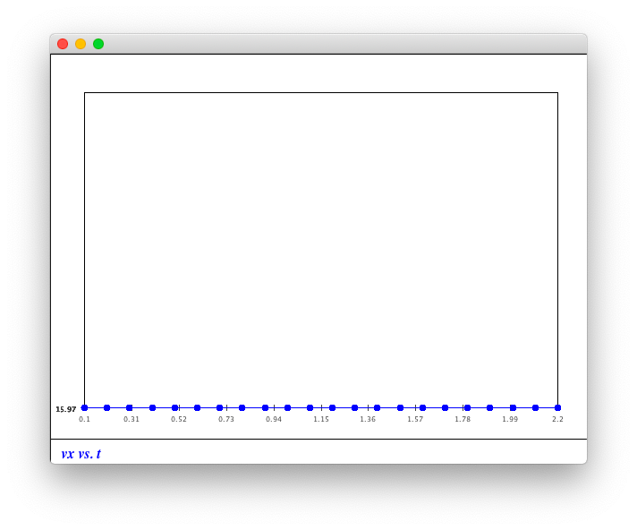

It seems that "vx" is constant and "dx vs. t" is a straight line.

### 17

> Modify the above code to compute and display the distance and velocity functions for the y-axis shadow. Do the x-axis and y-axis shadows satisfy our "universal law"?

See `ProjectileSimulatorExample3.java`.

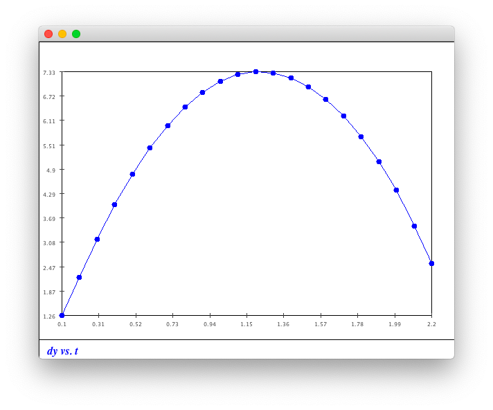

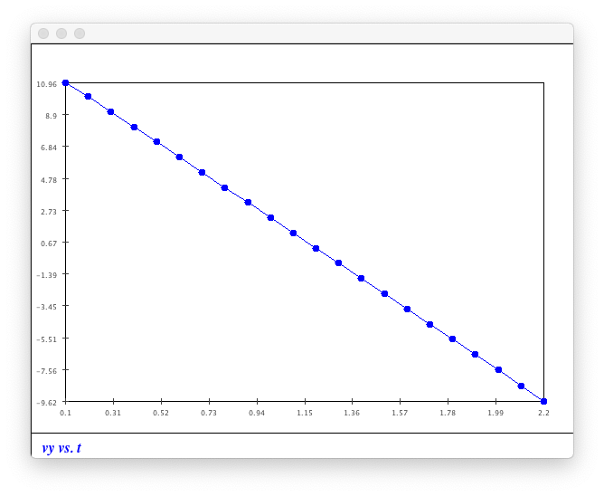

Yes, the x-axis and y-axis shadows satisfy our "universal law".

### 18

> Why are these statements true? And why is the second equivalent to the first?

It is clear that the distance, velocity and acceleration can be orthogonal decomposed.

### 19

> Explain how $d(t)​$ is estimated in the above code? That is, why does `d = d + distance (x, y, nextX, nextY);` work? Why did we need the variables `nextX`, `nextY`?
>

$d(t)$ is the actual distance the object moves. It should be accumulation of each move (`distance()`) calculated by move on x-asix and y-asix.

### 20

> This clean "separation" into x and y shadows appears mystifying. Do you believe it works? Download and execute [InclineSimulatorExample3.java](https://www2.seas.gwu.edu/~simhaweb/contalg/modules/module3/examples/InclineSimulatorExample3.java) to compare the two simulators. Print out the horizontal and vertical accelerations.

See file `InclineSimulatorExample3.java`.

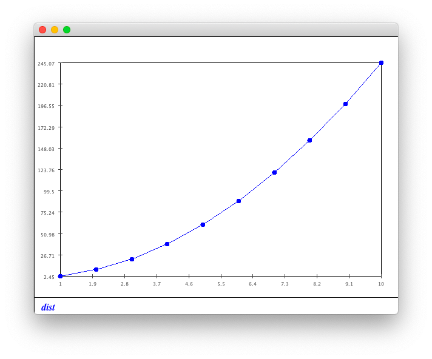

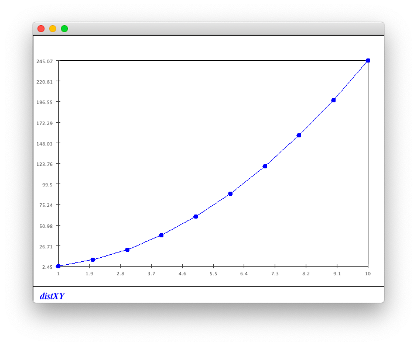

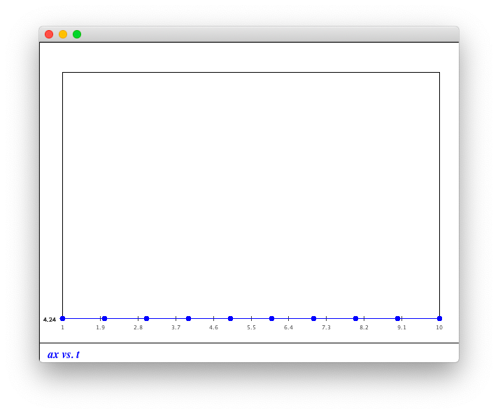

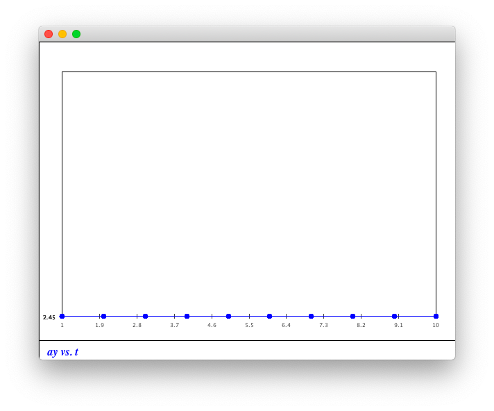

It works.

### 21

> Are there more unanswered questions regarding gravity?

Yes.

### 22

> Do you have answers for the above two questions? As it turns out they are quite significant.

The slope provides the support force to the object. It is the resultant force, which made by the gravity and the support force of the object, that finally cause the acceleration.

### 23

> How many times is the loop iterated? Can you think of a more efficient algorithm for the same problem?

See file `BallDropSimulatorExercise2.java`.

The loop iterated 1021 times.

```
Loop times: 1021
Height required: 2021.0
```

Use dichotomy to optimize:

``` java
public class BallDropSimulatorExercise2 {

    public static void main(String[] argv) {
        BallDropSimulator2 sim = new BallDropSimulator2();
        double targetVelocity = 200;
        double error = 1;

        int loop = 0;
        double low = 1000;
        double high = 10000;
        double middle;
        double finalVelocity;

        while (true) {
            loop++;
            middle = (low + high) / 2;
            sim.run(middle);
            finalVelocity = sim.getV();
            if (finalVelocity > -targetVelocity + error) {
                low = middle;
            } else if (finalVelocity < -targetVelocity - error) {
                high = middle;
            } else {
                break;
            }
        }

        System.out.println("Loop times: " + loop);
        System.out.println("Height required: " + middle);
    }

}
```

Result:

```
Loop times: 6
Height required: 2031.25
```

### 24

> Modify the code to answer the third question: At what time and height is the velocity half the final velocity (when dropped from a height of 1000)?

Change `targetVelocity` in above code to `100` and execute.

```
Loop times: 8
Height required: 507.8125
```

### 25

> How would you get a more accurate estimate of the initial velocity needed to reach 1000?

See file `BallTossExercise3.java`.

Result:

```
initV=500.0  stopTime=52.0 prevY=12752.602019998401 nextY=12747.755019998353
initV=500.0  height=12752.602019998401
initV=250.0  stopTime=27.0 prevY=3186.3259999996853 nextY=3176.57699999967
initV=250.0  height=3186.3259999996853
initV=125.0  stopTime=14.0 prevY=796.2380200000085 nextY=788.7910200000097
initV=125.0  height=796.2380200000085
initV=187.5  stopTime=20.0 prevY=1792.6689999998803 nextY=1789.0199999998733
initV=187.5  height=1792.6689999998803
initV=156.25  stopTime=17.0 prevY=1244.8095199999536 nextY=1239.2125199999507
initV=156.25  height=1244.8095199999536
initV=140.625  stopTime=15.0 prevY=1007.6972699999856 nextY=1006.0752699999849
initV=140.625  height=1007.6972699999856
initV=132.8125  stopTime=15.0 prevY=898.2441450000002 nextY=888.8096450000007
initV=132.8125  height=898.2441450000002
initV=136.71875  stopTime=15.0 prevY=952.9707074999928 nextY=947.4424574999928
initV=136.71875  height=952.9707074999928
initV=138.671875  stopTime=15.0 prevY=980.3339887499892 nextY=976.7588637499889
initV=138.671875  height=980.3339887499892
initV=139.6484375  stopTime=15.0 prevY=994.0156293749875 nextY=991.417066874987
initV=139.6484375  height=994.0156293749875
initV=140.13671875  stopTime=15.0 prevY=1000.8564496874866 nextY=998.746168437486
initV=140.13671875  height=1000.8564496874866
initV=140.13671875  height=1000.8564496874866
```

### 26

> So, is it true that the two velocities are the same? Is there an intuition for why or why not?

Yes, the two velocities are the same.

The total energy of the ball include the kinetic energy (related by velocity) and the gravitational energy (related by height). During the ball toss movement, the total energy is conserved. The same height means the same gravitational energy. As a result, the kinetic energy is same at this time, which means the velocity is same.

### 27

> What is the best angle? Run the program and find out. Does it make intuitive sense?

The best angle is 45 degree, which makes intuitive sense.

### 28

> Write code to solve the second problem: find two angle/velocity combinations to reach a target at a distance of 200. What is the time-offlight for each?

Based on Newton's law of motion：
$$
\begin{align*}
vt\cos\theta&=x\\
-2v\sin\theta&=gt\\
\end{align*}
$$
In this problem:
$$
\begin{align*}
x&=200\\
g&=-9.8\\
v&>0\\
0&<\theta<\frac{\pi}{2}\\
\end{align*}
$$
As a result:
$$
\begin{align*}
v^{2}\sin2\theta=1960\Longrightarrow v=\sqrt{\frac{1960}{\sin 2\theta}}
\end{align*}
$$
It shows that any $(v,\theta)$ which meet the aformentioned equation could be a solution.

Let $v=100​$ and write code in `ProjectileExercise3.java`.

Result:

```
velocity=44.27188724235731, angle=45.0deg, distance=199.97603136377825
velocity=47.57323885571943, angle=60.0deg, distance=199.9978961494406
```

### 29

> Is it obvious that the route within each region must be a straight line?

Yes.

### 30

> Compute by hand the time taken to go from A to P, and the time taken to go from P to B in terms of $a,b,v_{1},v_{2},x,y$. Then download and modify [TwoVelocityProblem.java](https://www2.seas.gwu.edu/~simhaweb/contalg/modules/module3/examples/TwoVelocityProblem.java) and implement your formulas as code. Compare the program's results with your hand-worked results.

See file `TwoVelocityProblem.java`.

Result:

```
time=11.609957354703951
```

### 31

> Suppose $v_{1}$ is (much) smaller than $v_{2}$. Which of the three routes shown below is likely to be best?

The red route is the best.

### 32

> Then download and modify [TwoVelocityProblem2.java](https://www2.seas.gwu.edu/~simhaweb/contalg/modules/module3/examples/TwoVelocityProblem2.java) to try different values of y in a loop.

See file `TwoVelocityProblem2.java`.

Result:

```
best y=6.813000000000712
```

### 33

> Then download and modify [TwoVelocityProblem3.java](https://www2.seas.gwu.edu/~simhaweb/contalg/modules/module3/examples/TwoVelocityProblem3.java) to try different values of $y$ in a loop, and also compare with the distances $d_{1},d_{2},(a − y),y$. Notice that we are using different ratios $\frac{v_{2}}{v_{1}}$.
>
> - Is there a relationship between $\frac{v_{2}}{v_{1}}​$ and $\frac{d_{2}}{d_{1}}​$?
>
> - Between $\frac{v_{2}}{v_{1}}​$ and the ratio of $\frac{(a-y)}{d_{1}}​$ to $\frac{y}{d_{2}}​$?

See file `TwoVelocityProblem3.java`.

Result:

```
v2/v1=1.0  best y=5.000000000000107
d2/d1=1.0000000000000213
(y/d2)/((a-y)/d1)=1.000000000000021

v2/v1=1.1  best y=5.4730000000002645
d2/d1=1.0990635774031978
(y/d2)/((a-y)/d1)=1.0999986139185138

v2/v1=1.2000000000000002  best y=5.888000000000403
d2/d1=1.193222499684411
(y/d2)/((a-y)/d1)=1.2000332001491323

v2/v1=1.3000000000000003  best y=6.245000000000522
d2/d1=1.2793858828838272
(y/d2)/((a-y)/d1)=1.2999329348475142

v2/v1=1.4000000000000004  best y=6.5510000000006245
d2/d1=1.3567426564489924
(y/d2)/((a-y)/d1)=1.3999641854225748

v2/v1=1.5000000000000004  best y=6.813000000000712
d2/d1=1.4252629449838297
(y/d2)/((a-y)/d1)=1.4998966366931608

v2/v1=1.6000000000000005  best y=7.0390000000007875
d2/d1=1.4858227841630742
(y/d2)/((a-y)/d1)=1.5999468073378253

v2/v1=1.7000000000000006  best y=7.235000000000853
d2/d1=1.5392420545419518
(y/d2)/((a-y)/d1)=1.6999512976590991

v2/v1=1.8000000000000007  best y=7.40600000000091
d2/d1=1.586379995922879
(y/d2)/((a-y)/d1)=1.7997264986891908

v2/v1=1.9000000000000008  best y=7.5570000000009605
d2/d1=1.628302427035709
(y/d2)/((a-y)/d1)=1.8997256432245095
```

It seems that:
$$
\begin{align*}
\frac{v_{2}}{v_{1}}&=\frac{\frac{y}{d_{2}}}{\frac{a-y}{d_{1}}}\\
\end{align*}
$$

### 34

> Before playing with a simulation, what does your intuition tell you?
>
> - Download and execute [MultiIncline.java](https://www2.seas.gwu.edu/~simhaweb/contalg/modules/module3/examples/MultiIncline.java), which lets you define the number of segments and move them around. Were you able to get the bead down sooner than using a straight line?
> - What does the phrase "without loss of generality" mean in the context above? What "general" situations might we be interested in?
> - Referring to the figure below, write down the sin and cosine of the two angles shown in terms of the point coordinates.

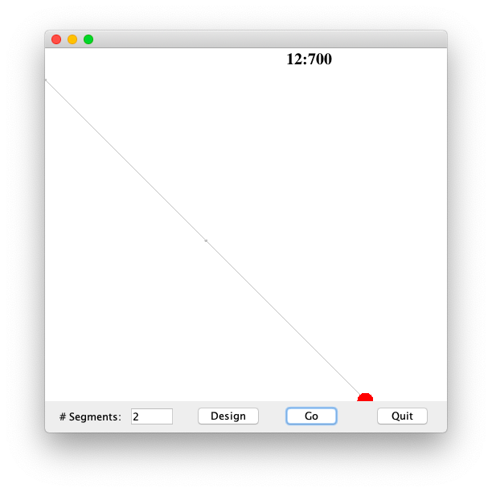

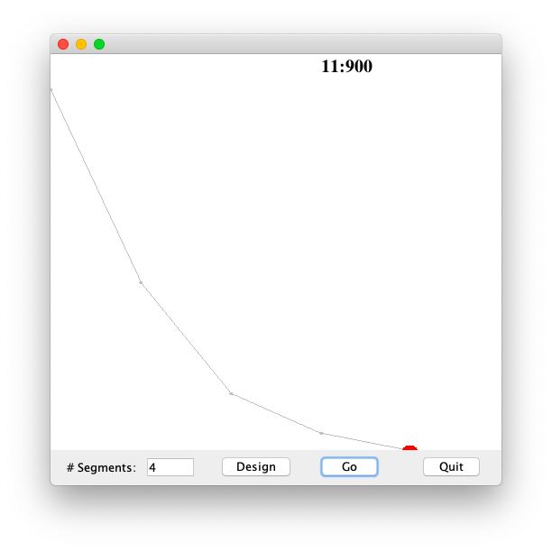

We might be interest about the route which costs the least time (brachistochrone curve).
$$
\begin{align*}
\sin\alpha&=\frac{\lvert y_{2}-y_{1}\rvert}{\sqrt{(x_{2}-x_{1})^{2}+(y_{2}-y_{1})^{2}}}\\
\cos\alpha&=\frac{\lvert x_{2}-x_{1}\rvert}{\sqrt{(x_{2}-x_{1})^{2}+(y_{2}-y_{1})^{2}}}\\
\sin\beta&=\frac{\lvert y_{3}-y_{2}\rvert}{\sqrt{(x_{3}-x_{2})^{2}+(y_{3}-y_{2})^{2}}}\\
\cos\beta&=\frac{\lvert x_{3}-x_{2}\rvert}{\sqrt{(x_{3}-x_{2})^{2}+(y_{3}-y_{2})^{2}}}\\
\end{align*}
$$

### 35

> Download [TwoSegmentIncline.java](https://www2.seas.gwu.edu/~simhaweb/contalg/modules/module3/examples/TwoSegmentIncline.java) and [InclineSegmentSimulator.java](https://www2.seas.gwu.edu/~simhaweb/contalg/modules/module3/examples/InclineSegmentSimulator.java). Fill in the missing code above in `InclineSegmentSimulator`. What reasoning did you use in the missing code? What can you say about the underlying principle?

See file `TwoSegmentIncline.java`.

$v_{x}$ and $v_{y}$ at the end of the first stage will be used used as the initial state of the second stage. In other words, the articulation is smooth and no kinetic energy will be lost.

Result:

```
Straight solution: 2.0199999999998886
Twisted solution: 2.0209999999999537
```

### 36

> Fill in the missing code above.

See file `TwoSegmentIncline2.java`.

Result:

```
Straight solution: 2.0199999999998886
Twisted solution for y2=1.0: 2.2539999999999405
Twisted solution for y2=2.0: 2.1539999999999453
Twisted solution for y2=3.0: 2.0839999999999494
Twisted solution for y2=4.0: 2.0379999999999527
Twisted solution for y2=5.0: 2.0209999999999537
Twisted solution for y2=6.0: 2.2189999999999523
Twisted solution for y2=7.0: 2.502999999999944
Twisted solution for y2=8.0: 2.9329999999998986
Twisted solution for y2=9.0: 3.7429999999998094
```

### 37

> Download and unpack [movingobject.zip](https://www2.seas.gwu.edu/~simhaweb/contalg/modules/module3/examples/movingobject.zip). Then, compile and execute `MovingObject.java`. Examine the code to confirm the basic iteration above.

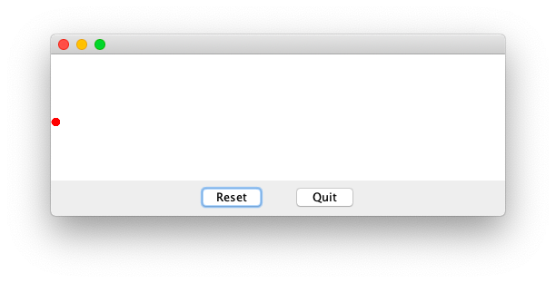

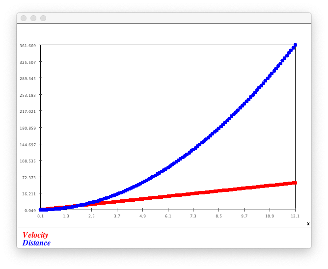

### 38

> Write the three lines in the basic iteration to complete the code in `MovingObjectBasic.java` and then execute to obtain the velocity and distance curves measured over a shorter span (the first 3 seconds).

See file `MovingObjectBasic.java`.

Result:

```
t=0.10 a=4.90 v=0.49 d=0.05
t=0.20 a=4.90 v=0.98 d=0.15
t=0.30 a=4.90 v=1.47 d=0.29
t=0.40 a=4.90 v=1.96 d=0.49
t=0.50 a=4.90 v=2.45 d=0.74
t=0.60 a=4.90 v=2.94 d=1.03
t=0.70 a=4.90 v=3.43 d=1.37
t=0.80 a=4.90 v=3.92 d=1.76
t=0.90 a=4.90 v=4.41 d=2.21
t=1.00 a=4.90 v=4.90 d=2.70
t=1.10 a=4.90 v=5.39 d=3.23
t=1.20 a=4.90 v=5.88 d=3.82
t=1.30 a=4.90 v=6.37 d=4.46
t=1.40 a=4.90 v=6.86 d=5.15
t=1.50 a=4.90 v=7.35 d=5.88
t=1.60 a=4.90 v=7.84 d=6.66
t=1.70 a=4.90 v=8.33 d=7.50
t=1.80 a=4.90 v=8.82 d=8.38
t=1.90 a=4.90 v=9.31 d=9.31
t=2.00 a=4.90 v=9.80 d=10.29
t=2.10 a=4.90 v=10.29 d=11.32
t=2.20 a=4.90 v=10.78 d=12.40
t=2.30 a=4.90 v=11.27 d=13.52
t=2.40 a=4.90 v=11.76 d=14.70
t=2.50 a=4.90 v=12.25 d=15.93
t=2.60 a=4.90 v=12.74 d=17.20
t=2.70 a=4.90 v=13.23 d=18.52
t=2.80 a=4.90 v=13.72 d=19.89
t=2.90 a=4.90 v=14.21 d=21.32
t=3.00 a=4.90 v=14.70 d=22.79
```

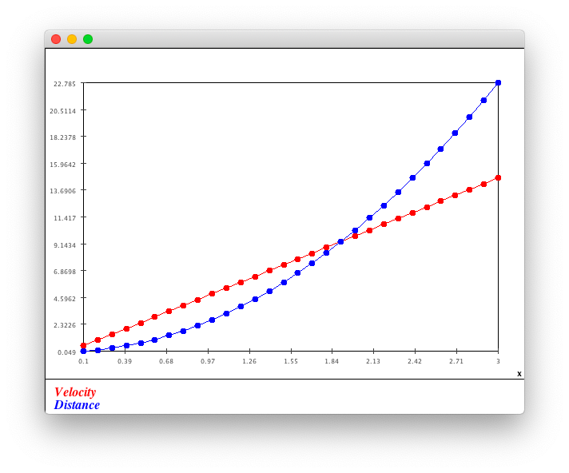

### 39

> Draw on paper the acceleration function for the range $[0,1]$ at the points $0,0.1,0.2,…,1.0$. The intervals here are $[0,0.1],[0.1,0.2],…,[0.9,1.0]$. Calculate the area of each rectangle "under the curve", and the accumulating sum as you go left to right (so, the area of the first rectangle, then the area of the first two rectangles, then the first three etc).

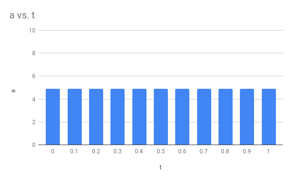

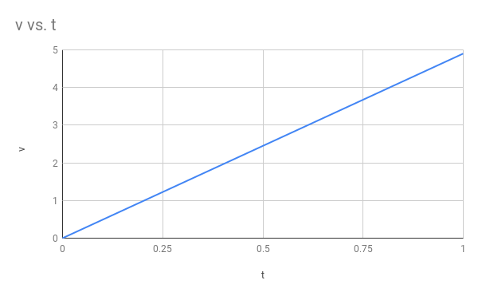

### 40

> Write the one line of code needed to compute the area of each rectangle in `MovingObjectIntegration.java`, and then compare what you see with your calculations and drawing. Then, follow the instructions in the program to see the area accumulation for the velocity curve.

See file `MovingObjectIntegration.java`.

Result:

```
t=0.10 a=4.90 v=0.49 d=0.05
 area=0.49 areaSum=0.49 v=0.49
 area=0.05 areaSum=0.05 d=0.05
t=0.20 a=4.90 v=0.98 d=0.15
 area=0.49 areaSum=0.98 v=0.98
 area=0.10 areaSum=0.15 d=0.15
t=0.30 a=4.90 v=1.47 d=0.29
 area=0.49 areaSum=1.47 v=1.47
 area=0.15 areaSum=0.29 d=0.29
t=0.40 a=4.90 v=1.96 d=0.49
 area=0.49 areaSum=1.96 v=1.96
 area=0.20 areaSum=0.49 d=0.49
t=0.50 a=4.90 v=2.45 d=0.74
 area=0.49 areaSum=2.45 v=2.45
 area=0.25 areaSum=0.74 d=0.74
t=0.60 a=4.90 v=2.94 d=1.03
 area=0.49 areaSum=2.94 v=2.94
 area=0.29 areaSum=1.03 d=1.03
t=0.70 a=4.90 v=3.43 d=1.37
 area=0.49 areaSum=3.43 v=3.43
 area=0.34 areaSum=1.37 d=1.37
t=0.80 a=4.90 v=3.92 d=1.76
 area=0.49 areaSum=3.92 v=3.92
 area=0.39 areaSum=1.76 d=1.76
t=0.90 a=4.90 v=4.41 d=2.21
 area=0.49 areaSum=4.41 v=4.41
 area=0.44 areaSum=2.21 d=2.21
t=1.00 a=4.90 v=4.90 d=2.70
 area=0.49 areaSum=4.90 v=4.90
 area=0.49 areaSum=2.70 d=2.70
t=1.10 a=4.90 v=5.39 d=3.23
 area=0.49 areaSum=5.39 v=5.39
 area=0.54 areaSum=3.23 d=3.23
t=1.20 a=4.90 v=5.88 d=3.82
 area=0.49 areaSum=5.88 v=5.88
 area=0.59 areaSum=3.82 d=3.82
t=1.30 a=4.90 v=6.37 d=4.46
 area=0.49 areaSum=6.37 v=6.37
 area=0.64 areaSum=4.46 d=4.46
t=1.40 a=4.90 v=6.86 d=5.15
 area=0.49 areaSum=6.86 v=6.86
 area=0.69 areaSum=5.15 d=5.15
t=1.50 a=4.90 v=7.35 d=5.88
 area=0.49 areaSum=7.35 v=7.35
 area=0.74 areaSum=5.88 d=5.88
t=1.60 a=4.90 v=7.84 d=6.66
 area=0.49 areaSum=7.84 v=7.84
 area=0.78 areaSum=6.66 d=6.66
t=1.70 a=4.90 v=8.33 d=7.50
 area=0.49 areaSum=8.33 v=8.33
 area=0.83 areaSum=7.50 d=7.50
t=1.80 a=4.90 v=8.82 d=8.38
 area=0.49 areaSum=8.82 v=8.82
 area=0.88 areaSum=8.38 d=8.38
t=1.90 a=4.90 v=9.31 d=9.31
 area=0.49 areaSum=9.31 v=9.31
 area=0.93 areaSum=9.31 d=9.31
t=2.00 a=4.90 v=9.80 d=10.29
 area=0.49 areaSum=9.80 v=9.80
 area=0.98 areaSum=10.29 d=10.29
t=2.10 a=4.90 v=10.29 d=11.32
 area=0.49 areaSum=10.29 v=10.29
 area=1.03 areaSum=11.32 d=11.32
t=2.20 a=4.90 v=10.78 d=12.40
 area=0.49 areaSum=10.78 v=10.78
 area=1.08 areaSum=12.40 d=12.40
t=2.30 a=4.90 v=11.27 d=13.52
 area=0.49 areaSum=11.27 v=11.27
 area=1.13 areaSum=13.52 d=13.52
t=2.40 a=4.90 v=11.76 d=14.70
 area=0.49 areaSum=11.76 v=11.76
 area=1.18 areaSum=14.70 d=14.70
t=2.50 a=4.90 v=12.25 d=15.93
 area=0.49 areaSum=12.25 v=12.25
 area=1.23 areaSum=15.93 d=15.93
t=2.60 a=4.90 v=12.74 d=17.20
 area=0.49 areaSum=12.74 v=12.74
 area=1.27 areaSum=17.20 d=17.20
t=2.70 a=4.90 v=13.23 d=18.52
 area=0.49 areaSum=13.23 v=13.23
 area=1.32 areaSum=18.52 d=18.52
t=2.80 a=4.90 v=13.72 d=19.89
 area=0.49 areaSum=13.72 v=13.72
 area=1.37 areaSum=19.89 d=19.89
t=2.90 a=4.90 v=14.21 d=21.32
 area=0.49 areaSum=14.21 v=14.21
 area=1.42 areaSum=21.32 d=21.32
t=3.00 a=4.90 v=14.70 d=22.79
 area=0.49 areaSum=14.70 v=14.70
 area=1.47 areaSum=22.79 d=22.79
```

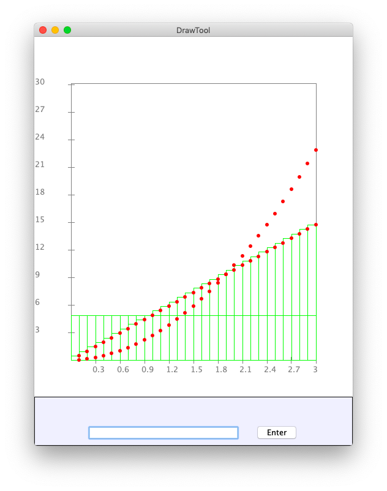

