# Module 4

### 01

> Download and unpack [this ZIP file](https://www2.seas.gwu.edu/~simhaweb/contalg/modules/module4/examples/VirtualReactor.zip) into a new directory. Upon unpacking, you will see that it creates a new subdirectory called `VirtualReactor`. Go into that subdirectory and execute `VirtualReactor`. This will bring up a window. Here's what you do:
>
> - Note that the Model menu offers you the choice of different models. Select the first one: standard simulation.
> - In the section entitled "Initial numbers of molecules" enter 100 in the box for A, 50 in the box for B, and 0 for C. Then click "Change" in the same row.
> - Hit the Reset button in the "Animation" section.
> - Then hit the "Go" button, and simulate until the time shows about 100 (this is in the rightmost label of the "Stats" section).
> - About time 100, hit "Stop" and then "Plot". You should see the time-evolution of the concentrations of each of A, B and C.
> - Finally, compare how long it takes to simulate 100 time units when there are large numbers of molecules (10000 of A, 5000 of B, 0 of C).

It takes 12 seconds to simulate "100A 50B 0C".

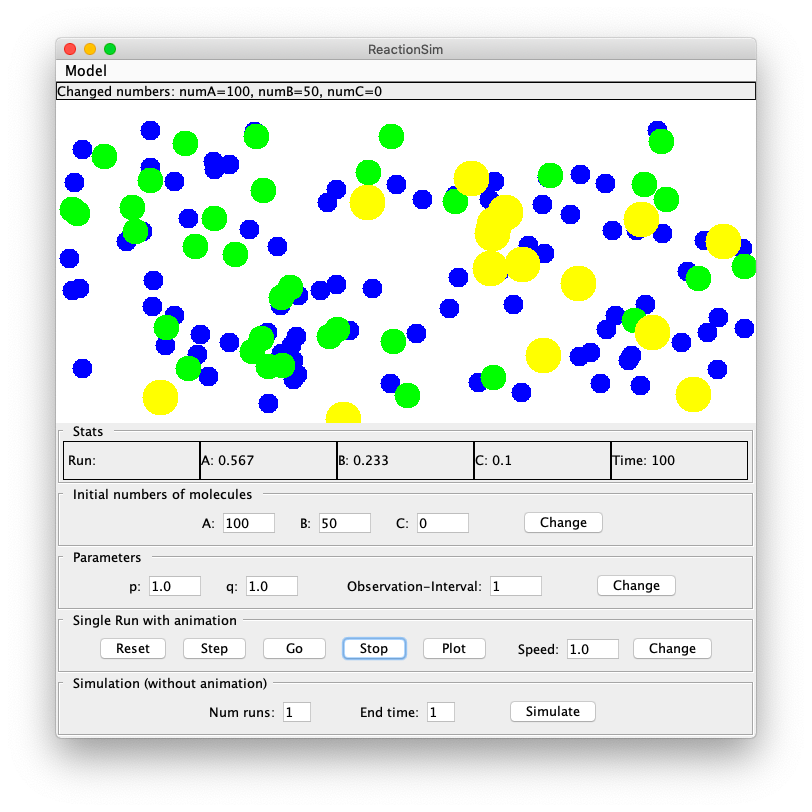

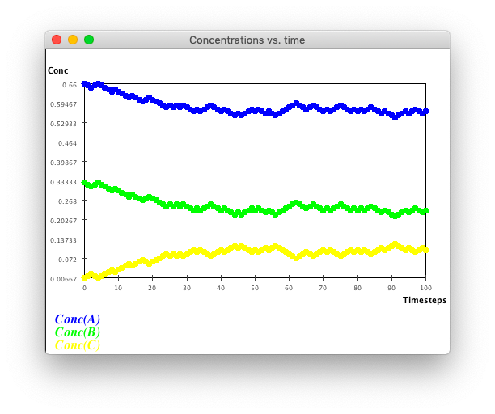

It takes 25 seconds to simulate "10000A 5000B 0C".

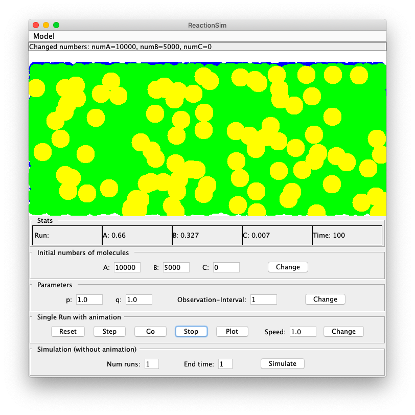

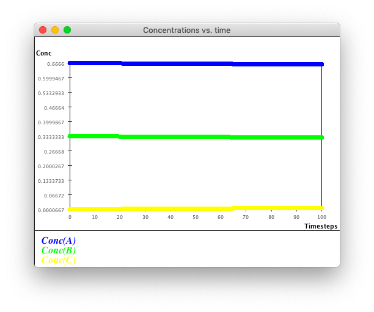

### 02

> Suppose you have ten A molecules and five B molecules.
>
> - Compute the concentrations (by hand) of A and B using the reasoning above.
>
> Now run the simulation very slowly by clicking on the "Step" button. (Note: Each time you start, remember to hit the "Reset" button.)
>
> - How long before you see the second reaction taking place?
> - Just after you see the second reaction taking place for the first time, re-compute (by hand) the concentrations and verify that they match with the numbers in the "Stats" section.

$$
\begin{align*}
V_{total}&=V_{A}+V_{B}+2V_{C}=10+5+2\times0=15\\
E_{A}&=\frac{V_{A}}{V_{total}}=\frac{10}{15}\approx0.66\\
E_{B}&=\frac{V_{B}}{V_{total}}=\frac{5}{15}\approx0.33\\
E_{C}&=\frac{V_{C}}{V_{total}}=\frac{0}{15}=0\\
\end{align*}
$$

At time 3, the second reaction takes place.

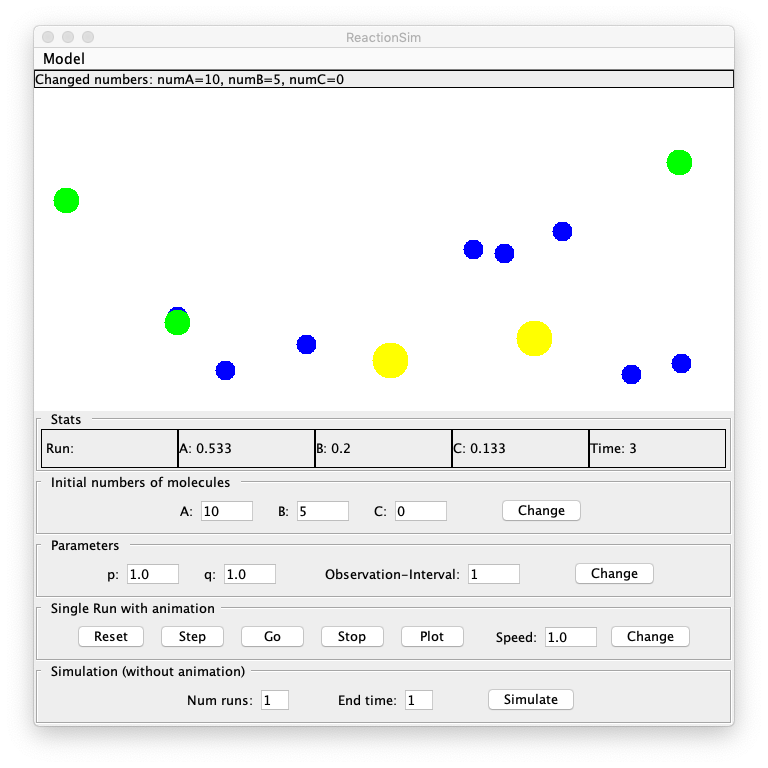
$$
\begin{align*}
V_{total}&=V_{A}+V_{B}+2V_{C}=8+3+2\times2=15\\
E_{A}&=\frac{V_{A}}{V_{total}}=\frac{8}{15}\approx0.53\\
E_{B}&=\frac{V_{B}}{V_{total}}=\frac{3}{15}=0.2\\
E_{C}&=\frac{V_{C}}{V_{total}}=\frac{2}{15}\approx0.13\\
\end{align*}
$$

### 03

> Study the long-term behavior (starting with 100 molecules of A, 50 molecules of B):
>
> - How long (in time-steps shown) does it take for the concentrations to "settle"?
> - Do the concentrations ever stay fixed after a while? Why or why not?
> - What are the final concentrations of A, B, and C, approximately?

It takes 24 times for the concentrations to "settle".

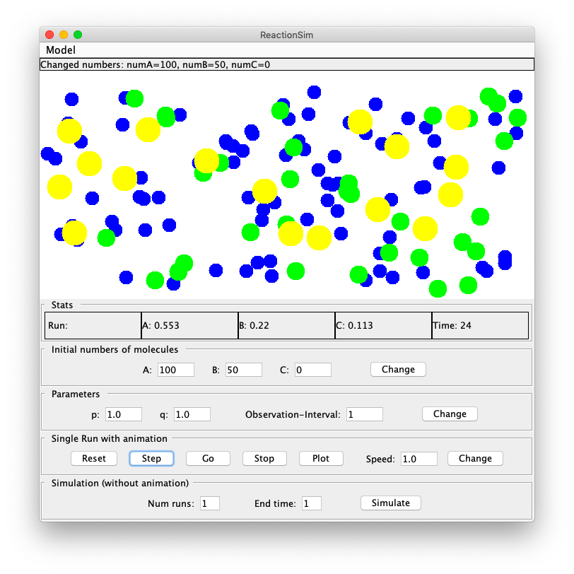

No, the concentrations does not stay fixed. It changes slightly, because the reaction is still in process.

The final concentrations are about:

- A: 0.56
- B: 0.227
- C: 0.107

### 04

> - What is the purpose of `uniform()` above and how does it ensure that the reactions are selected with appropriate probabilities?
>
> - Examine the code in method `standard()` in `MolecularSimPanel.java`. What is the relevance of the spatial distance between molecules?

The purpose of `uniform()` is to provide uncertainty. By comparing `uniform()` with $\frac{R_{1}}{R_{1}+R_{2}}$, it ensure that the reactions are selected with appropriate probabilities.

It seems that the reaction happens between with a random molecule A with the closest molecule B. The new molecule C is created at the middle of them.

### 05

> Use the "Model" menu and switch to the spatial model. Using the same numbers of molecules as above, see what happens when you run for about 100 time units and plot.
>
> - What do you observe? Why are there more fluctuations?
> - Next, look at the last row of controls. Set EndTime=100 and NumRuns=10. Then click the "simulate" button. What do you observe?
> - Try the same with NumRuns=100. What do you see?
> - For comparison, try NumRuns=10 and NumRuns=100 in the standard simulation.

The result of spatial model:

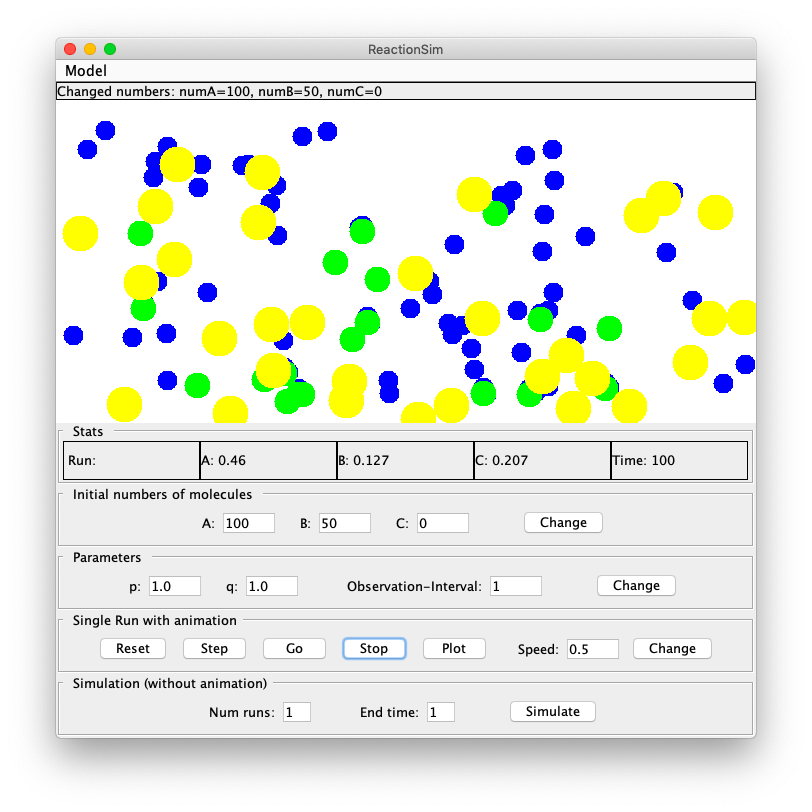

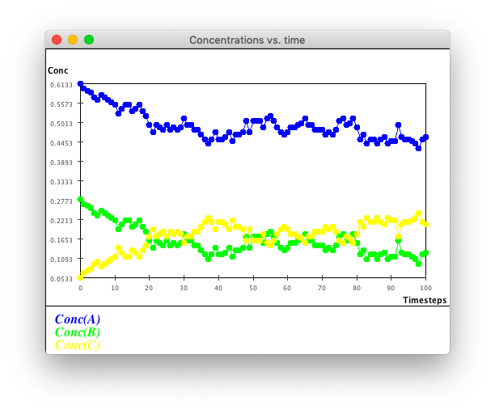

It seems that there are more fluctuations than standard model, since sometime the reaction does not happen when the probability meets the condition (the distance is too long).

Use spatial mode to run 10 times:

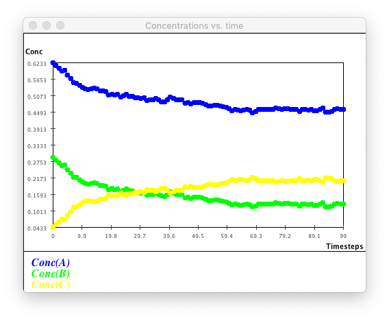

It seems that the curve is not as smooth as stand mode.

Use spatial mode to run 100 times:

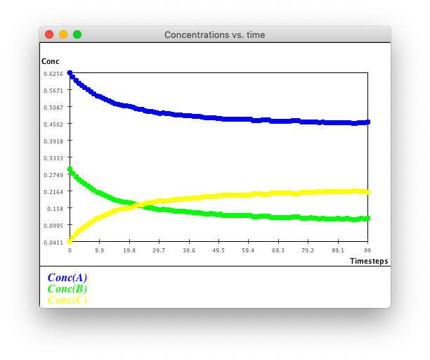

Use stardard mode to run 100 times:

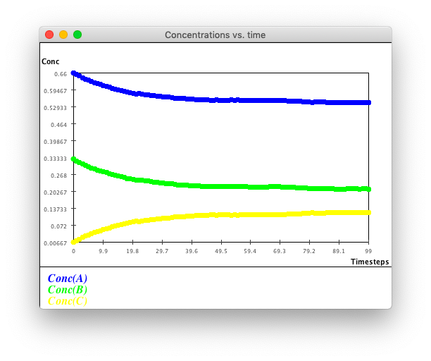

### 06

>  Fill in the missing number in the table above.

| Concentration of A | t=1  | t=2   | t=3   | t=4   |
| ------------------ | ---- | ----- | ----- | ----- |
| Run=1              | 0.63 | 0.58  | 0.59  | 0.52  |
| Run=2              | 0.61 | 0.56  | 0.53  | 0.54  |
| Run=3              | 0.62 | 0.59  | 0.55  | 0.51  |
| Average            | 0.62 | 0.576 | 0.567 | 0.523 |

### 07

> 1. If the spatial model doesn't use concentration, why then is the behavior like the standard model?
>
> 2. Find the place in the code that has the "distance" parameter. What is the distance parameter set at?
> 3. Double it and see what you get. Can you explain?
> 4. What is "doubling" the distance equivalent to in terms of using other values for $p​$ and $q​$?

**1**

In the spatial model, whether the reaction happens or not dependents on the distance between molecules. It means that: the smaller the average distance is, the more likely the reaction `A + B => C` happens. It is also clear that: the higher the concentration `A` and `B` is, the smaller the average distance is. As a result, the higher the concentration `A` and `B` is, the more likely the reaction `A + B => C` happens. Such conclusion fits the standard model.

**2**

The distance parameter is `closenessDistance` in class `MolecularSimPanel` in file `MolecularSimPanel` which is setted at `100`.

**3**

```
closenessDistance = 100

Model = Spatial Simulation
A = 100
B = 50
C = 0
Num runs = 100
End time = 100
```


```
closenessDistance = 200

Model = Spatial Simulation
A = 100
B = 50
C = 0
Num runs = 100
End time = 100
```

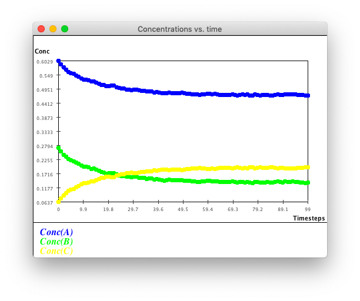

**4**

Doubling the distance means: reaction `A + B => C` becomes more likely to happen. It is equivalent to increase $p$ and decrease $q$ in the standard model.

### 08

> Suppose $s=0.01,K_{ab}=1.0,K_{c}=0.5$, and $A(0)=3.0,B(0)=2.0,C(0)=1.5$. Compute the concentrations of $A(t),B(t),C(t)$ at time $t=0.01,t=0.02,t=0.03$ as follows:
>
> - First, calculate $A(0.01),B(0.01),C(0.01)$.
> - Then, use these values to calculate $A(0.02),B(0.02),C(0.02)​$.
> - Then, use the values at $0.02$ to calculate $A(0.03),B(0.03),C(0.03)$.

$$
\begin{align*}
A(0.01)&=A(0)+s(K_{c}C(0)-K_{ab}A(0)B(0))&=2.9475\\
B(0.01)&=B(0)+s(K_{c}C(0)-K_{ab}A(0)B(0))&=1.9475\\
C(0.01)&=C(0)+s(K_{c}C(0)-K_{ab}A(0)B(0))&=1.5525\\
A(0.02)&=A(0.01)+s(K_{c}C(0.01)-K_{ab}A(0.01)B(0.01))&\approx2.898\\
B(0.02)&=B(0.01)+s(K_{c}C(0.01)-K_{ab}A(0.01)B(0.01))&\approx2.898\\
C(0.02)&=C(0.01)+s(K_{c}C(0.01)-K_{ab}A(0.01)B(0.01))&\approx1.602\\
A(0.03)&=A(0.03)+s(K_{c}C(0.03)-K_{ab}A(0.02)B(0.02))&\approx2.850\\
B(0.03)&=B(0.03)+s(K_{c}C(0.03)-K_{ab}A(0.02)B(0.02))&\approx1.850\\
C(0.03)&=C(0.03)+s(K_{c}C(0.03)-K_{ab}A(0.02)B(0.02))&\approx1.650\\
\end{align*}
$$

### 09

> Write a Java program to compute concentrations using this model. Start by using [this template](https://www2.seas.gwu.edu/~simhaweb/contalg/modules/module4/examples/ConcCalc.java). Then, modify the code to change the end-time to 1.0. What do you observe as the final concentrations of A, B and C? Plot a graph of how the concentrations change with time, and compare with previous models.

See file `ConcCalc.java`.

Result:

```
At time t=0:   A(t)=2.947   B(t)=1.949   C(t)=1.55
At time t=0.01:   A(t)=2.898   B(t)=1.9   C(t)=1.597
At time t=0.02:   A(t)=2.851   B(t)=1.854   C(t)=1.642
At time t=0.03:   A(t)=2.806   B(t)=1.81   C(t)=1.685
At time t=0.04:   A(t)=2.764   B(t)=1.768   C(t)=1.725
At time t=0.05:   A(t)=2.724   B(t)=1.729   C(t)=1.764
At time t=0.06:   A(t)=2.685   B(t)=1.691   C(t)=1.8
At time t=0.07:   A(t)=2.649   B(t)=1.655   C(t)=1.835
At time t=0.08:   A(t)=2.614   B(t)=1.621   C(t)=1.868
At time t=0.09:   A(t)=2.581   B(t)=1.589   C(t)=1.9
At time t=0.1:   A(t)=2.55   B(t)=1.558   C(t)=1.93
At time t=0.11:   A(t)=2.52   B(t)=1.528   C(t)=1.959
At time t=0.12:   A(t)=2.491   B(t)=1.5   C(t)=1.987
At time t=0.13:   A(t)=2.463   B(t)=1.473   C(t)=2.013
At time t=0.14:   A(t)=2.437   B(t)=1.447   C(t)=2.038
At time t=0.15:   A(t)=2.412   B(t)=1.422   C(t)=2.062
At time t=0.16:   A(t)=2.388   B(t)=1.399   C(t)=2.085
At time t=0.17:   A(t)=2.365   B(t)=1.376   C(t)=2.107
At time t=0.18:   A(t)=2.343   B(t)=1.354   C(t)=2.129
At time t=0.19:   A(t)=2.322   B(t)=1.333   C(t)=2.149
At time t=0.2:   A(t)=2.302   B(t)=1.314   C(t)=2.168
At time t=0.21:   A(t)=2.282   B(t)=1.294   C(t)=2.187
At time t=0.22:   A(t)=2.264   B(t)=1.276   C(t)=2.205
At time t=0.23:   A(t)=2.246   B(t)=1.258   C(t)=2.222
At time t=0.24:   A(t)=2.229   B(t)=1.241   C(t)=2.239
At time t=0.25:   A(t)=2.212   B(t)=1.225   C(t)=2.255
At time t=0.26:   A(t)=2.197   B(t)=1.21   C(t)=2.27
At time t=0.27:   A(t)=2.181   B(t)=1.195   C(t)=2.285
At time t=0.28:   A(t)=2.167   B(t)=1.18   C(t)=2.299
At time t=0.29:   A(t)=2.153   B(t)=1.166   C(t)=2.313
At time t=0.3:   A(t)=2.139   B(t)=1.153   C(t)=2.326
At time t=0.31:   A(t)=2.126   B(t)=1.14   C(t)=2.338
At time t=0.32:   A(t)=2.113   B(t)=1.127   C(t)=2.35
At time t=0.33:   A(t)=2.101   B(t)=1.116   C(t)=2.362
At time t=0.34:   A(t)=2.09   B(t)=1.104   C(t)=2.373
At time t=0.35:   A(t)=2.079   B(t)=1.093   C(t)=2.384
At time t=0.36:   A(t)=2.068   B(t)=1.082   C(t)=2.395
At time t=0.37:   A(t)=2.057   B(t)=1.072   C(t)=2.405
At time t=0.38:   A(t)=2.047   B(t)=1.062   C(t)=2.414
At time t=0.39:   A(t)=2.038   B(t)=1.052   C(t)=2.424
At time t=0.4:   A(t)=2.028   B(t)=1.043   C(t)=2.433
At time t=0.41:   A(t)=2.019   B(t)=1.034   C(t)=2.442
At time t=0.42:   A(t)=2.011   B(t)=1.026   C(t)=2.45
At time t=0.43:   A(t)=2.002   B(t)=1.017   C(t)=2.458
At time t=0.44:   A(t)=1.994   B(t)=1.009   C(t)=2.466
At time t=0.45:   A(t)=1.986   B(t)=1.002   C(t)=2.474
At time t=0.46:   A(t)=1.979   B(t)=0.994   C(t)=2.481
At time t=0.47:   A(t)=1.972   B(t)=0.987   C(t)=2.488
At time t=0.48:   A(t)=1.965   B(t)=0.98   C(t)=2.495
At time t=0.49:   A(t)=1.958   B(t)=0.973   C(t)=2.501
At time t=0.5:   A(t)=1.951   B(t)=0.967   C(t)=2.508
At time t=0.51:   A(t)=1.945   B(t)=0.961   C(t)=2.514
At time t=0.52:   A(t)=1.939   B(t)=0.955   C(t)=2.52
At time t=0.53:   A(t)=1.933   B(t)=0.949   C(t)=2.525
At time t=0.54:   A(t)=1.927   B(t)=0.943   C(t)=2.531
At time t=0.55:   A(t)=1.922   B(t)=0.938   C(t)=2.536
At time t=0.56:   A(t)=1.916   B(t)=0.932   C(t)=2.542
At time t=0.57:   A(t)=1.911   B(t)=0.927   C(t)=2.547
At time t=0.58:   A(t)=1.906   B(t)=0.922   C(t)=2.551
At time t=0.59:   A(t)=1.901   B(t)=0.918   C(t)=2.556
At time t=0.6:   A(t)=1.897   B(t)=0.913   C(t)=2.561
At time t=0.61:   A(t)=1.892   B(t)=0.908   C(t)=2.565
At time t=0.62:   A(t)=1.888   B(t)=0.904   C(t)=2.569
At time t=0.63:   A(t)=1.884   B(t)=0.9   C(t)=2.573
At time t=0.64:   A(t)=1.879   B(t)=0.896   C(t)=2.577
At time t=0.65:   A(t)=1.876   B(t)=0.892   C(t)=2.581
At time t=0.66:   A(t)=1.872   B(t)=0.888   C(t)=2.585
At time t=0.67:   A(t)=1.868   B(t)=0.885   C(t)=2.589
At time t=0.68:   A(t)=1.864   B(t)=0.881   C(t)=2.592
At time t=0.69:   A(t)=1.861   B(t)=0.878   C(t)=2.595
At time t=0.7:   A(t)=1.858   B(t)=0.874   C(t)=2.599
At time t=0.71:   A(t)=1.854   B(t)=0.871   C(t)=2.602
At time t=0.72:   A(t)=1.851   B(t)=0.868   C(t)=2.605
At time t=0.73:   A(t)=1.848   B(t)=0.865   C(t)=2.608
At time t=0.74:   A(t)=1.845   B(t)=0.862   C(t)=2.611
At time t=0.75:   A(t)=1.842   B(t)=0.859   C(t)=2.613
At time t=0.76:   A(t)=1.84   B(t)=0.856   C(t)=2.616
At time t=0.77:   A(t)=1.837   B(t)=0.854   C(t)=2.619
At time t=0.78:   A(t)=1.834   B(t)=0.851   C(t)=2.621
At time t=0.79:   A(t)=1.832   B(t)=0.849   C(t)=2.624
At time t=0.8:   A(t)=1.829   B(t)=0.846   C(t)=2.626
At time t=0.81:   A(t)=1.827   B(t)=0.844   C(t)=2.628
At time t=0.82:   A(t)=1.825   B(t)=0.842   C(t)=2.631
At time t=0.83:   A(t)=1.823   B(t)=0.839   C(t)=2.633
At time t=0.84:   A(t)=1.82   B(t)=0.837   C(t)=2.635
At time t=0.85:   A(t)=1.818   B(t)=0.835   C(t)=2.637
At time t=0.86:   A(t)=1.816   B(t)=0.833   C(t)=2.639
At time t=0.87:   A(t)=1.814   B(t)=0.831   C(t)=2.641
At time t=0.88:   A(t)=1.813   B(t)=0.83   C(t)=2.642
At time t=0.89:   A(t)=1.811   B(t)=0.828   C(t)=2.644
At time t=0.9:   A(t)=1.809   B(t)=0.826   C(t)=2.646
At time t=0.91:   A(t)=1.807   B(t)=0.824   C(t)=2.648
At time t=0.92:   A(t)=1.806   B(t)=0.823   C(t)=2.649
At time t=0.93:   A(t)=1.804   B(t)=0.821   C(t)=2.651
At time t=0.94:   A(t)=1.802   B(t)=0.819   C(t)=2.652
At time t=0.95:   A(t)=1.801   B(t)=0.818   C(t)=2.654
At time t=0.96:   A(t)=1.799   B(t)=0.817   C(t)=2.655
At time t=0.97:   A(t)=1.798   B(t)=0.815   C(t)=2.657
At time t=0.98:   A(t)=1.797   B(t)=0.814   C(t)=2.658
At time t=0.99:   A(t)=1.795   B(t)=0.812   C(t)=2.659
```

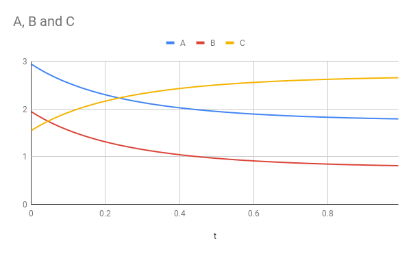

### 10

> How would one go about writing the code so that it's recursive? That is, our goal is to compute $A(t),B(t),C(t)​$ for some large $T​$, which we could do recursively in terms of $A(T-s),B(T-s),C(T-s)​$, which in turn can computed from $A(T-2s),B(T-2s),C(T-2s)​$ … etc. Write a recursive version and compare the number of arithmetic operations in the recursive approach vs. the iterative one.
>

See file `ConcCalcRecursive.java`.

Result:

```
At time t=-0:   A(t)=3   B(t)=2   C(t)=1.5
At time t=0.01:   A(t)=2.947   B(t)=1.949   C(t)=1.55
At time t=0.02:   A(t)=2.898   B(t)=1.9   C(t)=1.597
At time t=0.03:   A(t)=2.851   B(t)=1.854   C(t)=1.642
At time t=0.04:   A(t)=2.806   B(t)=1.81   C(t)=1.685
At time t=0.05:   A(t)=2.764   B(t)=1.768   C(t)=1.725
At time t=0.06:   A(t)=2.724   B(t)=1.729   C(t)=1.764
At time t=0.07:   A(t)=2.685   B(t)=1.691   C(t)=1.8
At time t=0.08:   A(t)=2.649   B(t)=1.655   C(t)=1.835
At time t=0.09:   A(t)=2.614   B(t)=1.621   C(t)=1.868
At time t=0.1:   A(t)=2.581   B(t)=1.589   C(t)=1.9
At time t=0.11:   A(t)=2.55   B(t)=1.558   C(t)=1.93
At time t=0.12:   A(t)=2.52   B(t)=1.528   C(t)=1.959
At time t=0.13:   A(t)=2.491   B(t)=1.5   C(t)=1.987
At time t=0.14:   A(t)=2.463   B(t)=1.473   C(t)=2.013
At time t=0.15:   A(t)=2.437   B(t)=1.447   C(t)=2.038
At time t=0.16:   A(t)=2.412   B(t)=1.422   C(t)=2.062
At time t=0.17:   A(t)=2.388   B(t)=1.399   C(t)=2.085
At time t=0.18:   A(t)=2.365   B(t)=1.376   C(t)=2.107
At time t=0.19:   A(t)=2.343   B(t)=1.354   C(t)=2.129
At time t=0.2:   A(t)=2.322   B(t)=1.333   C(t)=2.149
At time t=0.21:   A(t)=2.302   B(t)=1.314   C(t)=2.168
At time t=0.22:   A(t)=2.282   B(t)=1.294   C(t)=2.187
At time t=0.23:   A(t)=2.264   B(t)=1.276   C(t)=2.205
At time t=0.24:   A(t)=2.246   B(t)=1.258   C(t)=2.222
At time t=0.25:   A(t)=2.229   B(t)=1.241   C(t)=2.239
At time t=0.26:   A(t)=2.212   B(t)=1.225   C(t)=2.255
At time t=0.27:   A(t)=2.197   B(t)=1.21   C(t)=2.27
At time t=0.28:   A(t)=2.181   B(t)=1.195   C(t)=2.285
At time t=0.29:   A(t)=2.167   B(t)=1.18   C(t)=2.299
At time t=0.3:   A(t)=2.153   B(t)=1.166   C(t)=2.313
At time t=0.31:   A(t)=2.139   B(t)=1.153   C(t)=2.326
At time t=0.32:   A(t)=2.126   B(t)=1.14   C(t)=2.338
At time t=0.33:   A(t)=2.113   B(t)=1.127   C(t)=2.35
At time t=0.34:   A(t)=2.101   B(t)=1.116   C(t)=2.362
At time t=0.35:   A(t)=2.09   B(t)=1.104   C(t)=2.373
At time t=0.36:   A(t)=2.079   B(t)=1.093   C(t)=2.384
At time t=0.37:   A(t)=2.068   B(t)=1.082   C(t)=2.395
At time t=0.38:   A(t)=2.057   B(t)=1.072   C(t)=2.405
At time t=0.39:   A(t)=2.047   B(t)=1.062   C(t)=2.414
At time t=0.4:   A(t)=2.038   B(t)=1.052   C(t)=2.424
At time t=0.41:   A(t)=2.028   B(t)=1.043   C(t)=2.433
At time t=0.42:   A(t)=2.019   B(t)=1.034   C(t)=2.442
At time t=0.43:   A(t)=2.011   B(t)=1.026   C(t)=2.45
At time t=0.44:   A(t)=2.002   B(t)=1.017   C(t)=2.458
At time t=0.45:   A(t)=1.994   B(t)=1.009   C(t)=2.466
At time t=0.46:   A(t)=1.986   B(t)=1.002   C(t)=2.474
At time t=0.47:   A(t)=1.979   B(t)=0.994   C(t)=2.481
At time t=0.48:   A(t)=1.972   B(t)=0.987   C(t)=2.488
At time t=0.49:   A(t)=1.965   B(t)=0.98   C(t)=2.495
At time t=0.5:   A(t)=1.958   B(t)=0.973   C(t)=2.501
At time t=0.51:   A(t)=1.951   B(t)=0.967   C(t)=2.508
At time t=0.52:   A(t)=1.945   B(t)=0.961   C(t)=2.514
At time t=0.53:   A(t)=1.939   B(t)=0.955   C(t)=2.52
At time t=0.54:   A(t)=1.933   B(t)=0.949   C(t)=2.525
At time t=0.55:   A(t)=1.927   B(t)=0.943   C(t)=2.531
At time t=0.56:   A(t)=1.922   B(t)=0.938   C(t)=2.536
At time t=0.57:   A(t)=1.916   B(t)=0.932   C(t)=2.542
At time t=0.58:   A(t)=1.911   B(t)=0.927   C(t)=2.547
At time t=0.59:   A(t)=1.906   B(t)=0.922   C(t)=2.551
At time t=0.6:   A(t)=1.901   B(t)=0.918   C(t)=2.556
At time t=0.61:   A(t)=1.897   B(t)=0.913   C(t)=2.561
At time t=0.62:   A(t)=1.892   B(t)=0.908   C(t)=2.565
At time t=0.63:   A(t)=1.888   B(t)=0.904   C(t)=2.569
At time t=0.64:   A(t)=1.884   B(t)=0.9   C(t)=2.573
At time t=0.65:   A(t)=1.879   B(t)=0.896   C(t)=2.577
At time t=0.66:   A(t)=1.876   B(t)=0.892   C(t)=2.581
At time t=0.67:   A(t)=1.872   B(t)=0.888   C(t)=2.585
At time t=0.68:   A(t)=1.868   B(t)=0.885   C(t)=2.589
At time t=0.69:   A(t)=1.864   B(t)=0.881   C(t)=2.592
At time t=0.7:   A(t)=1.861   B(t)=0.878   C(t)=2.595
At time t=0.71:   A(t)=1.858   B(t)=0.874   C(t)=2.599
At time t=0.72:   A(t)=1.854   B(t)=0.871   C(t)=2.602
At time t=0.73:   A(t)=1.851   B(t)=0.868   C(t)=2.605
At time t=0.74:   A(t)=1.848   B(t)=0.865   C(t)=2.608
At time t=0.75:   A(t)=1.845   B(t)=0.862   C(t)=2.611
At time t=0.76:   A(t)=1.842   B(t)=0.859   C(t)=2.613
At time t=0.77:   A(t)=1.84   B(t)=0.856   C(t)=2.616
At time t=0.78:   A(t)=1.837   B(t)=0.854   C(t)=2.619
At time t=0.79:   A(t)=1.834   B(t)=0.851   C(t)=2.621
At time t=0.8:   A(t)=1.832   B(t)=0.849   C(t)=2.624
At time t=0.81:   A(t)=1.829   B(t)=0.846   C(t)=2.626
At time t=0.82:   A(t)=1.827   B(t)=0.844   C(t)=2.628
At time t=0.83:   A(t)=1.825   B(t)=0.842   C(t)=2.631
At time t=0.84:   A(t)=1.823   B(t)=0.839   C(t)=2.633
At time t=0.85:   A(t)=1.82   B(t)=0.837   C(t)=2.635
At time t=0.86:   A(t)=1.818   B(t)=0.835   C(t)=2.637
At time t=0.87:   A(t)=1.816   B(t)=0.833   C(t)=2.639
At time t=0.88:   A(t)=1.814   B(t)=0.831   C(t)=2.641
At time t=0.89:   A(t)=1.813   B(t)=0.83   C(t)=2.642
At time t=0.9:   A(t)=1.811   B(t)=0.828   C(t)=2.644
At time t=0.91:   A(t)=1.809   B(t)=0.826   C(t)=2.646
At time t=0.92:   A(t)=1.807   B(t)=0.824   C(t)=2.648
At time t=0.93:   A(t)=1.806   B(t)=0.823   C(t)=2.649
At time t=0.94:   A(t)=1.804   B(t)=0.821   C(t)=2.651
At time t=0.95:   A(t)=1.802   B(t)=0.819   C(t)=2.652
At time t=0.96:   A(t)=1.801   B(t)=0.818   C(t)=2.654
At time t=0.97:   A(t)=1.799   B(t)=0.817   C(t)=2.655
At time t=0.98:   A(t)=1.798   B(t)=0.815   C(t)=2.657
At time t=0.99:   A(t)=1.797   B(t)=0.814   C(t)=2.658
At time t=1:   A(t)=1.795   B(t)=0.812   C(t)=2.659
```

The time complexity of both versions are $O(t)$. However, recursive approach costs more time since it contains more function call.

### 11

> Exercise 11: In general, how accurate should a model be? Consider this Physics experiment:
>
> - Suppose, from atop a 300-foot building on campus you fix a point on a protruding rod where you can drop a heavy (so that wind won't have an effect) object to observe where it lands on the ground.
> - From that same drop-point, you let down a plumb-line and mark the spot where the plumb line touches the ground. Now you drop the heavy object.
> - You expect the dropped object to hit the marked spot dead on, right?
>
> Discuss with your neighboring students/team, whether:
>
> 1. The object hits the marked spot dead-on.
>
> 2. The object lands a little to the West.
>
> 3. The object lands a little to the East.
>
> 4. The object lands a little to the North.
>
> 5. The object lands a little to the South.
>
> 6. Something else. (What?)
>
> The answer to this question, it turns out, has had tremendous historical significance.

(nothing to answer)

### 12

> Exercise 12: Run the VirtualReactor program and select the "Rabbit-Lynx" model. Use these values: $X(0)=1.5,Y(0)=1.0,k_{1}=2.4,k_{2}=4.2,k_{3}=5.1,endTime=10$. (Ignore the $k_{4}$ parameter.) You should observe something quite interesting.

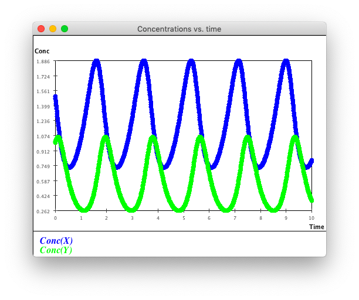

### 13

> Download and execute [Missile.java](https://www2.seas.gwu.edu/~simhaweb/contalg/modules/module4/examples/Missile.java). Examine the code and write down the differential equations. How many variables (functions) are involved?

missile:
$$
\begin{align*}
Y&=300+y\\
v_{y}&=\frac{\newcommand*{\dif}{\mathop{}\!\mathrm{d}}y}{\newcommand*{\dif}{\mathop{}\!\mathrm{d}}t}\\
-3&=\frac{\newcommand*{\dif}{\mathop{}\!\mathrm{d}}v_{y}}{\newcommand*{\dif}{\mathop{}\!\mathrm{d}}t}\\
\end{align*}
$$

### 14

> Why is this true?

It is true because of the mathematical and the physical law.

### 15

> Why is this true?

It is true because of the mathematical and the physical law.

### 16

> Write pseudocode for a Dubin car simulator based on these equations.

Use the current state to calculate the state after `deltaT`:

``` pseudocode
function simulate(
	input: x, y, theta, omegaL, omegaR, R, L, deltaT
	out: xFinal, yFinal, thetaFinal
)
begin
  dPrime = (1 / 2) * R * (omegaL + omegaR)
  xPrime = dPrime * cos(theta);
  yPrime = dPrime * sin(theta);
  xFinal = x + xPrime * deltaT;
  yFinal = y + yPrime * deltaT;
  thetaPrime = (omegaL - omegaR) * R / L;
  thetaFinal += theta + thetaPrime * deltaT;
end simulate
```

### 17

> What additional equation is needed for an accelerative version of the Dubin car?

$$
\begin{align*}
\omega_{L}(t)&=a_{L}t\\
\omega_{R}(t)&=a_{R}t\\
\end{align*}
$$

### 18

> Write down the equations for the Simple-Car which has two controls: forward-velocity $v$ and steering angle $\phi$. Implement a simulator for the Simple-Car in CarSim. (To draw one, merely draw a circle).

(I don't know. It's too difficult.)

### 19

> Why?

$$
\begin{align*}
x&=\theta R\\
v&=\frac{\newcommand*{\dif}{\mathop{}\!\mathrm{d}}x}{\newcommand*{\dif}{\mathop{}\!\mathrm{d}}t}=\frac{\newcommand*{\dif}{R\mathop{}\!\mathrm{d}}\theta}{\newcommand*{\dif}{\mathop{}\!\mathrm{d}}t}=\omega R\\
a&=\frac{\newcommand*{\dif}{\mathop{}\!\mathrm{d}}v}{\newcommand*{\dif}{\mathop{}\!\mathrm{d}}t}=\frac{\newcommand*{\dif}{R\mathop{}\!\mathrm{d}}\omega}{\newcommand*{\dif}{\mathop{}\!\mathrm{d}}t}=\mu R\\
\end{align*}
$$

### 20

> Download and examine [Winch.java](https://www2.seas.gwu.edu/~simhaweb/contalg/modules/module4/examples/Winch.java).
>
> - Identify the code corresponding to the differential equations we derived earlier.
>
> - Handcode different values of torque to see what value is sufficient to lift the load. Is there a value that will lift the load and yet avert a collision with the winch?

code corresponding

``` java
void nextStep() {
```

avoid collision

``` java
while (y < winchY - R) {   // Stop if it collides with the winch.
```

### 21

> Set `isVertical=false` in the program and execute. You should see a version without gravity (as if the load were on a frictionless surface). What value of torque is sufficient to pull the load?

Based on Newton's laws:
$$
\begin{align*}
\tau_{min}-mgR=0\\
\end{align*}
$$
So:
$$
\begin{align*}
\tau_{min}=mgR\\
\end{align*}
$$
