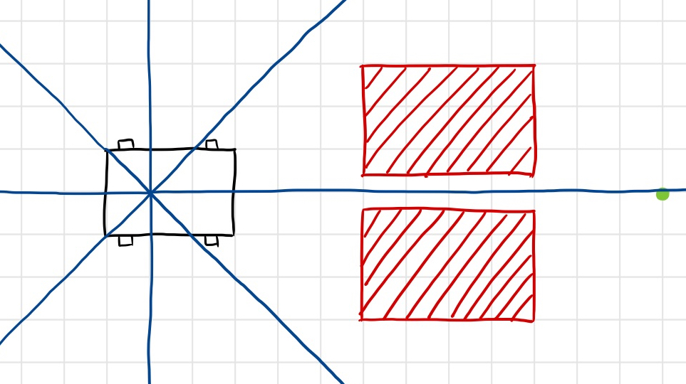

# Module 05

### 11

> Add derivative control to your controller. Experiment with different values of the two proportionality constants $k_{p}​$ and $k_{d}​$ What do you observe?

Let $k_{p}=0.05$ and $k_{d}=\frac{k_{p}}{20}​$.

See file `MySimpleCarController.java` and run it in `CarGUI`.

### 16

> Implement the above in [MySimpleCarController3.java](https://www2.seas.gwu.edu/~simhaweb/contalg/modules/module5/examples/MySimpleCarController3.java) and see if it works. The open-to-goal test has been implemented for you.

See file `MySimpleCarController3.java` and run it in `CarGUI`.

### 17

> How can you determine whether it's closer to turn clockwise vs. anticlockwise?

See followimg code in file `MySimpleCarController3.java`.

``` java
...

double gammaInTheta = gamma - theta;
double gammaInThetaDelta;

while (gammaInTheta > 2 * Math.PI) {
    gammaInTheta -= 2 * Math.PI;
}
while (gammaInTheta < 0) {
    gammaInTheta += 2 * Math.PI;
}
if (gammaInTheta <= Math.PI) {
    gammaInThetaDelta = gammaInTheta;
} else {
    gammaInThetaDelta = gammaInTheta - 2 * Math.PI;
}

...
```

If `gammaInThetaDelta` is positive, then turn left, else turn right.

### 18

> What happens if we are too close to an obstacle on the left side? What changes are needed for obstacle avoidance on the left?

It may hit the obstacle when turing. Ths solution is to enlarge $\delta$ - the lower limit of distance sensored by sonar of North.

### 19

> Assuming obstacle avoidance works, draw on paper a scenario on paper where the above goal-seeking algorithm fails to reach the goal. Suggest a better algorithm.


