# Module 07

### 05

> What is $Pr[X\le 2]$ example? Write down $Pr[X\le k]$ above? Write down $Pr[X\le k]$ for all relevant values of $k$. Next, suppose $Pr[heads]=p$ in the above example. Write down $Pr[X=i],i\in\{0,1,2,3\}$, in terms of $p$.
>

$$
\begin{align*}
Pr[X\le 0]&=Pr[X=0]=0.064\\
Pr[X\le 1]&=Pr[X\le 0]+Pr[X=1]=0.352\\
Pr[X\le 2]&=Pr[X\le 1]+Pr[X=2]=0.784\\
Pr[X\le 3]&=Pr[X\le 2]+Pr[X=3]=1\\
\end{align*}
$$

Let $P[heads]=p$,
$$
\begin{align*}
Pr[X=0]&=(1-p)^{3}\\
Pr[X=1]&=3p(1-p)^{2}\\
Pr[X=2]&=3p^{2}(1-p)\\
Pr[X=3]&=p^{3}\\
\end{align*}
$$

### 08

> If $p=0.6$, what is the probability that the first heads appears on the 3rd flip? Verify your answer using [Coin.java](https://www2.seas.gwu.edu/~simhaweb/contalg/modules/module7/examples/Coin.java) and [CoinExample.java](https://www2.seas.gwu.edu/~simhaweb/contalg/modules/module7/examples/CoinExample.java).

$$
\begin{align*}
Pr=(1-0.6)^{2}0.6=0.096\\
\end{align*}
$$

### 09

> Suppose I compare two parameter values for the Geometric distribution: $p=0.6$ and $p=0.8$. For which of the two values of $p$ is $Pr[X=3]$ higher?

Let $p=0.6$,
$$
\begin{align*}
Pr[X=3]=(1-0.6)^{2}0.6=0.096\\
\end{align*}
$$


Let $p=0.8$,
$$
\begin{align*}
Pr[X=3]=(1-0.8)^{2}0.8=0.032\\
\end{align*}
$$
It seems that $P[X=3]$ for $p=0.8$ is higher.

### 10

> Compute (by hand) $Pr[X > k]$ when $X\sim Geometric(p)$.

$$
\begin{align*}
Pr[X>k]&=1-Pr[X\le k]=1-\sum^{k}_{i=1}Pr[X=i]=1-\sum^{k}_{i=1}[(1-p)^{i-1}p]\\
\end{align*}
$$

### 11

> Suppose we flip a coin $n$ times and count the number of heads using a coin for which $P[H]=p$,
>
> - Write code to compute $Pr[X=k]$ using the formula
>
>     $P[X=k]=\dbinom{n}{k}p^{k}(1-p)^{n-k}$
>
>   Write your code in [Binomial.java](https://www2.seas.gwu.edu/~simhaweb/contalg/modules/module7/examples/Binomial.java).
>
> - Plot a graph of $Pr[X=k]$ vs. $k$ for the case $n=10,p=0.6$ and for the case $n=10,p=0.2$.
>
> - Write a simulation to estimate $Pr[X=3]$ when $n=10,p=0.6$. You can use [Coin.java](https://www2.seas.gwu.edu/~simhaweb/contalg/modules/module7/examples/Coin.java) and [CoinExample2.java](https://www2.seas.gwu.edu/~simhaweb/contalg/modules/module7/examples/CoinExample2.java) for this purpose. Verify the estimate using the earlier formula.

**1**

See file `Binomial.java`.

**2**

$n=10$ and $p=0.6$

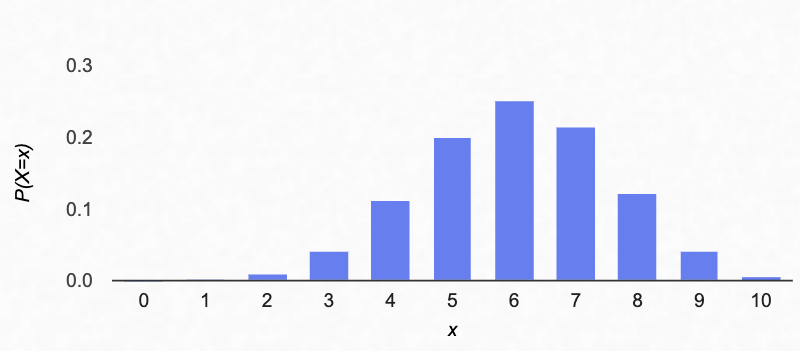

$n=10$ and $p=0.2$

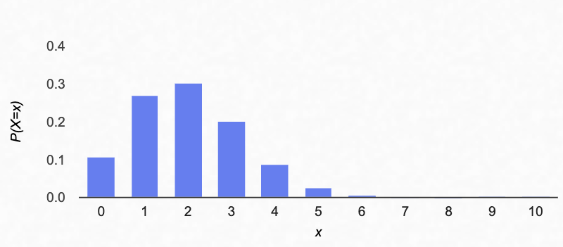

**3**

See file `CoinExample2.java`.

### 13

> Add code to [Poisson.java](https://www2.seas.gwu.edu/~simhaweb/contalg/modules/module7/examples/Poisson.java) to compute $Pr[X=k]$ and plot a graph of $Pr[X=k]$ vs. $k$ when $\gamma=2$. Use the Taylor series for $e^{x}$ to prove that $\sum_{k}Pr[X=k]$ adds up to 1.

See file `Poisson.java`.

$\gamma=2$

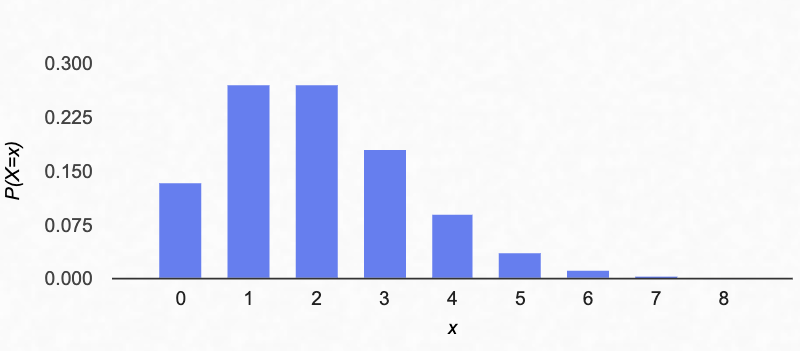

Based on Taylor series,
$$
\begin{align*}
e^{x}&=\sum_{k}\frac{x^{k}}{k!}\\

\end{align*}
$$
So,
$$
\begin{align*}
\sum_{k}Pr[X=k]&=\sum_{k}e^{-\gamma}\frac{\gamma^{k}}{k!}=e^{-\gamma}\sum_{k}\frac{\gamma^{k}}{k!}=e^{-\gamma}e^{\gamma}=1\\
\end{align*}
$$

### 14

> Download [BusStop.java](https://www2.seas.gwu.edu/~simhaweb/contalg/modules/module7/examples/BusStop.java) and [BusStopExample3.java](https://www2.seas.gwu.edu/~simhaweb/contalg/modules/module7/examples/BusStopExample3.java), and modify the latter to estimate the probability that exactly three buses arrive during the interval $[0,2]$. Compare this with $Pr[X=3]$ when $X\sim Poisson(2)$.

See file `BusStopExample3.java`.

Result:

```
The probability that exactly three buses arrive during the interval [0,2] is 0.1813
```

If $X\sim Poisson(2)$,
$$
\begin{align*}
Pr[X=3]=e^{-\gamma}\frac{\gamma^{k}}{k!}=e^{-2}\frac{2^{3}}{3!}=0.18045
\end{align*}
$$

### 19

> Consider the distribution for the 3-coin-flip example:
>
> $Pr[X=0]=0.064$
>
> $Pr[X=1]=0.288$
>
> $Pr[X=2]=0.432$
>
> $Pr[X=3]=0.216$
>
> Sketch the CDF on paper.

$$
\begin{align*}
CDF(0)=Pr[X<=0]&=0.064\\
CDF(1)=Pr[X<=1]&=0.352\\
CDF(2)=Pr[X<=2]&=0.784\\
CDF(3)=Pr[X<=3]&=1\\
\end{align*}
$$

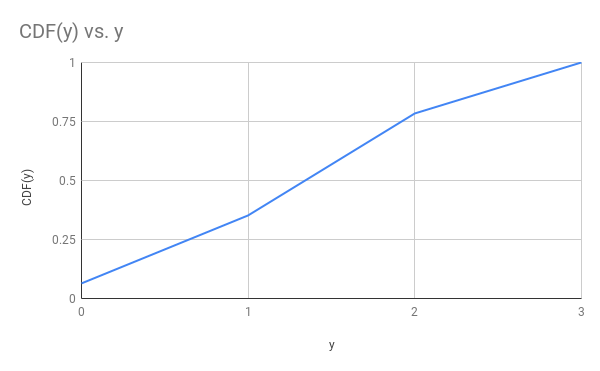

### 23

> What is an example of a continuous rv associated with the [QueueControl.java](https://www2.seas.gwu.edu/~simhaweb/contalg/modules/module7/examples/QueueControl.java) application?

the average service time for a customer

### 25

> The program [GaussianCDF.java](https://www2.seas.gwu.edu/~simhaweb/contalg/modules/module7/examples/GaussianCDF.java) estimates the CDF of a Gaussian rv. Execute the program to plot the CDF. Then, use this CDF to compute the following probabilities:
>
> - $Pr[0<X≤2]$
> - $Pr[X>0]$

Modify file ` GaussianCDF.java` as:

``` java
public class GaussianCDF {
    public static void main(String[] argv) {
        Function F = makeGaussianCDF();
        F.show();
        System.out.println("Pr[0 < x <= 2] = " + (F.get(2) - F.get(0)));
        System.out.println("Pr[x > 0] = " + (F.get(2) - F.get(0)));
    }
    static Function makeGaussianCDF() {
        double a = -2, b = 2;
        int M = 50;                   // Number of intervals.
        double delta = (b - a) / M;     // Interval size.
        double[] intervalCounts = new double[M];
        double numTrials = 1000000;
        for (int t = 0; t < numTrials; t++) {
            // Random sample:
            double y = RandTool.gaussian();
            // Truncate:
            if (y < a) {
                y = a;
            }
            if (y > b) {
                y = b;
            }
            // Find the right interval:
            int k = (int) Math.floor((y - a) / delta);
            // Increment the count for every interval above and including k.
            if (k < 0) {
                System.out.println("k=" + k + " y=" + y + " (y-a)=" + (y - a));
            }
            for (int i = k; i < M; i++) {
                intervalCounts[i]++;
            }
        }
        // Now compute probabilities for each interval.
        double[] cdf = new double[M];
        for (int k = 0; k < M; k++) {
            cdf[k] = intervalCounts[k] / numTrials;
        }
        // Build the CDF. Use mid-point of each interval.
        Function F = new Function("Gaussian cdf");
        for (int k = 0; k < M; k++) {
            double midPoint = a + k * delta + delta / 2;
            F.add(midPoint, cdf[k]);
        }
        return F;
    }
}
```

Result:

```
Pr[0 < x <= 2] = 0.462294
Pr[x > 0] = 0.462294
```

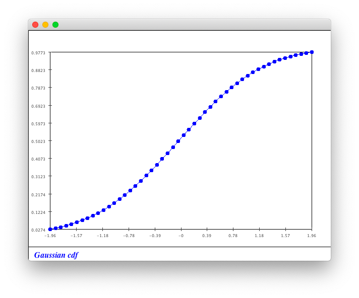

### 26

> Modify [UniformCDF.java](https://www2.seas.gwu.edu/~simhaweb/contalg/modules/module7/examples/UniformCDF.java) and [GaussianCDF.java](https://www2.seas.gwu.edu/~simhaweb/contalg/modules/module7/examples/GaussianCDF.java) to compute the derivative of each. What is the shape of $F'(y)$ in each case?

See file `UniformCDF.java`.

Result:

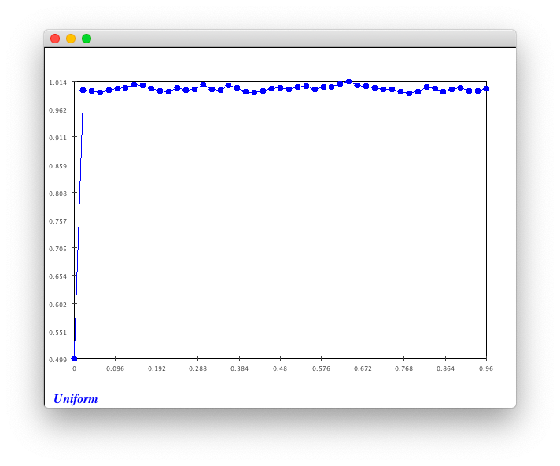

See file `GaussianCDF.java`.

Result:

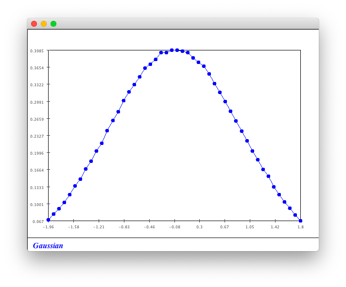

### 27

>  If $X$ denotes the first interarrival time in the bus-stop problem, estimate the CDF of $X$ as follows:
>
> - Assume that values fall in the range $[0,3]$ (i.e., disregard values outside this range).
> - Use [ExponentialCDF.java](https://www2.seas.gwu.edu/~simhaweb/contalg/modules/module7/examples/ExponentialCDF.java) as a template, and add modified code from [UniformCDF.java](https://www2.seas.gwu.edu/~simhaweb/contalg/modules/module7/examples/UniformCDF.java).
> - Next, compute the *derivative* of this function and display it.

See file `ExponentialCDF.java`.

Result:

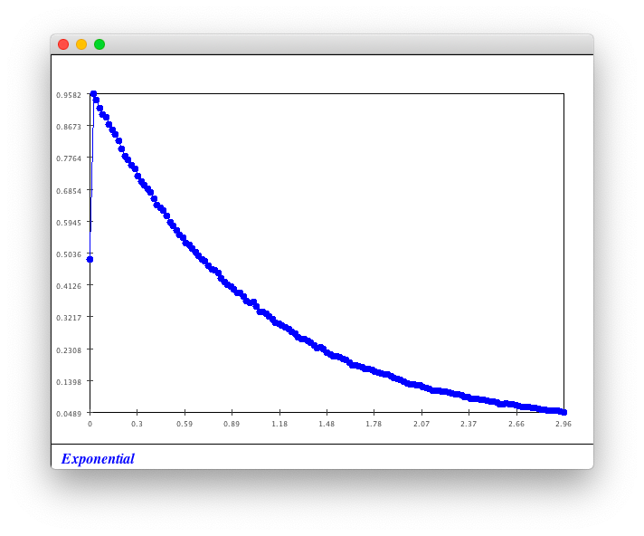

### 28

> Complete the calculation above. What would you get if $Pr[H]=0.5$?

$$
\begin{align*}
E[X]&=\sum_{k∈\{0,1,2,3\}}k\cdot Pr[X=k]\\
&=0\cdot Pr[X=0]+1\cdot Pr[X=1]+2\cdot Pr[X=2]+3\cdot Pr[X=3]\\
&=0\times 0.064+1\times 0.288+2\times 0.432+3\times 0.216\\
&=1.8\\
&=3\times 0.6\\
&=np
\end{align*}
$$

If $Pr[H]=0.5$ which means $X\sim Binomial(3,0.5)$,
$$
\begin{align*}
P[X=k]&=\dbinom{3}{k}0.5^{k}(1-0.5)^{3-k}=\dbinom{3}{k}0.5^{3}\\
\end{align*}
$$
So,
$$
\begin{align*}
Pr[X=0]&=0.125\\
Pr[X=1]&=0.375\\
Pr[X=2]&=0.375\\
Pr[X=3]&=0.125\\
\end{align*}
$$
Expected value:
$$
\begin{align*}
E[X]&=\sum_{k∈\{0,1,2,3\}}k\cdot Pr[X=k]\\
&=0\cdot Pr[X=0]+1\cdot Pr[X=1]+2\cdot Pr[X=2]+3\cdot Pr[X=3]\\
&=0∗0.125+1∗0.375+2∗0.375+3∗0.125\\
&=1.5\\
&=3\times 0.5\\
&=np
\end{align*}
$$

### 29

> How does this relate to the 3-coin-flip example?

See exercise \#28.

### 31

> What does $\frac{n}{k_{n}}$ become in the limit? Unfold the sum for the 3-coin-flip example to see why this is true.

$\frac{n}{k_{n}}$ in the limit will become as the probability.

### 32

> Download [Coin.java](https://www2.seas.gwu.edu/~simhaweb/contalg/modules/module7/examples/Coin.java) and [CoinExample3.java](https://www2.seas.gwu.edu/~simhaweb/contalg/modules/module7/examples/CoinExample3.java) and and let $X=$ the number of heads in 3 coin flips.
>
> - Compute the average value of $X$ using $\frac{1}{n}S_{n}$
> - Estimate $Pr[X=k]$ using $\frac{n_{k}}{n}$.
> - Compute $\sum_{k}\frac{n_{k}}{n}$ using the estimates of $\frac{n_{k}}{n}$.
>
> Compare with the $E[X]$ calculation you made earlier.

See file `CoinExample3.java`.

Result:

```
average value of X: 1.800082
Pr[X=0] = 0.064165
Pr[X=1] = 0.287286
Pr[X=2] = 0.432851
Pr[X=3] = 0.215698
\sum_{k}k\frac{n_{k}}{n} = 1.8000819999999997
```

### 33

> Use [Coin.java](https://www2.seas.gwu.edu/~simhaweb/contalg/modules/module7/examples/Coin.java) and [CoinExample4.java](https://www2.seas.gwu.edu/~simhaweb/contalg/modules/module7/examples/CoinExample4.java) and let $X=$ the number of flips needed to get the first heads when $Pr[Heads]=0.1$. Compute the average value of $X$ using $\frac{1}{n}S_{n}$ as you did in the previous exercise. Compare with the $E[X]$ calculation from earlier.

See file `CoinExample4.java`.

Result:

```
range: 0 - 1000
average value of X: 10.008696
Pr[X=1] = 0.100442
Pr[X=2] = 0.089667
Pr[X=3] = 0.081536
\sum_{k}k\frac{n_{k}}{n} = 10.008696000000002
```

It is clear that $X\sim Geometric(0.1)$ and $E(X)=\frac{1}{0.1}=10$.

### 34

> Try this computation with the uniform, Gaussian and exponential distributions using [UniformCDF2.java](https://www2.seas.gwu.edu/~simhaweb/contalg/modules/module7/examples/UniformCDF2.java), [GaussianCDF2.java](https://www2.seas.gwu.edu/~simhaweb/contalg/modules/module7/examples/GaussianCDF2.java), and [ExponentialCDF2.java](https://www2.seas.gwu.edu/~simhaweb/contalg/modules/module7/examples/ExponentialCDF2.java). Explore what happens when more intervals are used in the expectation computation than in the CDF estimation.

See file `UniformCDF2.java`.

Result:

```
Uniform ex: 0.4900223200000005
```

See file `GaussianCDF2.java`.

Result:

```
Gaussian ex: -0.027875039999999858
```

See file `Exponential.java`.

Result:

```
Exponential ex: 0.4621379250000003
```

### 40

> Estimate the density of the time spent in the system by a random customer in the QueueControl example. To do this, you need to build a density histogram of values of the variable `timeInSystem` in [QueueControl.java](https://www2.seas.gwu.edu/~simhaweb/contalg/modules/module7/examples/QueueControl.java).

See file `exercise40.java`.

Result:

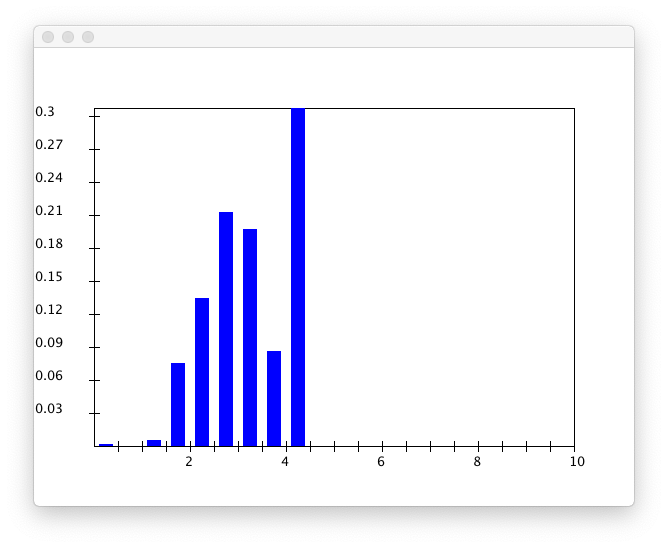

### 44

> Suppose $X\sim Exponential(\gamma)$ with CDF $F(x)$. Write down an expression for $F^{−1}(y)$, the inverse of $F$.

$$
\begin{align*}
F(x)&=
\left\{
\begin{array}
{ll}0 & \;\;\; x\leq 0\\
1 - e^{-\gamma x} & \;\;\; x\gt 0\\
\end{array}
\right.
\end{align*}
$$

Only consider when $x>0$,
$$
\begin{align*}
y&=F(x)=1-e^{-\gamma x}\\
\end{align*}
$$
So,
$$
\begin{align*}
x&=F^{-1}(y)=-\frac{\log(1-y)}{\gamma}\\
\end{align*}
$$

### 46

> Add code to [DiscreteGenExample.java](https://www2.seas.gwu.edu/~simhaweb/contalg/modules/module7/examples/DiscreteGenExample.java) to implement the above generator, and to test it by building a histogram.

See file `DiscreteGenExample.java`.

Result:

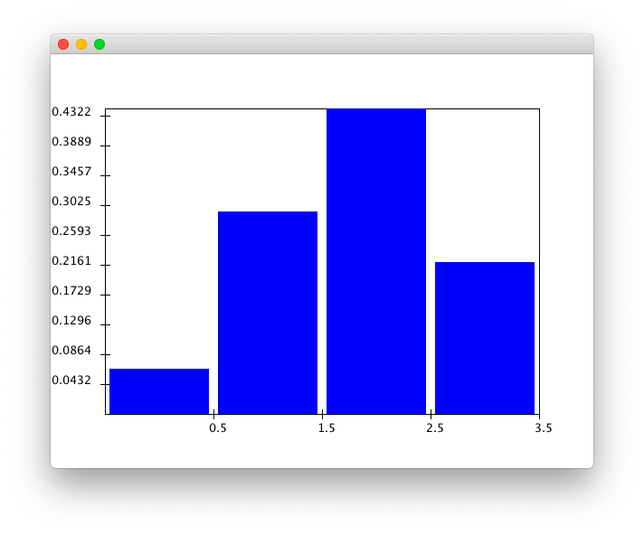

### 48

> Add code to [ExponentialGenerator.java](https://www2.seas.gwu.edu/~simhaweb/contalg/modules/module7/examples/ExponentialGenerator.java) to implement the above idea. Use the inverse-CDF you computed earlier. The test code is written to produce a histogram. Use your modified version of [PropHistogram.java](https://www2.seas.gwu.edu/~simhaweb/contalg/modules/module7/examples/PropHistogram.java) to make a density histogram. Compare the result with the actual density (using $\gamma=4$). How do you know your code worked?

See file `ExponentialGenerator.java`.

Result:

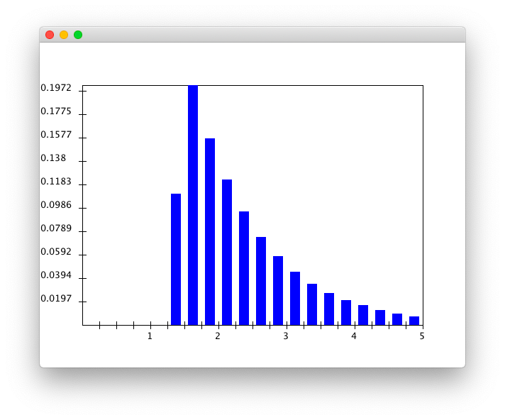
