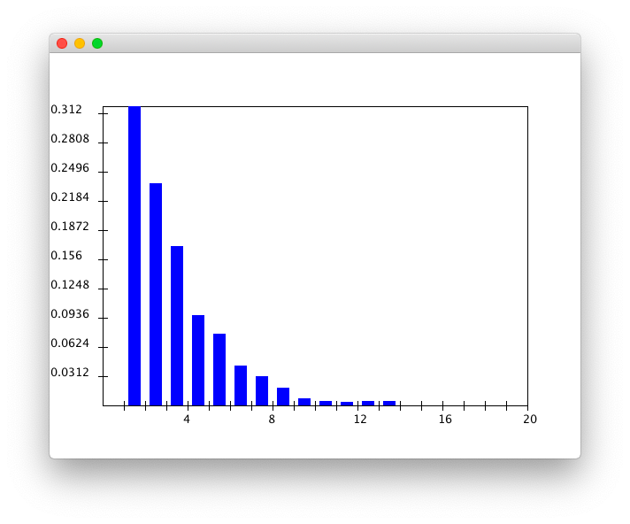
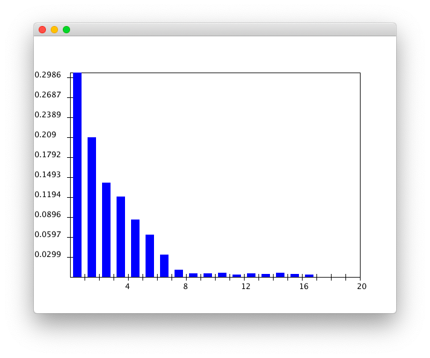
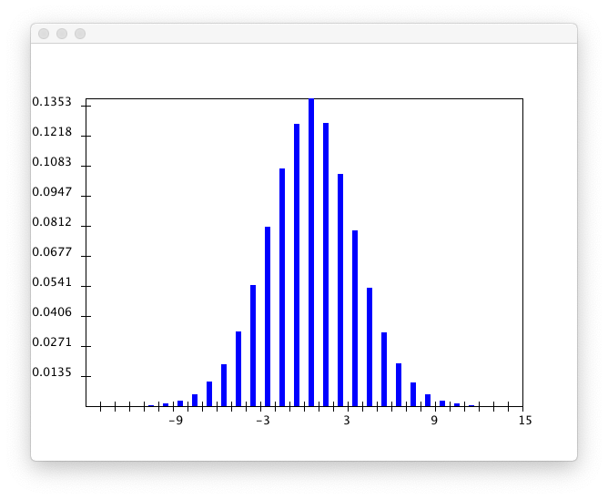
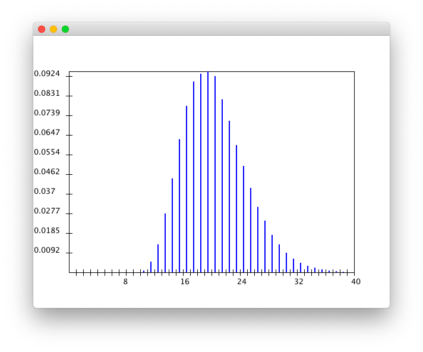

# Module 08

### 02

> Download and execute [Queue.java](https://www2.seas.gwu.edu/~simhaweb/contalg/modules/module8/examples/Queue.java), which is a simulation of a single server queue. Cursorily examine the code.
>
> - What data structures are being used?
> - Where in the code are interarrival times being generated? From what distribution?
> - Where are service times being generated? From what distribution?

The data structure of queue are used.

Interarrival times are generated in function `void scheduleArrival()` called by function `void handleArrival(QueueEvent e)`.

Service times are generated in function `void scheduleDeparture()` called by function `void handleDeparture(QueueEvent e)`.

### 03

> Add code in method `randomInterarrivalTime()` in [Queue.java](https://www2.seas.gwu.edu/~simhaweb/contalg/modules/module8/examples/Queue.java) to estimate the average interarrival time. What does this number have to do with the value of variable `arrivalRate` in the program?

See file `Queue.java`.

It seems that the average interarrival time is the reciprocal of `arrivalRate`.

### 06

> Examine method `simulate()` in [Queue.java](https://www2.seas.gwu.edu/~simhaweb/contalg/modules/module8/examples/Queue.java) and verify that it has this structure. Then examine `init()` to see if the initialization makes sense. Why is there a call to `scheduleArrival()` in `init()`?

The function `init()` must generate the first arrival, or `eventList` will be null and the program ends immediately.

### 07

> Execute [Queue.java](https://www2.seas.gwu.edu/~simhaweb/contalg/modules/module8/examples/Queue.java) to estimate the average time in system.

See exercise \#15.

### 08

> Execute [Queue.java](https://www2.seas.gwu.edu/~simhaweb/contalg/modules/module8/examples/Queue.java) to estimate the average waiting time. Subtract this from the estimate of the average system-time. What do you get? Is it what you expect?

See exercise \#15..

It seems that the average interarrival time is the sum of *the average wait time* and *the average service time*.

### 10

See exercise \#15.

### 11

> Fix the service rate at $\mu=1$ and vary the arrival rate: try $\lambda=0.5,0.75,1.25$. What do you observe when $\lambda=1.25$?

The larger $\lambda$ is, the smaller the average waiting time is.

### 12

> What about it?

$\lambda \rightarrow 0$ will cause:

*the system time* $\rightarrow$  *the average waiting time*

### 14

> For $\lambda=0.75$ and $μ=1$, estimate mm. Then compute $\frac{m}{d}$, where $d$ is the mean system time.

See exercise \#15.

It seems that $\frac{m}{d}$ is always 1.

### 15

> For $\lambda=0.75$ and $\mu=1$, estimate the probability that an arriving customer finds the server free. Try this for $\lambda=0.5,0.6$ as well. Can you relate this probability to $\lambda=0.75$ and $\mu=1$?

See file `Queue.java`.

Result:

```
Simulation results:
  numArrivals:           1000
  numDepartures:         998
  avg Wait:              1.8906618446580803
  avg System Time (d)    2.814388534740915
  avg Interarrival Time: 1.3558307457972822
  interarrival Rate (λ): 0.7375551875481038
  avg Service Time:      0.9253604657777389
  service Rate (μ):      1.0806599557498155
  Custom number:         2944.0
  avg Custom Number (m): 2.944
  probability of Free:   0.312
```

It seems that the probability is equal to $1-\lambda$.

### 16

> We will focus on two distributions: the distribution of the number in the system, and the system time. Let rv $M$ denote the number of customers seen by an arriving customer, and let rv $D$ denote the system time experienced by a random customer.
>
> - Is $M$ discrete or continuous? What about $D$? What is the range of $M$? Of $D$?
> - For $\lambda=0.75$ and $\mu=1$, obtain the appropriate histogram of $M$. Which well-known distribution does this look like?
> - For $\lambda=0.75$ and $\mu=1$, obtain the appropriate histogram of $D$. Which well-known distribution does this look like?
>
> Note: use [PropHistogram.java](https://www2.seas.gwu.edu/~simhaweb/contalg/modules/module8/examples/PropHistogram.java) or [DensityHistogram.java](https://www2.seas.gwu.edu/~simhaweb/contalg/modules/module8/examples/DensityHistogram.java) as appropriate.

$M$ is discrete and its range $M \ge 1$. $D$ is continuous and its range $D \ge 0$.

It seems that $M\sim Exponential(0.334)$.



It seems that $D\sim Exponential(0.355)$.



### 19

> Download and execute [AsynchBoids.java](https://www2.seas.gwu.edu/~simhaweb/contalg/modules/module8/examples/AsynchBoids.java). What do you notice? Does it work?

It works.

### 20

> Examine the code in the molecular simulation from [Module 4](https://www2.seas.gwu.edu/~simhaweb/contalg/modules/module4/module4.html). Is this synchronous or asynchronous?

It is synchronous.

### 21

> Find a simulation of the Game-of-Life. Is this synchronous or asynchronous?

It is asynchronous.

### 22

> Fill in code in [Raindrop.java](https://www2.seas.gwu.edu/~simhaweb/contalg/modules/module8/examples/Raindrop.java) to obtain histograms of $X$ and $T$ respectively. Use $s=1,h=10,p=0.5$.
>
> - What is the likely distribution of $X$?
> - Vary $h$: try $h=20,30,40,50$. What is the relationship between $E[T]$ and $h$?
>
> Note: use [PropHistogram.java](https://www2.seas.gwu.edu/~simhaweb/contalg/modules/module8/examples/PropHistogram.java) or [DensityHistogram.java](https://www2.seas.gwu.edu/~simhaweb/contalg/modules/module8/examples/DensityHistogram.java) as appropriate.

See file `Raindrop.java`.

Result:

```
E[T] = 19.99368
```

It seems that $X\sim N(0,\sigma^{2})$



$T$



Also,

```
h = 20 ===> E[T] = 40.0269
h = 30 ===> E[T] = 60.03735
h = 40 ===> E[T] = 80.03158
h = 50 ===> E[T] = 100.01916
```

It seems that $E[T]=\frac{h}{p}$.

### 23

> Do you know the historical significance of the distributions of $X$ and $T$?

(I don't know.)

### 24

> What is the size of the eventlist for the single-server queue? For the three-queue example?

Each item of single-server queue has 2 variable. Each item of three-queue has 3 variable.

### 25

> If the eventlist has $n$ events, how long does it take for each operation (in order-notation)?

The time compliexty of enqueue is $O(\log n)$.

The time complexity of enqueue is $O(1)$.
