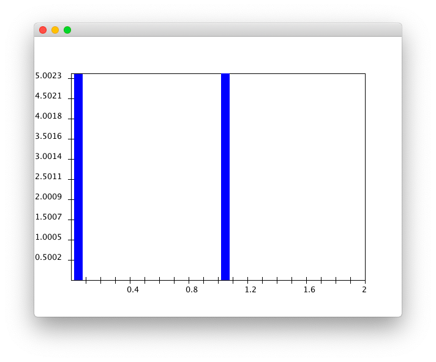
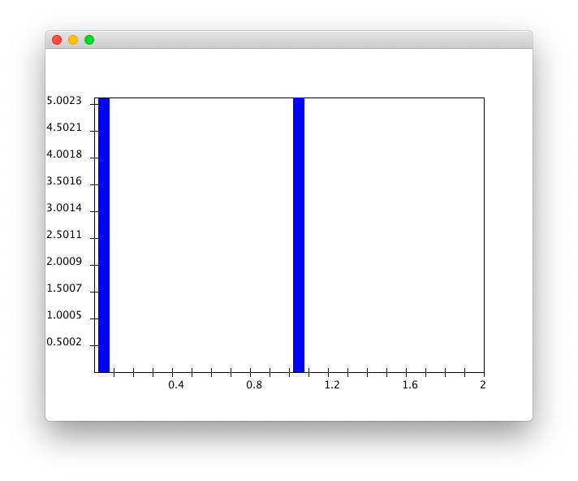
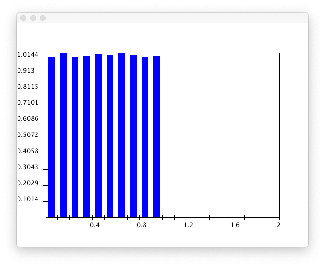
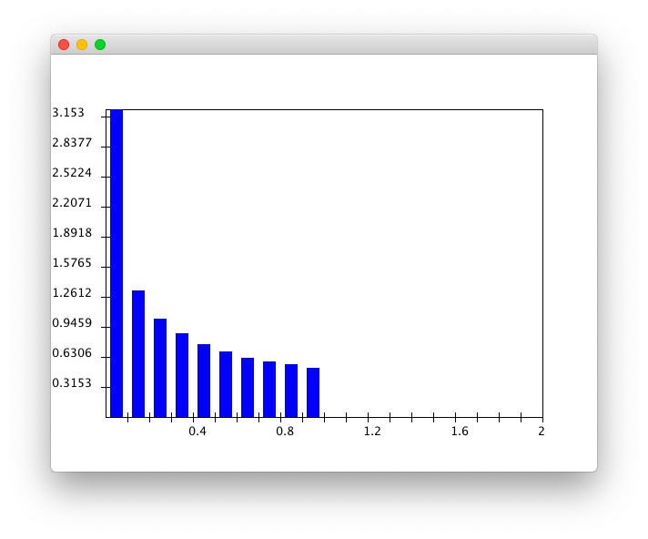
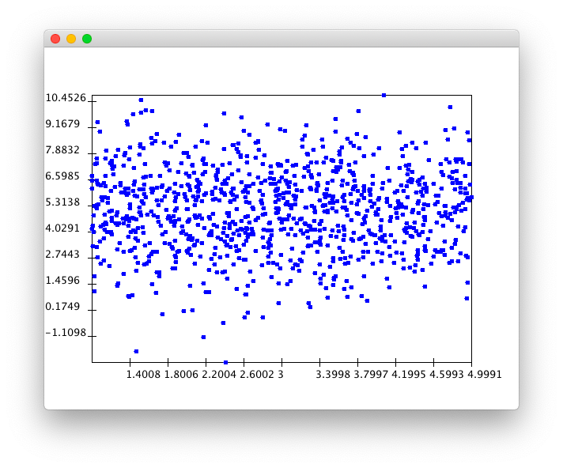
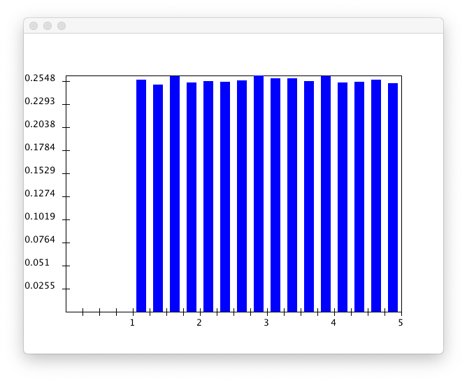
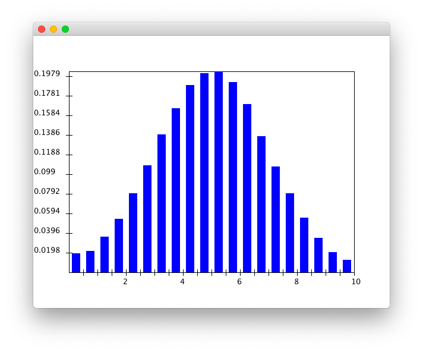

# Module 09

### 03

> Suppose that $X\sim Uniform(0,1)$ and $g(X)=X^{2}$. Modify [UniformExample.java](https://www2.seas.gwu.edu/~simhaweb/contalg/modules/module9/examples/UniformExample.java) to estimate the pdf of $g(X)$ and its average value. You will also need [RandTool.java](https://www2.seas.gwu.edu/~simhaweb/contalg/useful/RandTool.java) and [DensityHistogram.java](https://www2.seas.gwu.edu/~simhaweb/contalg/modules/module9/examples/DensityHistogram.java). What do you notice about the average value of $g(X)$ compared with the average value of $X$?

See file `UniformExample.java`.

Result:

```
E(X)        = 0.50023
E(g(X)=X^2) = 0.50023
```

$X$



$g(X)=X^{2}$



### 06

> Suppose $X\sim Uniform(0,1)$ and $g(x)$ is the function $g(x)=(x−0.5)^{2}$. Work out $E[g(X)]$ by hand. Then estimate the average value of the rv $g(X)$ by adding code to [UniformExample4.java](https://www2.seas.gwu.edu/~simhaweb/contalg/modules/module9/examples/UniformExample4.java).

See file `UniformExample.java`.

Result:

```
E(x)        = 0.5000630164767703
E(g(x)=x^2) = 0.33308660577988347
```

$x$



$g(x)=x^{2}$



### 07

> Suppose $X$ is a rv with range $9,11$ and pmf
>      $Pr[X=9]=0.5$
>      $Pr[X=11]=0.5$
> and $Y$ is a rv with range $8,12$ and pmf
>      $Pr[Y=8]=0.5$
>      $Pr[Y=12]=0.5$
> and $Z$ is a rv with range $8,10,12$ and pmf
>      $Pr[Z=8]=0.1$
>      $Pr[Z=10]=0.8$
>      $Pr[Z=12]=0.1$
> Compute $var[X],var[Y]$ and $var[Z]$.

$$
\begin{align*}
E(X)&=\sum_{k}k\cdot P[X=k]=10\\
var[X]&=E[(X-E(X))^{2}]=1\\
\\
E(Y)&=\sum_{k}k\cdot P[Y=k]=10\\
var[Y]&=E[(X-E(Y))^{2}]=4\\
\\
E(Z)&=\sum_{k}k\cdot P[Z=k]=10\\
var[Z]&=E[(X-E(Z))^{2}]=2.667\\
\end{align*}
$$

### 08

> Download and execute [PointGeneratorExample.java](https://www2.seas.gwu.edu/~simhaweb/contalg/modules/module9/examples/PointGeneratorExample.java). You will also need [PointGenerator.java](https://www2.seas.gwu.edu/~simhaweb/contalg/modules/module9/examples/PointGenerator.java) and [PointDisplay.java](https://www2.seas.gwu.edu/~simhaweb/contalg/modules/module9/examples/PointDisplay.java). Increase the number of points to 1000. Can you guess the distribution of $X$? Of $Y$?

See file `PointGeneratorExample.java`.



It seems that $X\sim Uniform(0,5)$ and $Y\sim N(5,\sigma^{2})$.

### 09

> Download and modify [PointGeneratorExample2.java](https://www2.seas.gwu.edu/~simhaweb/contalg/modules/module9/examples/PointGeneratorExample2.java) to display density histograms for $X$ and $Y$.

See file `PointGeneratorExample2.java`.

$X$



$Y$



### 10

> Download and examine [PointGeneratorExample3.java](https://www2.seas.gwu.edu/~simhaweb/contalg/modules/module9/examples/PointGeneratorExample3.java). The first part of the code estimates $Pr[Y∈[5,7]]$. Add code below to estimate $Pr[Y∈[5,7]|X∈[3,4]]$. Are these events independent?

See file `PointGeneratorExample3.java`.

Result:

```
Pr[Y in [5,7]]              = 0.34286
Pr[Y in [5,7] | X in [3,4]] = 0.341532114095291
```

$X,Y$ are independent., since $Pr[Y∈[5,7]]=Pr[Y∈[5,7]|X∈[3,4]]$.

### 24

> Execute [UniformVarianceExample.java](https://www2.seas.gwu.edu/~simhaweb/contalg/modules/module9/examples/UniformVarianceExample.java) and obtain the two estimates.

See file `UniformVarianceExample.java`.

Result:

```
Mean estimate: 0.5216167255358847
Std-dev estimate: 0.28058637197873465
```

### 26

> If $\mu′=0.48$ and $\sigma′=0.27$ and obtain the number of samples needed.

$$
\begin{align*}
f&=0.049\\
\end{align*}
$$

### 27

>  If $\mu′=0.48$ and $\sigma′=0.27$, obtain $f$ when $n=500$ samples are used.

$$
\begin{align*}
f&=0.049\\
\end{align*}
$$

### 28

> Express $\delta$ as a function of $\sigma$ and $n$.

$$
\begin{align*}
\delta=\frac{1.96\sigma′}{\sqrt{n}}
\end{align*}
$$

### 29

> Use [Stats.java](https://www2.seas.gwu.edu/~simhaweb/contalg/modules/module9/examples/Stats.java) to collect statistics about the single-server queue in [Queue.java](https://www2.seas.gwu.edu/~simhaweb/contalg/modules/module9/examples/Queue.java).
>
> - Estimate the mean interarrival time. How many samples are needed for a 5% ($f=0.05$) confidence interval?
> - Estimate the mean time in system. Again, how many samples are needed for a 5% ($f=0.05$) confidence interval? Consider that the true mean system time is $E[S]=4.0$ when the arrival rate is 0.75 and the service rate is 1.0.
>
> Explain why it may be inappropriate to use our usual procedure (the standard-normal approximation) to compute confidence intervals when estimating the mean system time.

See file `Queue.java`.

Result:

```
Simulation results:
  numArrivals:     1000
  numDepartures:   998
  avg Wait:        1.8906618446580803
  avg System Time: 2.814388534740915
```
