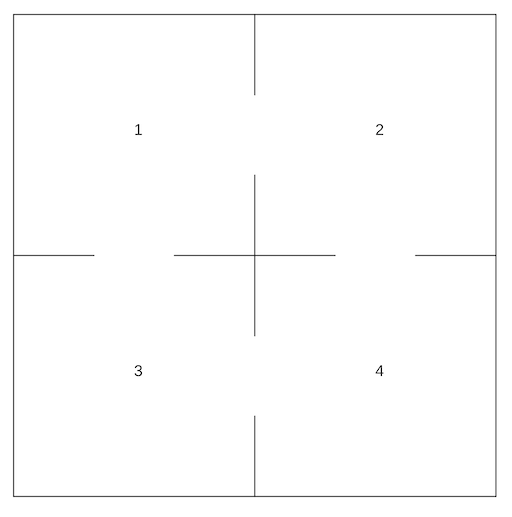
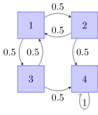

# Markov Chain

### Definition

The **Markov chain** is a [stochastic model](https://en.wikipedia.org/wiki/Stochastic_model) describing a [sequence](https://en.wikipedia.org/wiki/Sequence) of possible events in which the probability of each event depends only on the state attained in the previous event. (by [wikipedia](https://en.wikipedia.org/wiki/Markov_chain))

It fits into the category of continuous math because the stochastic model can be used to predict and process the event in the natural world. Moreover,  the current event state is only related to the previous state and the state tend to be convergence, thus is instinct from the topics in class. 

The "possible" event above is called **state**. The **state diagram** shows the probability transformation between each state.

Also, the probability transformation between each state could be expressed as the **transition matrix** $T$.

- $T$ is a $m\times m$ matrix, which $m$ is the number of states.
- $T_{ij}$ shows the probability that "state $i$ transforms to state $j$". It is clear that the sum of each column of $T$ must be $1$.

$$
\begin{align*}
T=
\begin{bmatrix} 
0.6 & 0.7\\
0.4 & 0.3\\
\end{bmatrix}
\end{align*}
$$

(Assume that "A" as state 1 and "E" as state 2.)

Here are two important concepts:

- The **state vector** $x_{n}$ is a $m \times 1$ matrix which presents the probability of each of $m$ states after $n$ steps.
- When $n=0$, the state vector $x_{0}$ is called **initial state vector**.

And an equation:
$$
\begin{align*}
x_{n}&=T^{n}x_{0}\\
\end{align*}
$$
If there exist a non-negative integer $k$ causes $x_{k+1}=Tx_{k}$, we say that the Markov chain has a **stationary distribution** $x_{k}$.

Have trouble to understand? let's see examples below.

### Maze Runner

#### Scene 1

Discription:

- There is a maze with $2\times 2$ grids (numbered as $1,2,3,4$). There is a door between each pair of adjacent grids.
- There is a rat at grid $1$ which can move to an adjacent grid randomly through the door.
- The rat will randomly choose which grid to move, and the probability to go through each door is equal.
- Grid $4$ is considered as a exit.

It is clear that the event "which grid the rat is in" is only dependent by the previous, which meets the condition of a Markov chain.

The state of this scene is defined as "which grid the rat is in", and it is clear that there are 4 states and $m=4$.

The state diagram is:

(Grid \#4 is defined as exit, and the rat will stay there after it arrives.)

The transition matrix is:
$$
\begin{align*}
T=
\begin{bmatrix} 
0 & 0.5 & 0.5 & 0\\
0.5 & 0 & 0 & 0\\
0.5 & 0 & 0 & 0\\
0 & 0.5 & 0.5 & 1\\
\end{bmatrix}
\end{align*}
$$
The initial state vector is:

(The initial state is determined - the rat is in grid $1$ at the very beginning.)
$$
x_{0}=\begin{bmatrix} 
1\\
0\\
0\\
0\\
\end{bmatrix}
$$

> **Exercise 1**
>
> Read and execute file `Maze1.java` and answer following questions:
>
> 1. What is the probability of "the rat exits the maze" after 5/10/20 moves?
> 2. There is a claim that "the rat will eventually exit the mase if enough moves are allowed". By your intuition, is it true?
> 3. Does the calculation result confirm your intuition? If yes, how it does?

#### Scene 2

The discription of scene 2 is almost same as scene 1, however:

- Grid $4$ is **NOT** considered as a exit, and it is considered as a normal grid.

It is clear that the event "which grid the rat is in" is only dependent by the previous, which meets the condition of a Markov chain.

The state of this scene is defined as "which grid the rat is in", and it is clear that there are 4 states and $m=4$.

The state diagram is:

(Grid \#4 is defined as exit, and the rat will stay there after it arrives.)

The transition matrix is:
$$
\begin{align*}
T=
\begin{bmatrix} 
0 & 0.5 & 0.5 & 0\\
0.5 & 0 & 0 & 0.5\\
0.5 & 0 & 0 & 0.5\\
0 & 0.5 & 0.5 & 0\\
\end{bmatrix}
\end{align*}
$$
The initial state vector is:

(The initial state is determined - the rat is in grid $1$ at the very beginning.)
$$
x_{0}=\begin{bmatrix} 
1\\
0\\
0\\
0\\
\end{bmatrix}
$$

>**Exercise 2**
>
>Read and execute file `Maze2.java` and answer following questions:
>
>1. There is a claim that "the probabilities of 'the rat appears at every grid' are equal (all 0.25)". By your intuition, is it true?
>2. Does the calculation result confirm your intuition?

Some Markov chains may not have stationary distribution!

---

**Theorem**

The sufficient condition of "the Markov chain has a stationary distribution" is that "all elements in its transition matrix are positive".

---

Change the transition matrix as:
$$
\begin{align*}
T=
\begin{bmatrix} 
0.001 & 0.499 & 0.499 & 0.001\\
0.499 & 0.001 & 0.001 & 0.499\\
0.499 & 0.001 & 0.001 & 0.499\\
0.001 & 0.499 & 0.499 & 0.001\\
\end{bmatrix}
\end{align*}
$$

> **Exercise 3**
>
> Finish file `Maze3.java` by $T$. Execute it and answer following questions:
>
> 1. There is a claim that "the probabilities of 'the rat appears at every grid' are equal (all 0.25)". By your intuition, is it true?
> 2. Does the calculation result confirm your intuition?

### Weather Report

Discription:

- Assume that weathers of somewhere are only "sunny", "cloudy" and "rainy", and the probability of the weather tomorrow (day 1) only depends on the weather today (day 0).
- If today is sunny, the probabilities of the weathers tomorrow are: sunny - 0.65, cloudy - 0.1, rainy - 0.25.
- If today is cloudy, the probabilities of the weathers tomorrow are: sunny - 0.25, cloudy - 0.25, rainy - 0.5.
- If today is rainy, the probabilities of the weathers tomorrow are: sunny - 0.25, cloudy - 0.15, rainy - 0.6.

It is clear that the event "what the weather is" is only dependent by the previous, which meets the condition of a Markov chain.

States of this scene are "sunny", "cloudy" and "rainy" ($m=3$).

> **Exercise 4**
>
> 1. Draw the state diagram.
> 2. Write down the transition matrix and the initial state vector.
> 3. Finish file `WeatherReport.java`, execute it to find the stationary distribution.
