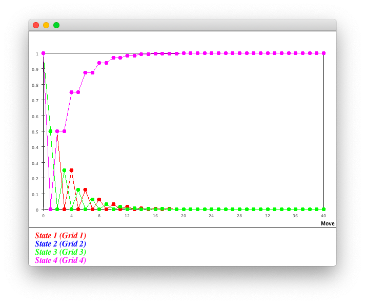
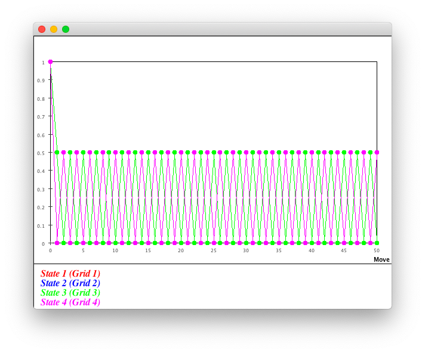
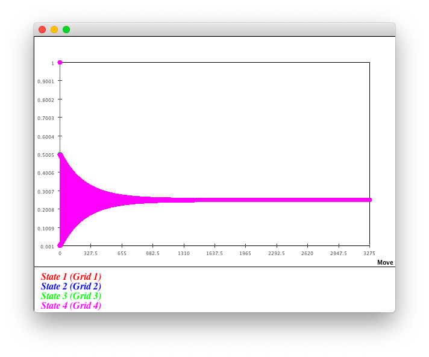
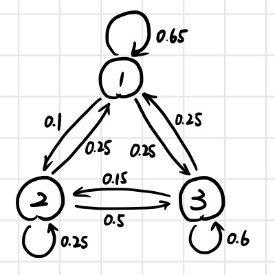
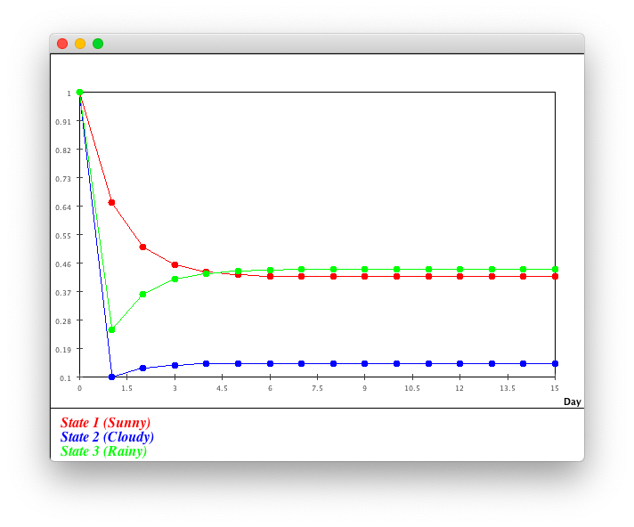

# Markov Chain - Solution

### 1

> Read and execute file `Maze1.java` and answer following questions:
>
> 1. What is the probability of "the rat exits the maze" after 5/10/20 moves?
> 2. There is a claim that "the rat will eventually exit the mase if enough moves are allowed". By your intuition, is it true?
> 3. Does the calculation result confirm your intuition? If yes, how it does?

See file `Maze1.java`.

Result:

```
# Move 0
[[1.0]
[0.0]
[0.0]
[0.0]]

# Move 1
[[0.0]
[0.5]
[0.5]
[0.0]]

...

# Move 5
[[0.0]
[0.125]
[0.125]
[0.75]]

...

# Move 10
[[0.03125]
[0.0]
[0.0]
[0.96875]]

...

# Move 20
[[9.765625E-4]
[0.0]
[0.0]
[0.9990234375]]

...

# Move 39
[[0.0]
[9.5367431640625E-7]
[9.5367431640625E-7]
[0.9999980926513672]]

# Move 40
[[9.5367431640625E-7]
[0.0]
[0.0]
[0.9999990463256836]]

The stationary distribution appears at move 40.
```



**1**

The probability "the rat exits the maze" after 5 moves is 0.75.

The probability "the rat exits the maze" after 10 moves is 0.96875.

The probability "the rat exits the maze" after 5 moves is 0.9990234375.

**2**

It is true.

**3**

The stationary distribution (move 40) shows that: the probability of "exit" (state 4) is almost 1.

### 2

> Read and execute file `Maze2.java` and answer following questions:
>
> 1. There is a claim that "the probabilities of 'the rat appears at every grid' are equal (all 0.25)". By your intuition, is it true?
> 2. Does the calculation result confirm your intuition?

See file `Maze2.java`.

Result:

```
# Move 0
[[1.0]
[0.0]
[0.0]
[0.0]]

# Move 1
[[0.0]
[0.5]
[0.5]
[0.0]]

# Move 2
[[0.5]
[0.0]
[0.0]
[0.5]]

# Move 3
[[0.0]
[0.5]
[0.5]
[0.0]]

...

# Move 999
[[0.0]
[0.5]
[0.5]
[0.0]]

# Move 1000
[[0.5]
[0.0]
[0.0]
[0.5]]

The stationary distribution does not appears after 1000 move(s).
```



**1**

It is true.

**2**

No.

### 3

> Finish file `Maze3.java` by $T$. Execute it and answer following questions:
>
> 1. There is a claim that "the probabilities of 'the rat appears at every grid' are equal (all 0.25)". By your intuition, is it true?
> 2. Does the calculation result confirm your intuition?

See file `Maze3Answer.java`.

Result:

```
# Move 0
[[1.0]
[0.0]
[0.0]
[0.0]]

# Move 1
[[0.001]
[0.499]
[0.499]
[0.001]]

...

# Move 3274
[[0.2500005000506633]
[0.2499994999493365]
[0.2499994999493365]
[0.2500005000506633]]

# Move 3275
[[0.24999950194953918]
[0.25000049805046065]
[0.25000049805046065]
[0.24999950194953918]]

The stationary distribution appears at move 3275.
```



**1**

It is true.

**2**

Yes.

### 4

> 1. Draw the state diagram.
> 2. Write down the transition matrix and the initial state vector.
> 3. Finish file `WeatherReport.java`, execute it to find the stationary distribution.

**1**

Assume that:

- state 1 - sunny
- state 2 - cloudy
- state 3 - rainny



**2**

The transition matrix is:
$$
\begin{align*}
T=
\begin{bmatrix} 
0.65 & 0.25 & 0.25\\
0.1 & 0.25 & 0.15\\
0.25 & 0.5 & 0.6\\
\end{bmatrix}
\end{align*}
$$
One of the initial state vector is:
$$
x_{0}=\begin{bmatrix} 
1\\
0\\
0\\
\end{bmatrix}
$$
**3**

See file `WeatherReportAnswer.java`.

Result:

```
# Day 0
[[1.0]
[0.0]
[0.0]]

# Day 1
[[0.65]
[0.1]
[0.25]]

...

# Day 14
[[0.4166682325401601]
[0.1435182575396025]
[0.4398135099202376]]

# Day 15
[[0.41666729301606414]
[0.14351841412695227]
[0.43981429285698387]]

The stationary distribution appears at day 15.
```



The stationary distribution is
$$
x_{15}=\begin{bmatrix} 
0.41666729301606414\\
0.14351841412695227\\
0.43981429285698387\\
\end{bmatrix}
$$