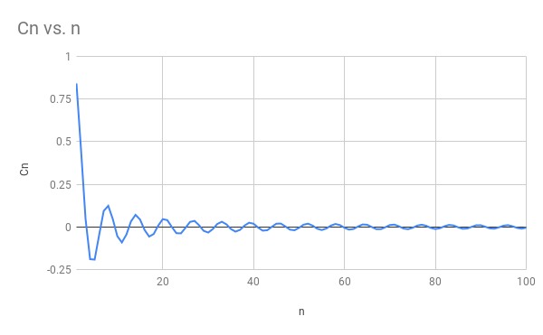
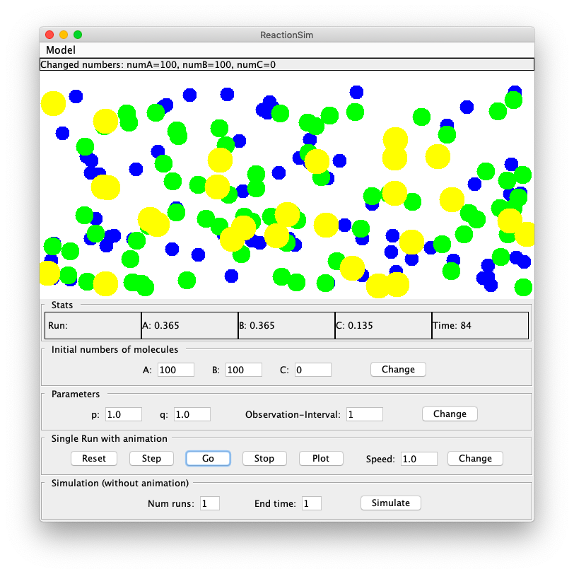
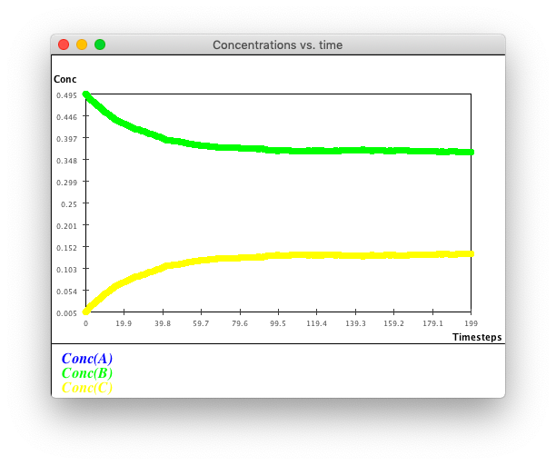

# Reflection Exercise 1

### 1

At the beginning of module 1, there is an interesting question:

> Is there a rational number between every two rationals?

Instinctively, the answer is YES. But how to prove it.

Here is a proof.

> Rational numbers can be expressed by the division of two integers.
>
> $m,n,p,q​$ are integers.
>
> Let $a=\frac{m}{n}​$ and $b=\frac{p}{q}​$. It is clear that $a,b​$ are rational numbers.
>
> Let $c=\frac{a+b}{2}$ which means $a\le c\le b$.
> $$
> \begin{align*}
> c&=\frac{a+b}{2}=\frac{\frac{m}{n}+\frac{p}{q}}{2}=\frac{mp+nq}{2nq}\\
> \end{align*}
> $$
> Both numerator and denominator are integers, so $c$ is a rational number.
>
> As a result, a rational number always exists between every two rational numbers.

The proof is beautiful since it is concise, strict and effective. Rather than trying or imaging, mathematics provides an convincing explanation. Mathematics is really an important tool for us to explore the whole world.

### 2

How to calculate GCD? (module 1)

By hand, I always use a method called "short divition". For example,

```
2 | 24   30
  ------------
   3 | 12   15
     ------------
        4   5

GCD = 2 * 3 = 6
```

But how to calculate GCD by computer (effectively)?

If I just directly realize "short divition", it will cost much time and space.

Euclid algorithm is always used by computer to calculate GCD.

``` java
int gcd(int m, int n) {
    // Bad input check:
    if (n > m) {
        return gcd(n, m);
    }
    // Algorithm:
    if (n == 0) {
        return m;
    } else { 
        return gcd(n, m % n);
    }
}
```

Comparing these two methods, I find out the difference between the computer and the brain of human. A method may be suitable for human brain, but hard for computer (and vice versa). This difference is also reflected by some algorithms of sorting and graph. We must "think as a computer" to make an effective algorithm.

At the same time, I deeply comprehend concepts of "common divisor" and "greatest common divisor (GCD)".

### 3

Module 1 provides a proof about "$\sqrt{2}​$ is irrational".

> Assume that $\sqrt{2}$ is rational.
>
> Express $\sqrt{2}$ as $r=\frac{p}{q}$ where fraction $\frac{p}{q}$ CANNOT be reduced.
>
> Then $\frac{p^{2}}{q^{2}}=2​$.
>
> As a result, $p^{2}=2q^{2}$.
>
> So, $p^{2}​$ is even and $p​$ is even.
>
> Let $p=2s$ which $s$ is an integer since $p$ is even.
>
> $4s^{2}=2q^{2}\Longrightarrow q^{2}=2s^{2}$.
>
> So, $q^{2}​$ is even and $q​$ is even.
>
> Since $p​$ and $q​$ are both even, fraction $\frac{p}{q}​$ CAN be reduced.
>
> Contradict! the assumption must be fause.
>
> $\sqrt{2}​$ is irrational.

It is a very good example of "proof by contradiction" - a form of proof that establishes the truth or validity of a proposition by first assuming that the opposite proposition is true, and then shows that such an assumption leads to a contradiction (Wikipedia).

Directly make a mathematical proof might be difficult, but "proof by contradiction" might provide an easy way. Sometimes, thinking inversely could give us laconical solutions.

### 4

In module 1, "limit" is defined (most commonly) as

>For every small number $\epsilon$, there exists an integer $N$ such that $\lvert X_{n}-L\rvert < \epsilon$ for all $n>N$.

Intuitively, the "limit" is like: (module 1 exercise 9)


However, "limit" may be also like: (module 1 exercise 10)



These image expand my primary insight of the concept "limit" - it could be reached by two ways rather than one. Also, it enlights me "why we use such an tedious but strict way to describe the concept of limit".

### 5

There is an important concept in module 3 called "instantaneous rate-of-change (derivative)", which is illustrated by an experiment "ball drop".

Formula:
$$
\begin{align*}
v(t)&=\frac{d(t+0.01)-d(t)}{0.01}\\
a(t)&=\frac{v(t+0.01)-v(t)}{0.01}\\
\end{align*}
$$
Code:

``` java
public class BallDropSimulatorExample {

    public static void main(String[] argv) {
        BallDropSimulator sim = new BallDropSimulator();
        Function dVst = new Function("d vs. t");
        Function vVsT = new Function("v vs. t");
        Function aVsT = new Function("a vs. t");
        double deltaT = 0.01;
        double height = 1000;
        for (double t = 0; t < 10; t++) {
            double d = sim.run(t, height);
            double dPrime = sim.run(t + deltaT, height);
            double dPrimePrime = sim.run(t + deltaT + deltaT, height);
            double v = (dPrime - d) / deltaT;
            double vPrime = (dPrimePrime - dPrime) / deltaT;
            double a = (vPrime - v) / deltaT;
            dVst.add(t, d);
            vVsT.add(t, v);
            aVsT.add(t, a);
            System.out.println("t=" + t + "  d=" + d + "  v=" + v + " a=" + a);
        }
        dVst.show();
        vVsT.show();
        aVsT.show();
    }

}
```

Image:


Such formulas, codes and images provides me a deep and visualized impression of "derivative", which is a very useful tool in physics and mathematics. Also, by doing these exercises, my ability of converting formula to code is improved.

### 6

"Simulating a simple chemical reaction" in module 4 provides a lot of description of the scene. To be honest, I am quite confuse when I first read it. Fortunately, there is a simulator.





The simulator is very useful for me to understand the scene. It also shows me the importance of using multimedia - image and animation - when trying to introducing new things to someone else.

