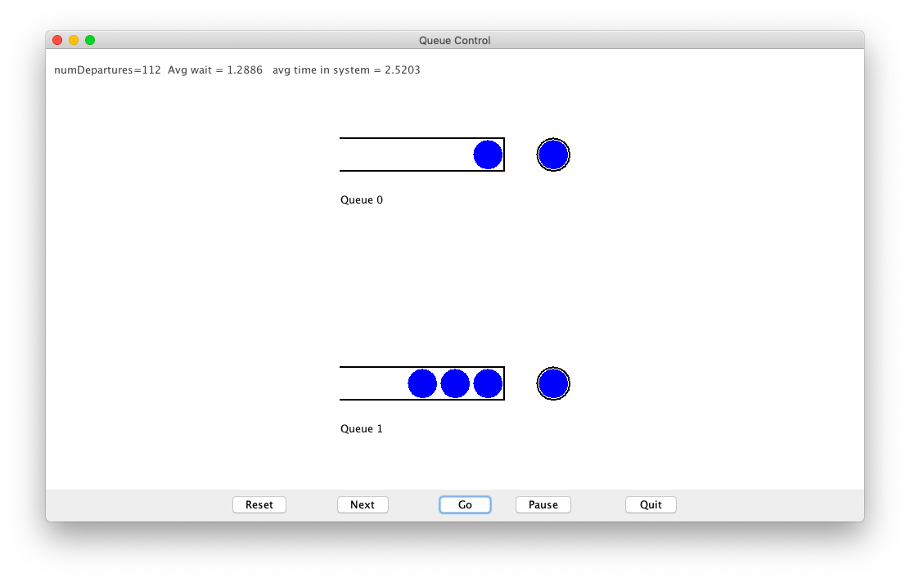
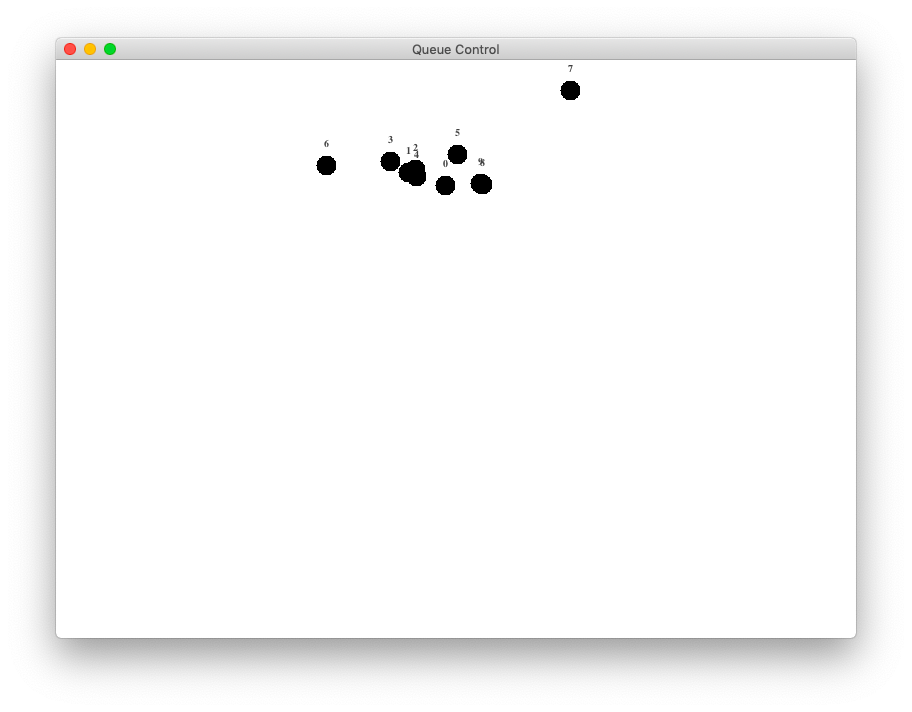
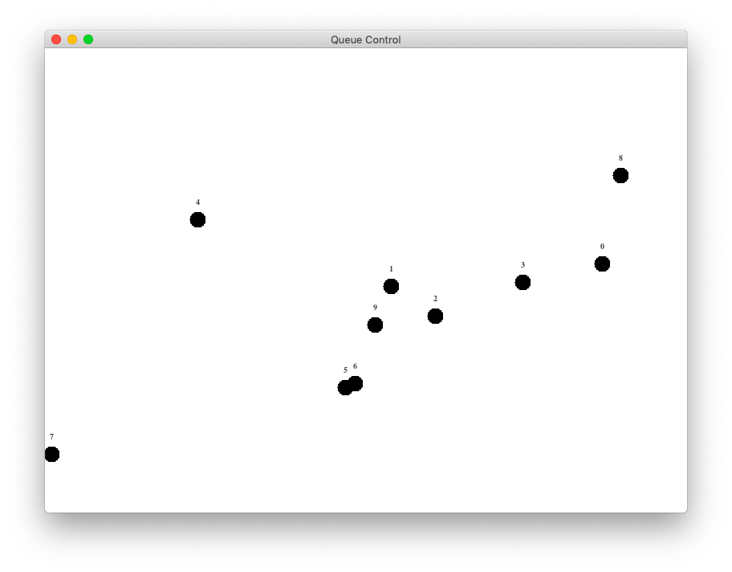

# Reflection Exercise 2

### 1

I have learned the probability theory 5 years ago when I was an undergraduate student. By reading module 6, I make a good review - there are so many code example which provide me a intuitive image. I can always check my calculation result by doing some programming.

For example, problem \#18 in the section of "6.6 Conditional probability":

> 5% of the population is infected.
> $$
> \begin{align*}
> P[S]&=0.05\\
> \end{align*}
> $$
> The probability that the test works for an infected person is 0.99.
> $$
> \begin{align*}
> P[T|S]&=0.99\\
> \end{align*}
> $$
> The probability of a false positive is 3%.
> $$
> \begin{align*}
> P[T|\overline{S}]&=0.03\\
> \end{align*}
> $$
> Probability that if a test is positive, the person is infected: $P[S|T]$.
>
> Probability that if a test is positive, the person is well: $P[\overline{S}|T]$.
> $$
> \begin{align*}
> P[TS]&=P[S]P[T|S]=0.0495\\
> P[\overline{S}]&=1-P[S]=0.95\\
> P[T\overline{S}]&=P[\overline{S}]P[T|\overline{S}]=0.0285\\
> P[T]&=P[TS]+P[T\overline{S}]=0.078\\
> P[S|T]&=\frac{P[TS]}{P[T]}=0.635\\
> P[\overline{S}|T]&=\frac{P[T\overline{S}]}{P[T]}=0.365\\
> \end{align*}
> $$
> Code:
>
> ``` java
> public class LabTestExample {
>
>     public static void main(String[] argv) {
>         double numTrials = 1000000;
>         double positive = 0;
>         double infected = 0;
>         double well = 0;
>         LabTest lab = new LabTest(0.05, 0.99, 0.03);
>         for (int n = 0; n < numTrials; n++) {
>             lab.nextPatient();
>             if (lab.testedPositive()) {
>                 // INSERT YOUR CODE HERE
>                 positive++;
>                 if (lab.isSick()) {
>                     infected++;
>                 } else {
>                     well++;
>                 }
>             }
>         }
>         // AND HERE
>         double infectedGivenPositive = infected / positive;
>         double wellGivenPositive = well / positive;
>         System.out.println("Pr[infected given positive]=" + infectedGivenPositive + "  theory=" + 0.635);
>         System.out.println("Pr[well given positive]=" + wellGivenPositive + "  theory=" + 0.365);
>     }
>
> }
> ```
>
> Result:
>
> ```
> Pr[infected given positive]=0.6340914353340709  theory=0.635
> Pr[well given positive]=0.36590856466592914  theory=0.365
> ```

It really helps me a lot.

### 2

At the same time, I review *the Bayes' rule* and *the law of total probability* by traditional math way.

the Bayes' rule:

> This idea
> $$
> \begin{align*}
> Pr[A|B]&=\frac{Pr[B|A]Pr[A]}{Pr[B]}
> \end{align*}
> $$
> is often called *Bayes' rule*.

the law of total probability:

> Thus,
> $$
> \begin{align*}
> Pr[A]&=Pr[(A\cap B_{1})\cup (A\cap B_{2})\cup...\cup(A\cap B_{n})]\\
> &=Pr[(A\cap B_{1})]+Pr[(A\cap B_{2})]+…+Pr[A\cap B_{n})]\\
> &=Pr[A|B_{1}]Pr[B_{1}]+Pr[A|B_{2}]Pr[B_{2}]+…Pr[A|B_{n}]Pr[B_{n}]\\
> \end{align*}
> $$
> This is sometimes called the *law of total probability*

After reading their mathematical proof, I get a deeper understanding of such formula. (I used to just recite them.) Now, I can use them proficiently.

### 3

At the very begining of module 6, it says that:

> Probability can be somewhat difficult and counterintuitive.

The last part - "6.9 Problem solving" - use traditional math way to show me such "counterintuitive".

> Another example:
>
> 
>
> - Suppose we draw two balls without replacement from an an urn with 3 red balls, and 2 blue balls. What is the probability both have the same color?
>
>
>
> - Identify the sample space:
> $$
> \begin{align*}
> \Omega&=\{(R,R),(R,B),(B,R),(B,B)\}\\
> \end{align*}
> $$
>
> - Clearly, the event of interest is:
> $$
> \begin{align*}
> A=\{(R,R),(B,B)\}
> \end{align*}
> $$
>
>
> - Note: it is NOT true that
> $$
> \begin{align*}
> Pr[A]&=\frac{\lvert A\rvert}{\lvert \Omega \rvert}\\
> \end{align*}
> $$
> for this example (because there's conditioning involved - see below)
>
> - That is, the individual outcomes are NOT equally likely.
>
> ​	 We have to work these out.
>
> - Obviously, the probabilities for the second drawing depend on what happened in the first.
>
> ​	$\Rightarrow$ Conditioning is involved.
>
> - Define key events
>
>   ​	$R_{1}=$"first is red"
>
>   ​	$R_{2}=$"second is red"_
>
>   ​	$B_{1}$="first is blue"
>
>   ​	$B_{2}=$"second is blue"
>
> - The event of interest is
>
>   ​								($R_{1}$ and $R_{2}$) OR ($B_{1}$ and $B_{2}$)
>
> - For additional clarity, we could write this with set notation (so that the combination of events is clear):
> $$
> \begin{align*}
> (R_{1}\cap R_{2})\cup (B_{1}\cap B_{2})\\
> \end{align*}
> $$
>
> - Right away, we can see that
> $$
> \begin{align*}
> Pr[R_{1}]&=\frac{3}{5}\\
> Pr[B_{1}]&=\frac{2}{5}\\
> \end{align*}
> $$
>
> - Also, some conditional probabilities are easy to read off:
> $$
> \begin{align*}
> Pr[R_{2}|R_{1}]=\frac{2}{4}\\
> Pr[B_{2}|B_{1}]=\frac{1}{4}\\
> \end{align*}
> $$
>
> - Recall that
> $$
> \begin{align*}
> Pr[R_{2}\cap R_{1}]&=Pr[R_{2}|R_{1}]Pr[R_{1}]=\frac{2}{4}\cdot \frac{3}{5}=\frac{6}{20}
> \end{align*}
> $$
>
> - Similarly
> $$
> \begin{align*}
> Pr[B_{2}\cap B_{1}]&=Pr[B_{2}|B_{1}]Pr[B_{1}]=\frac{1}{4}\cdot \frac{2}{5}=\frac{2}{20}\\
> \end{align*}
> $$
>
> - Now let's return to our event of interest:
> $$
> \begin{align*}
> (R1\cap R2)\cup (B1\cap B2)\\
> \end{align*}
> $$
> Both events being OR'd (union'ed) are disjoint, so
> $$
> \begin{align*}
> Pr[A]&=Pr[R_{1}\cap R_{2}]+Pr[B_{1}\cap B_{2}]\\
> \end{align*}
> $$
>
> - Thus,
> $$
> \begin{align*}
> Pr[A]=\frac{6}{20}+\frac{2}{20}=\frac{8}{20}\\
> \end{align*}
> $$
>
> - So, what did we learn from this example?
>
>   - In some problems, the conditional probabilities are easy to "read off" from the problem description.
>   - Even though the event of interest seemed complex, it was broken down quite easily.

This example tells me that: sometime we may "read off" some key point when try to solving a problem, and we should use strict mathematical tools rather than intuition to deal with a problem. I believe that it is really important - not only on this cource but everywhere.

### 4

There is a very interesting visual demo at the beginning of module 7.

By playing with this demo and thinking about the principle, I realize that there are still some important concepts in the probability theory I have to learn.



### 5

There is an interesting question - "how computers generate a random variable?". The answer is in the section of "7.10 Generating random values from distributions".

By reading the instruction, I do exercise \#48.

``` java
public class ExponentialGenerator {

    static double x = 1;

    public static void main(String[] argv) {
        int numTrials = 100000;

        // Exponential parameter.
        double gamma = 4.0;

        // Make a density histogram. NOTE: change code in PropHistogram accordingly.
        PropHistogram hist = new PropHistogram(0, 5, 20);
        for (int n = 0; n < numTrials; n++) {
            double x = generateNext(gamma);
            hist.add(x);
        }

        hist.display();
    }


    static double generateNext(double gamma) {
        // INSERT YOUR CODE HERE.
        return -Math.log((1 - uniform()) / gamma);
    }

    static double uniform() {
        int M = 1 << 16 - 1;
        int a = 48271;
        x = (a * x) % M;
        return x / (double) M;
    }

}
```

By doing such programming exercise, I also know "how computer generate the random number" and the concept of "seed".

### 6

Section "8.5 Synchronous simulations" in module 8 mentions asynchronous and synchronous simulation. It provide us two visual demos.

Boid - synchronous simulation:



Boid - asynchronous simulation:



It helps me to understand the difference between them:

- synchronous simulation: fixed time steps.
- asynchronous simulation: based on special events.
